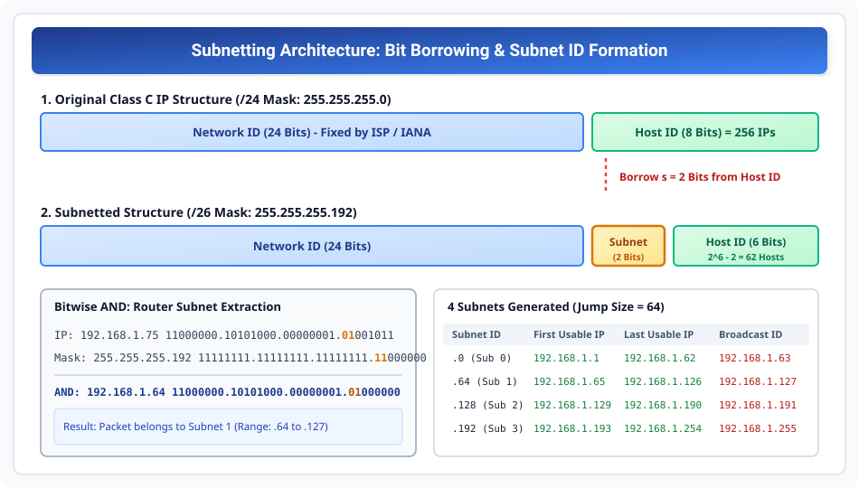

# Subnetting Mechanics and Classful Subnet Design

> **Unit 3: Network Layer (Core Routing & Addressing)**  
> **Course:** Computer Networks (BCS-603 / GATE CS / IT)  
> **Topic Depth:** Concept of Subnetting, Host-Bit Borrowing, Subnet Mask Math, Block Size Formula, Step-by-Step Numerical Calculations & AKTU PYQs

---

## 1. Subnetting Ka Core Concept aur Kyun Zaroorat Padi? (Need for Subnetting)

Purane **Classful Addressing** model (Classes A, B, C) mein do sabse badi dikkat thi:
1. **Huge Address Wastage (Internal Wastage):** Agar kisi organization ko 500 hosts chahiye, toh Class C (254 hosts) chhota pad jata tha, aur Class B (65,534 hosts) assign karna padta tha. Baki bache hue ~65,000 addresses poori tarah waste ho jate the!
2. **Flat Single-Level Network Complexity:** Ek hi bada network hone par router ko har host tak packet pahunchane ke liye broadcast flood dekhna padta tha. Network traffic congested ho jata tha aur security isolation zero thi.

### Subnetting Ki Definition
**Subnetting** ek aisi networking technique hai jisme ek single large physical network ko internally multiple smaller logical networks (**Subnets**) mein divide kiya jata hai.

```
Classful Structure: [Network ID] <---------------------> [Host ID]
Subnetted Structure: [Network ID] <---> [Subnet ID] <---> [Host ID]
```

- **External World (Outside Routers):** Bahar ke routers ke liye poori organization abhi bhi ek single Network ID ke roop mein dikhti hai. External routing tables par koi extra load nahi padta.
- **Internal Routers:** Organization ke internal router par subnet bits use karke packets ko exact departmental subnet (e.g., Accounts, IT, CS Lab) par deliver kiya jata hai.

---

## 2. Bit-Borrowing Mechanics & Standard Formulas

Subnetting karne ke liye hum **Host ID** ke most significant bits (MSBs) ko "borrow" (udhaar) lete hain aur unhe **Subnet ID** declare karte hain.



### Fundamental Formulas for Subnet Calculation:

1. **Number of Subnets ($N_s$):**
   Agar humne Host ID se $s$ bits borrow kiye:
   $$N_s = 2^s$$
   *(Note: Legacy RFC 950 standard mein $2^s - 2$ hota tha kyunki all-0s aur all-1s subnets reserved the. Modern CIDR aur RFC 1878 compliant networking mein all subnets valid hain, toh formula $2^s$ use hota hai).*

2. **Number of Valid Usable Hosts Per Subnet ($N_h$):**
   Agar total host bits mein se $s$ bits borrow karne ke baad $h$ bits Host ID ke liye bache:
   $$N_h = 2^h - 2$$
   **2 Kyun Subtract Karte Hain?**
   - **All 0s in Host ID:** Yeh us subnet ka **Subnet ID / Network Address** hota hai. Kisi host ko assign nahi ho sakta.
   - **All 1s in Host ID:** Yeh us subnet ka **Directed Broadcast Address (DBA)** hota hai.

3. **Subnet Mask:**
   Subnet mask mein Network ID aur Subnet ID ke saare bits $1$ hote hain, aur remaining Host ID bits $0$ hote hain.

4. **Block Size (Jump Size / Magic Number):**
   $$\text{Block Size} = 256 - (\text{Value of Interesting Octet in Subnet Mask})$$
   $$\text{Ya fir: } \text{Block Size} = 2^h$$
   (Jahan $h$ us specific octet mein remaining host bits hain).

---

## 3. Bitwise AND Operation: Subnet Identification by Router

Jab kisi router interface par koi IP packet aata hai, toh router yeh pata lagata hai ki yeh packet kis internal subnet ka hai:

$$\mathbf{Subnet\ ID = (\text{Destination IP Address}) \ \mathbf{AND}\ (\text{Subnet Mask})}$$

### Step-by-Step Bitwise AND Example:
- **Given IP:** `192.168.1.75`
- **Subnet Mask:** `255.255.255.192` (/26)

Converting 4th octet to binary:
- IP 4th octet ($75$): `0 1 0 0 1 0 1 1`
- Mask 4th octet ($192$): `1 1 0 0 0 0 0 0`
- Bitwise AND result: `0 1 0 0 0 0 0 0` $\implies 64$

Router instantly conclude karta hai ki yeh packet **Subnet 192.168.1.64** ke liye destined hai!

---

## 4. Solved Numericals (Step-by-Step AKTU & GATE Standards)

### Numerical 1 (AKTU 10-Marks Long Question):
> **Question:** Ek organization ko Class C network address `193.1.2.0` mila hai. Organization ko is network ko **4 subnets** mein divide karna hai. 
> Pata kijiye:
> 1. Subnet mask kya hoga?
> 2. Har subnet mein kitne usable hosts honge?
> 3. Har subnet ka Subnet ID, First Usable IP, Last Usable IP, aur Directed Broadcast Address calculate kijiye.

#### Solution:
- **Given:** Class C Address $\implies$ Default Mask $= 255.255.255.0$ (/24).
- Total Host bits $H = 8$.

**Step 1: Calculate Borrowed Bits ($s$)**
- Hume 4 subnets chahiye:
  $$2^s \ge 4 \implies s = 2 \text{ bits}$$
- Host bits remaining: $h = 8 - 2 = 6 \text{ bits}$.

**Step 2: Subnet Mask Calculation**
- 4th octet mein 2 bits borrow kiye:
  $$\text{Binary: } 11000000_2 = 128 + 64 = 192$$
- Custom Subnet Mask $= \mathbf{255.255.255.192}$ (Slash notation: `/26`).

**Step 3: Hosts Per Subnet**
- Usable hosts per subnet $= 2^h - 2 = 2^6 - 2 = 64 - 2 = \mathbf{62\text{ hosts}}$.

**Step 4: Block Size (Jump Size)**
- $\text{Block Size} = 256 - 192 = \mathbf{64}$ (ya $2^6 = 64$).

**Step 5: Subnet Allocation Table**

| Subnet No. | Subnet ID (Network Addr) | First Usable Host IP | Last Usable Host IP | Directed Broadcast Addr |
| :--- | :--- | :--- | :--- | :--- |
| **Subnet 0** | `193.1.2.0` | `193.1.2.1` | `193.1.2.62` | `193.1.2.63` |
| **Subnet 1** | `193.1.2.64` | `193.1.2.65` | `193.1.2.126` | `193.1.2.127` |
| **Subnet 2** | `193.1.2.128` | `193.1.2.129` | `193.1.2.190` | `193.1.2.191` |
| **Subnet 3** | `193.1.2.192` | `193.1.2.193` | `193.1.2.254` | `193.1.2.255` |

---

### Numerical 2 (Class B Subnetting):
> **Question:** Class B network `145.32.0.0` ko **16 subnets** mein baantna hai. Subnet mask aur har subnet mein usable hosts count kijiye.

#### Solution:
- Class B Default Mask $= 255.255.0.0$ (/16). Total host bits $= 16$.
- $2^s \ge 16 \implies s = 4 \text{ bits}$.
- 3rd octet se 4 bits borrow honge:
  $$\text{3rd octet binary: } 11110000_2 = 128 + 64 + 32 + 16 = 240$$
- **Subnet Mask:** $\mathbf{255.255.240.0}$ (Slash notation: `/20`).
- Remaining host bits $h = 16 - 4 = 12 \text{ bits}$.
- **Usable hosts per subnet:** $2^{12} - 2 = 4096 - 2 = \mathbf{4094\text{ hosts}}$.
