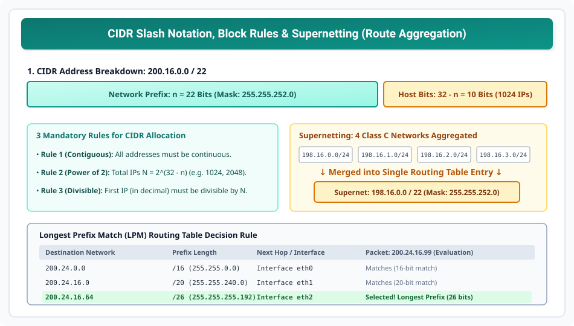

# Classless Addressing (CIDR) and Supernetting

> **Unit 3: Network Layer (Core Routing & Addressing)**  
> **Course:** Computer Networks (BCS-603 / GATE CS / IT)  
> **Topic Depth:** CIDR Prefix Notation (/n), 3 Allocation Rules, Supernetting vs Subnetting, Route Aggregation, Longest Prefix Match (LPM)

---

## 1. CIDR (Classless Inter-Domain Routing) Kya Hai?

1993 mein Internet Engineering Task Force (IETF) ne **RFC 1519** ke through **CIDR** introduce kiya. Classful addressing (Classes A, B, C) ke rigid boundaries ne IPv4 address pool ko exhaust kar diya tha.

### CIDR Ki Key Characteristics:
- **No Class Boundaries:** Class A, B, C ka concept poori tarah khatam kar diya gaya.
- **Slash Notation ($/n$):** Address ko `IP_Address / n` format mein likha jata hai (jahan $n$ network prefix bits ki sankhya hai, $1 \le n \le 32$).
- **Flexible Block Sizes:** Kisi organization ko exact jitne addresses ki zaroorat hoti hai (jaise 16, 64, 1024), utne hi size ka block provide kiya ja sakta hai.

---

## 2. CIDR Block Allocation Ke 3 Mandatory Rules

CIDR block ko valid maanne ke liye ISP ko IANA ke 3 strict rules follow karne hote hain:

1. **Rule 1 (Contiguity):** Block ke saare addresses continuous (lagaatar) hone chahiye. Koi address beech mein skip nahi ho sakta.
2. **Rule 2 (Power of 2):** Block ke total addresses ki sankhya strictly $2$ ki power honi chahiye:
   $$N = 2^{32 - n}$$
   *(Examples: $2^4 = 16, 2^8 = 256, 2^{10} = 1024$)*
3. **Rule 3 (Divisibility Rule - Most Important):** Block ka First Address (decimal value mein) total number of addresses $N$ se **evenly divisible** hona chahiye:
   $$\text{First Address (as 32-bit Integer)} \pmod N = 0$$

### Finding First & Last Address in CIDR:
- **First Address (Network Address):** IP ke aakhri $(32 - n)$ bits ko $0$ kar do (ya `IP AND Mask`).
- **Last Address (Broadcast Address):** IP ke aakhri $(32 - n)$ bits ko $1$ kar do.

---

## 3. Supernetting (Route Aggregation)

### Concept of Supernetting
Jab multiple smaller contiguous CIDR ya Class C networks ko combine karke ek single large network banaya jata hai, toh use **Supernetting** ya **Route Aggregation / Address Summarization** kehte hain.

### Subnetting vs Supernetting Comparison Table:

| Parameter | Subnetting | Supernetting |
| :--- | :--- | :--- |
| **Objective** | Ek large network ko divide karna | Multiple small networks ko combine karna |
| **Mask Effect** | Mask bits badhte hain ($/24 \to /26$) | Mask bits ghatte hain ($/24 \to /22$) |
| **Routing Tables** | Organization ke andar routing manage hoti hai | Global Internet routing table size chhota hota hai |
| **Address Space** | Split across departments | Aggregated across contiguous blocks |

### Rules for Supernetting Contiguous Networks:
Agar hume $K$ networks ko supernet karna hai:
1. Networks continuous hone chahiye.
2. Total networks $K$ must be a power of 2 ($K = 2^k$, e.g., 2, 4, 8, 16).
3. First network ka address total addresses se divisible hona chahiye.

### Solved Supernetting Example:
Char Class C networks hain:
- Network 0: `198.16.0.0 /24`
- Network 1: `198.16.1.0 /24`
- Network 2: `198.16.2.0 /24`
- Network 3: `198.16.3.0 /24`

Inka 3rd octet binary dekhein:
- `0`: `0 0 0 0 0 0 0 0`
- `1`: `0 0 0 0 0 0 0 1`
- `2`: `0 0 0 0 0 0 1 0`
- `3`: `0 0 0 0 0 0 1 1`

Pehle 6 bits (`000000`) chaaro mein common hain!
- Purana mask: $24$ bits.
- Common bits: $16 + 6 = 22$ bits.
- **Supernetted Address:** $\mathbf{198.16.0.0 / 22}$ (Supernet Mask: `255.255.252.0`).
- Global router ko ab 4 alag entries store karne ke bajaye sirf 1 entry rakhni padegi!

---

## 4. Longest Prefix Match (LPM) Forwarding Algorithm

CIDR routing tables mein multiple entries ek hi destination IP se match ho sakti hain. Aise case mein router kaunsi line select karega?

### The Rule:
Router hamesha us route ko pick karta hai jiska **Prefix Length ($n$) maximum (longest)** hota hai, kyunki wahi sabse specific aur accurate route hota hai.

### Worked Example:
Routing Table:

| Destination Prefix | Next Hop Interface |
| :--- | :--- |
| `200.24.0.0 /16` | eth0 |
| `200.24.16.0 /20` | eth1 |
| `200.24.16.64 /26`| eth2 |
| `0.0.0.0 /0` (Default) | eth3 |

**Incoming Packet Destination IP:** `200.24.16.99`
1. Test `/16`: IP AND `255.255.0.0` = `200.24.0.0` $\implies$ **Match!** (16 bits)
2. Test `/20`: IP AND `255.255.240.0` = `200.24.16.0` $\implies$ **Match!** (20 bits)
3. Test `/26`: IP AND `255.255.255.192` = `200.24.16.64` $\implies$ **Match!** (26 bits)

**Final Routing Decision:** Teeno match hue, par longest prefix `/26` hai, isliye packet ko **eth2** par forward kiya jayega!
