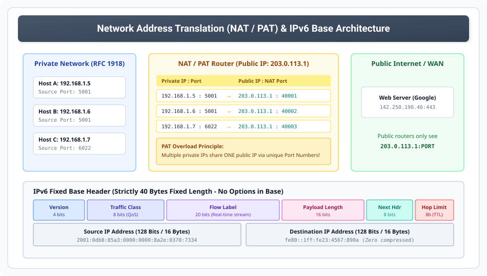

# Network Address Translation (NAT), PAT, and IPv6 Architecture

> **Unit 3: Network Layer (Core Routing & Addressing)**  
> **Course:** Computer Networks (BCS-603 / GATE CS / IT)  
> **Topic Depth:** NAT Mechanics (Static, Dynamic, PAT/Overload), Translation Tables, IPv6 128-bit Addressing, 40-Byte Fixed Base Header, IPv4 vs IPv6 Comparison & Transition Strategies

---

## 1. Network Address Translation (NAT) Kya Hai?

IPv4 addresses ki shortage ko handle karne ke liye **RFC 1631** ke tahat NAT introduce kiya gaya. 

### Core Idea:
Private home aur enterprise networks mein hum **Private IP Addresses (RFC 1918)** use karte hain (jaise `192.168.x.x` ya `10.x.x.x`). Yeh addresses public Internet par routable nahi hote. Jab koi private device Internet access karta hai, toh **NAT Router** uske private IP ko ek valid **Public Registered IP** mein translate kar deta hai.

---

## 2. Types of NAT

1. **Static NAT (One-to-One Mapping):**
   - Ek private IP hamesha ek fixed public IP par map hota hai.
   - Example: Internal Web Server `192.168.1.100` $\leftrightarrow$ Public IP `203.0.113.5`.
   - Mostly used jab bahar se incoming connections allow karne ho (Hosting servers).

2. **Dynamic NAT (Many-to-Many Mapping from Pool):**
   - Router ke paas registered public IPs ka ek pool hota hai.
   - Jab koi private host request bhejta hai, pool se pehla available public IP temporarily us host ko assign kar diya jata hai.
   - Agar pool ke saare IPs occupy ho gaye, toh next host ko wait karna padta hai.

3. **PAT (Port Address Translation / NAT Overload / NAPT):**
   - Sabse zyada use hone wala format!
   - Pure enterprise ya ghar ke hazaaron devices **sirf 1 single Public IP** share karte hain.
   - Translation identify karne ke liye Layer 4 ke **Port Numbers** use kiye jaate hain.

### NAT Translation Table Mechanics:

| Private IP : Port | Translated Public IP : Port | External Destination IP : Port | Protocol |
| :--- | :--- | :--- | :--- |
| `192.168.1.5 : 5001` | `203.0.113.1 : 40001` | `142.250.190.46 : 443` | TCP |
| `192.168.1.6 : 5001` | `203.0.113.1 : 40002` | `142.250.190.46 : 443` | TCP |
| `192.168.1.7 : 6022` | `203.0.113.1 : 40003` | `157.240.22.35 : 80` | TCP |

---

## 3. IPv6 Architecture & Address Representation

IPv4 ke total $2^{32} \approx 4.3 \text{ billion}$ addresses exhaust ho chuke the. Iska permanent solution **IPv6** hai:
- **Address Size:** $128$ bits ($16$ bytes).
- **Total Addresses:** $2^{128} \approx 3.4 \times 10^{38}$ addresses (Poore universe ke har particle ke liye sufficient!).

### Representation Rules (Hexadecimal Colon Notation):
1. **8 Groups of 16-bit Hexadecimal values**, separated by colons:
   `2001:0db8:85a3:0000:0000:8a2e:0370:7334`
2. **Rule of Leading Zeros:** Har block ke leading zeros ko omit kiya ja sakta hai (`0042` $\implies$ `42`, `0000` $\implies$ `0`).
3. **Double Colon Rule (`::`):** Consecutive blocks of zeros ko ek baar `::` se replace kiya ja sakta hai:
   `2001:0db8:0000:0000:0000:0000:1428:57ab` $\implies$ `2001:db8::1428:57ab`
   *(Rule: `::` can appear strictly once in an address to avoid ambiguity!)*

---

## 4. IPv6 Fixed Base Header (Strictly 40 Bytes)

IPv4 header variable length (20 to 60 bytes) tha jisse router parsing slow hoti thi. IPv6 ne isko **Fixed 40 Bytes** bana diya:

1. **Version (4 bits):** Value strictly `6` (`0110` binary).
2. **Traffic Class (8 bits):** IPv4 ke ToS / DiffServ jaisa (QoS prioritization).
3. **Flow Label (20 bits):** Specific real-time audio/video flows ko special non-default router handling provide karta hai.
4. **Payload Length (16 bits):** Base header ke baad aane wale data aur extension headers ka size (Bytes mein).
5. **Next Header (8 bits):** IPv4 ke Protocol field jaisa (indicates TCP=6, UDP=17, ya first Extension Header).
6. **Hop Limit (8 bits):** IPv4 ke TTL jaisa; har router par decrement hota hai. 0 par packet drop aur ICMPv6 message.
7. **Source Address (128 bits / 16 Bytes):** Sender ka complete 128-bit IPv6 address.
8. **Destination Address (128 bits / 16 Bytes):** Recipient ka complete 128-bit IPv6 address.

---

## 5. Comprehensive Comparison: IPv4 vs IPv6

| Feature | IPv4 | IPv6 |
| :--- | :--- | :--- |
| **Address Length** | 32 bits (4 bytes) | 128 bits (16 bytes) |
| **Address Space** | $\approx 4.3 \times 10^9$ addresses | $\approx 3.4 \times 10^{38}$ addresses |
| **Header Size** | Variable: 20 to 60 Bytes | Strictly Fixed: 40 Bytes |
| **Checksum Field** | Present in header (verified at every hop) | Removed (relying on L2 & L4 error control) |
| **Fragmentation** | Done by Routers and Sender Host | Done strictly by **Sender Host only** |
| **Configuration** | Manual or DHCP | SLAAC (Stateless Auto-configuration) or DHCPv6 |
| **Broadcast Support**| Present (Limited & Directed) | Replaced by **Multicast & Anycast** (No Broadcast) |

---

## 6. IPv4 to IPv6 Transition Strategies (AKTU 10-Marks)

1. **Dual Stack:** Routers aur hosts simultaneously dono IPv4 aur IPv6 protocol stacks run karte hain.
2. **Tunneling:** IPv6 packet ko standard IPv4 packet ke andar encapsulate karke IPv4 Internet ke through transport kiya jata hai.
3. **Header Translation / NAT-PT:** Direct IPv6 to IPv4 translation layer gateways.
