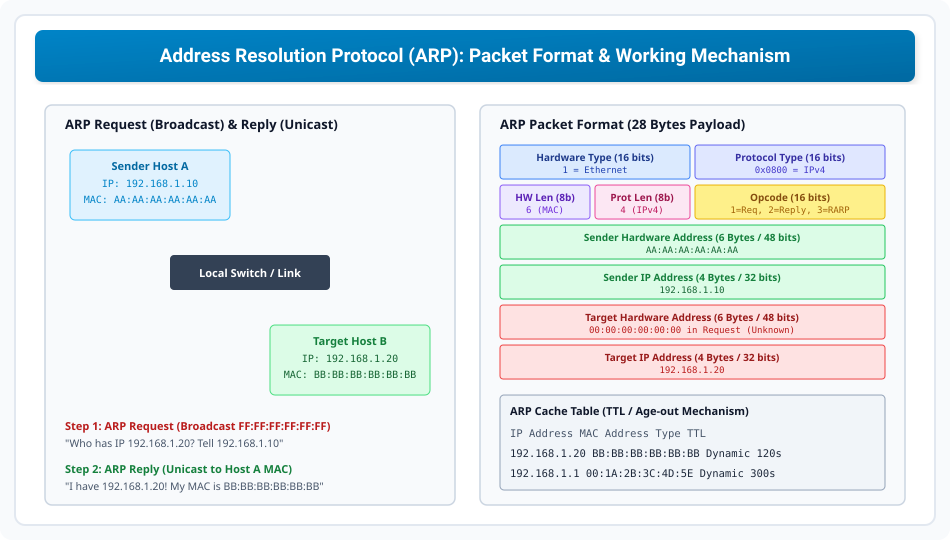

# Address Resolution Protocol (ARP) and RARP

> **Unit 3: Network Layer (Core Routing & Addressing)**  
> **Course:** Computer Networks (BCS-603 / GATE CS / IT)  
> **Topic Depth:** ARP Fundamentals, Request Broadcast vs Reply Unicast, 28-Byte Packet Format, ARP Cache Table & Age-Out, Proxy ARP, Gratuitous ARP, and RARP

---

## 1. ARP Ki Zaroorat Kyun Hai? (The Need for Address Resolution)

Computer Networks mein do tarah ke addresses hote hain:
1. **Logical Address (IP Address - Layer 3):** Universal delivery ke liye use hota hai (32-bit IPv4).
2. **Physical Address (MAC Address - Layer 2):** Local physical wire ya WiFi link par data frame deliver karne ke liye use hota hai (48-bit Ethernet MAC).

Jab Host A ko Host B tak IP packet bhejna hota hai, toh Data Link Layer ko destination ka **MAC address** chahiye hota hai. 
**ARP (Address Resolution Protocol - RFC 826)** logical IP address ko corresponding physical MAC address mein dynamically map karta hai:

$$\mathbf{Known:\ IP\ Address \xrightarrow{\text{ARP}} Discovered:\ MAC\ Address}$$

---

## 2. ARP Working Mechanism (Two-Step Process)

### Step 1: ARP Request (Broadcast)
- Jab sender ko destination IP ka MAC nahi pata hota, woh local network par ek **ARP Request packet** broadcast karta hai.
- **Ethernet Frame Destination MAC:** `FF:FF:FF:FF:FF:FF` (Broadcast address).
- Network ke saare hosts is frame ko receive aur inspect karte hain.
- Query hoti hai: *"Who has IP 192.168.1.20? Tell 192.168.1.10"*.
- Jin devices ka IP match nahi hota, woh packet ko quietly discard kar dete hain.

### Step 2: ARP Reply (Unicast)
- Jis target host ka IP query se match hota hai, woh apna physical MAC address send karta hai.
- Yeh reply **Unicast** hota hai (seedhe requester ke known MAC address par).
- Message hota hai: *"I have 192.168.1.20! My MAC is BB:BB:BB:BB:BB:BB"*.
- Requester host is mapping ko apne **ARP Cache** mein save kar leta hai.

---

## 3. ARP Packet Format (28 Bytes Payload)

ARP packet seedhe Ethernet frame ke data payload (EtherType `0x0806`) mein encapsulate hota hai:

1. **Hardware Type (16 bits):** Layer 2 network type. Ethernet ke liye value strictly `1` hoti hai.
2. **Protocol Type (16 bits):** Layer 3 protocol. IPv4 ke liye value `0x0800` hoti hai.
3. **Hardware Length (8 bits):** MAC address length in bytes (Ethernet = `6` bytes).
4. **Protocol Length (8 bits):** IP address length in bytes (IPv4 = `4` bytes).
5. **Opcode (16 bits):** Packet type specify karta hai:
   - `1` = ARP Request
   - `2` = ARP Reply
   - `3` = RARP Request
   - `4` = RARP Reply
6. **Sender Hardware Address (6 bytes):** Sender ka MAC address.
7. **Sender Protocol Address (4 bytes):** Sender ka IP address.
8. **Target Hardware Address (6 bytes):** Target ka MAC (ARP Request mein yeh all zeros `00:00:00:00:00:00` hota hai).
9. **Target Protocol Address (4 bytes):** Target ka IP address jiska MAC dhoondha ja raha hai.

---

## 4. The 4 Operational Scenarios of ARP

1. **Case 1 (Host to Host on Same Network):** Sender host target host ke liye seedhe ARP Request broadcast karta hai.
2. **Case 2 (Host to Host on Different Networks):** Sender host dekhta hai ki target IP kisi dusre network ka hai. Isliye sender apne **Default Gateway (Router interface)** ke MAC address ke liye ARP request bhejta hai!
3. **Case 3 (Router to Router across WAN/Link):** Intermediate router next-hop router ke interface ka MAC address nikalne ke liye ARP run karta hai.
4. **Case 4 (Router to Host on Destination Network):** Aakhri router destination subnet par packet deliver karne ke liye final host ke MAC address ke liye ARP bhejta hai.

---

## 5. ARP Cache Table & Special ARP Types

### ARP Cache:
Har network device (PC, server, router) ek local RAM cache maintain karta hai jisme recent `(IP, MAC, TTL)` mappings store hoti hain.
- **Dynamic Entries:** Auto-learned entries jinka ek timer (TTL, typically 2 to 20 minutes) hota hai. Time expire hone par entry drop ho jati hai taki stale mapping na rahe.
- **Static Entries:** Network admin manually enter karta hai (No expiration).

### Gratuitous ARP:
Jab koi host ek ARP Request broadcast karta hai jisme **Target IP khud ka apna IP hota hai!**
- **Purposes:**
  1. **IP Conflict Detection:** Agar network mein kisi aur device ke paas wahi same IP hai, toh alert trigger hota hai.
  2. **Update Cache on MAC Change:** NIC failover hone par sabhi switches aur routers ko naya MAC broadcast kar deta hai.

### Proxy ARP:
Jab router do subnets ke beech baith kar dusre subnet ke IP ke liye apne router interface ka MAC de deta hai.

---

## 6. RARP (Reverse Address Resolution Protocol)

$$\mathbf{Known:\ MAC\ Address \xrightarrow{\text{RARP}} Discovered:\ IP\ Address}$$

- **Use Case:** Diskless Workstations jo boot hone par ROM-burned MAC se apna IP dhoondhti thi.
- **Replacement:** RARP router boundary cross nahi kar pata tha aur subnet mask/gateway nahi de sakta tha. Isliye ise pehle **BOOTP** aur fir **DHCP** ne replace kiya.
