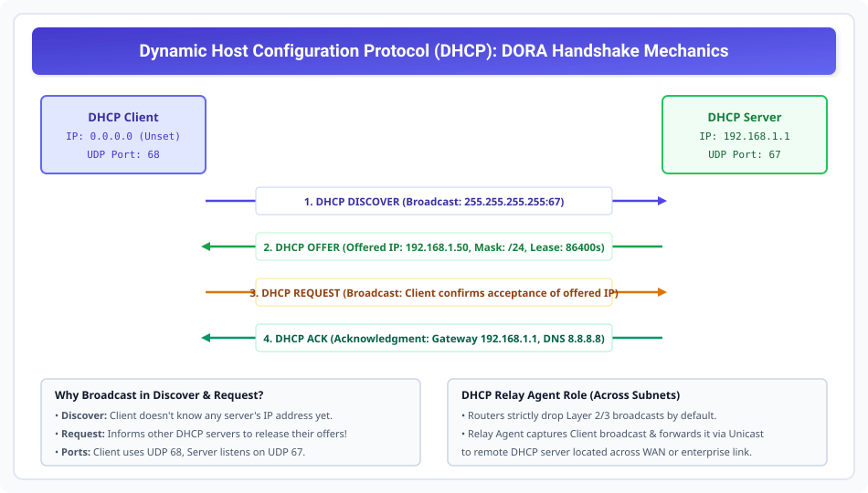

# Dynamic Host Configuration Protocol (DHCP)

> **Unit 3: Network Layer (Core Routing & Addressing)**  
> **Course:** Computer Networks (BCS-603 / GATE CS / IT)  
> **Topic Depth:** Dynamic IP Allocation, DORA 4-Step Handshake, UDP Port 67/68 Architecture, Lease Renewal, and DHCP Relay Agent across Subnets

---

## 1. DHCP Kya Hai aur Kyun Zaroorat Padi? (Need for DHCP)

Manual IP configuration (Static IP) chhooti labs ke liye theek tha, lekin enterprise campuses, Wi-Fi hotspots, aur mobile devices ke liye impossible hai:
- Agar 500 laptops roz campus me connect hote hain, to manual IP dene par **IP address conflict** aur human error hona tay hai.
- Laptop disconnect hone par uska IP lock rehta tha.

**DHCP (Dynamic Host Configuration Protocol - RFC 2131)** client-server architecture par operate karta hai. Yeh kisi bhi naye host ko network par aate hi automatically:
1. Valid **IP Address** assign karta hai.
2. **Subnet Mask** provide karta hai.
3. **Default Gateway** (Router IP) configure karta hai.
4. **DNS Server IP** addresses provide karta hai.
5. **Lease Time** set karta hai (e.g. 24 ghante).

---

## 2. The 4-Step DORA Handshake Process

Jab koi client network se connect hota hai, to **DORA** sequence execute hota hai:

### Step 1: DHCP DISCOVER (Client to Server - Broadcast)
- Client ke paas koi IP nahi hota ($0.0.0.0$).
- Client local link par broadcast frame bhejta hai:
  - **Source IP:** `0.0.0.0`, **Source Port:** UDP `68`
  - **Destination IP:** `255.255.255.255` (Limited Broadcast), **Dest Port:** UDP `67`
- Query: *"Is there any DHCP server on this network? I need an IP address!"*

### Step 2: DHCP OFFER (Server to Client - Broadcast / Unicast)
- Network ke DHCP servers client ki request sunte hain.
- Server apne available pool se ek IP reserve karta hai aur offer bhejta hai:
  - **Offered IP (yiaddr):** `192.168.1.50`
  - **Subnet Mask:** `255.255.255.0`
  - **Lease Time:** `86400` seconds (1 day)
  - **Server Identifier:** `192.168.1.1`

### Step 3: DHCP REQUEST (Client to Server - Broadcast)
- Agar network me multiple DHCP servers ne offer bheja ho, to client generally pehla receive hua offer select karta hai.
- Client dubara **Broadcast** bhejta hai:
  - Message: *"I accept Server 192.168.1.1's offer for IP 192.168.1.50!"*
- **Request Broadcast Kyun Hoti Hai?** Taki baki ke DHCP servers ko inform ho jaye ki unka offer reject ho gaya hai, aur wo apne reserved IPs ko pool me wapas release kar sakein!

### Step 4: DHCP ACK (Server to Client - Broadcast / Unicast)
- Selected server lease ko finalize karta hai aur client ko **DHCP ACK (Acknowledgment)** bhejta hai.
- Is packet me Default Gateway (`192.168.1.1`) aur DNS servers (`8.8.8.8`) ki complete configuration details hoti hain.
- Client official owner ban jata hai us IP address ka!

---

## 3. DHCP Lease Timers & Renewal Mechanism

DHCP IP permanent assignment nahi hota, balki ek temporary "Lease" hoti hai:
1. **$T_1$ Timer (50% Lease Time - Typically 12 Hours):**
   - Client server ko unicast **DHCP REQUEST** bhejkar lease extend karne ki request karta hai.
   - Server ACK bhejkar lease reset kar deta hai.
2. **$T_2$ Timer (87.5% Lease Time):**
   - Agar original server down tha aur reply nahi aaya, to client network par broadcast REQUEST bhejta hai taki koi doosra DHCP server use renew kar sake.
3. **Lease Expiration (100% Lease Time):**
   - Agar koi response nahi aata, to client ko wo IP release karna padta hai aur complete DORA process scratch se restart karni padti hai.

---

## 4. DHCP Relay Agent (Router Boundary Crossing)

- **The Problem:** Routers broadcast traffic (`255.255.255.255`) ko drop kar dete hain. Agar DHCP Server kisi central data center me ho (dusre subnet par), to client ka DHCP Discover us tak kabhi nahi pahunch payega!
- **The Solution:** Router interface par **DHCP Relay Agent (IP Helper Address)** configure kiya jata hai.
- Relay agent client ke L2 broadcast Discover packet ko intercept karta hai aur use ek standard **Unicast IP packet** me wrap karke remote DHCP server ke IP par forward kar deta hai!
