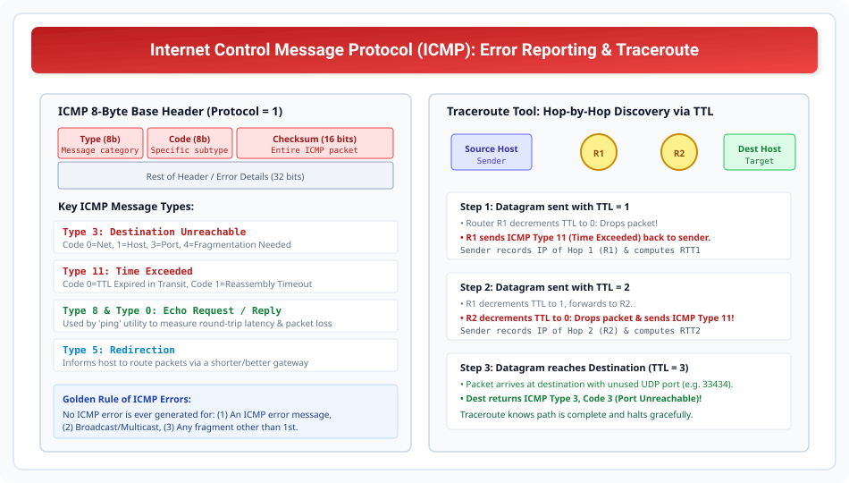

# Internet Control Message Protocol (ICMP)

> **Unit 3: Network Layer (Core Routing & Addressing)**  
> **Course:** Computer Networks (BCS-603 / GATE CS / IT)  
> **Topic Depth:** ICMP Role in Network Layer, Error Reporting vs Query Messages, Ping Diagnostics, and Step-by-Step Traceroute TTL Expiration Mechanics

---

## 1. ICMP Ki Zaroorat Kyun Padi? (Role of ICMP)

IPv4 protocol best-effort delivery provide karta hai. Isme do fundamental deficiencies hain:
1. **No Error-Reporting Mechanism:** Agar router ke paas buffer full ho jaye, TTL zero ho jaye, ya destination host offline ho, to IPv4 packet ko drop kar deta hai bina sender ko bataye.
2. **No Diagnostic Query Mechanism:** Host kisi remote router ya machine ki reachability test nahi kar sakta.

**ICMP (Internet Control Message Protocol - RFC 792)** in dono problems ko solve karta hai. Yeh Network Layer protocol hai (IP Protocol Field = `1`). ICMP packets seedhe IPv4 datagram ke andar encapsulate hote hain.

---

## 2. ICMP Message Categories & Types

ICMP messages do broad categories me divide hote hain:

### A. Error Reporting Messages:
1. **Destination Unreachable (Type 3):**
   - Code 0: Network Unreachable (No route in routing table).
   - Code 1: Host Unreachable (Host down / ARP failed).
   - Code 3: Port Unreachable (Transport layer port not listening).
   - Code 4: Fragmentation Needed but DF bit set (Path MTU discovery).
2. **Time Exceeded (Type 11):**
   - Code 0: TTL expired in transit (Value reached 0).
   - Code 1: Fragment reassembly timer expired at destination host.
3. **Parameter Problem (Type 12):** Header checksum ya header field invalid hai.
4. **Source Quench (Type 4 - Obsolete):** Router congested hone par sender ko slow down karne ka warning message.
5. **Redirection (Type 5):** Router host ko batata hai ki dusra router uske destination ke liye zyada optimal path par hai.

### B. Query Messages:
1. **Echo Request (Type 8) & Echo Reply (Type 0):** `ping` command dwara end-to-end reachability aur Round-Trip Time (RTT) measure karne ke liye use hota hai.
2. **Timestamp Request (Type 13) & Timestamp Reply (Type 14):** Clock synchronization aur link delay measurement.

---

## 3. Golden Rules: When ICMP Errors are NEVER Generated

Loop aur broadcast storms se bachne ke liye standard me strict rules define hain:
1. Kisi **ICMP Error message** ke drop hone par kabhi doosra ICMP error generate nahi hota!
2. Kisi **Broadcast ya Multicast address** par bheje gaye packet ke liye ICMP error create nahi hota.
3. Kisi fragment ke drop hone par sirf **1st Fragment** ke liye error banta hai, subsequent fragments ke liye nahi.

---

## 4. Working of Ping & Traceroute

### Ping Utility:
- Sender target IP par **ICMP Echo Request (Type 8, Code 0)** bhejta hai jisme sequence number aur timestamp hota hai.
- Target host **ICMP Echo Reply (Type 0, Code 0)** wapas bhejta hai.
- Sender RTT ($T_{\text{reply}} - T_{\text{request}}$) aur packet loss percentage display karta hai.

### Traceroute (Path Discovery Tool):
Traceroute source aur destination ke beech ke har intermediate router ka IP address discover karta hai:
1. **Hop 1:** Datagram bhejta hai with $\text{TTL} = 1$. Pehla router R1 TTL ko decrement karke $0$ karta hai, packet drop karta hai, aur **ICMP Type 11 (Time Exceeded)** reply karta hai. Sender R1 ka IP note karta hai!
2. **Hop 2:** Datagram bhejta hai with $\text{TTL} = 2$. R1 use forward karta hai with $\text{TTL} = 1$. R2 use drop karke ICMP Type 11 bhejta hai.
3. **Destination:** Aakhri destination par packet pahunchta hai with high invalid UDP port (e.g. 33434). Destination machine dekhti hai ki port open nahi hai, to wo **ICMP Type 3, Code 3 (Port Unreachable)** return karti hai. Traceroute samajh jata hai ki target reach ho gaya aur stop ho jata hai!
