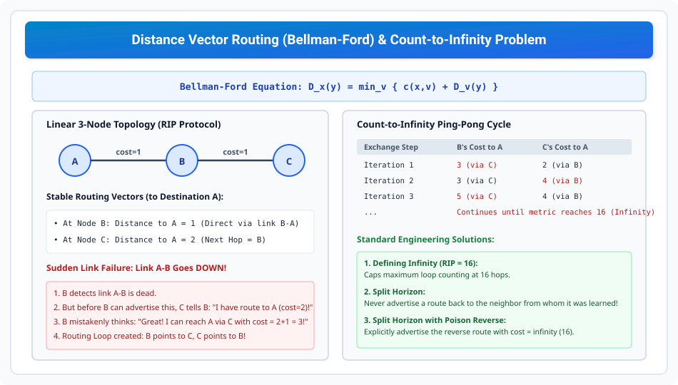

# Distance Vector Routing and Count-to-Infinity

> **Unit 3: Network Layer (Core Routing & Addressing)**  
> **Course:** Computer Networks (BCS-603 / GATE CS / IT)  
> **Topic Depth:** Bellman-Ford Mathematical Formulation, Distance Vector Routing Protocol (RIP), Periodic Neighbor Updates, Count-to-Infinity Routing Loops & Solutions (Split Horizon, Poison Reverse)

---

## 1. Routing Protocols Overview (Intra vs Inter-Domain)

Internet par routing do broad categories me hoti hai:
1. **Intra-Domain Routing (IGP - Interior Gateway Protocol):** Ek hi Autonomous System (AS) ke andar routing. Examples: **RIP** (Distance Vector), **OSPF** (Link State).
2. **Inter-Domain Routing (EGP - Exterior Gateway Protocol):** Alag-alag AS ke beech routing. Example: **BGP** (Path Vector).

---

## 2. Distance Vector Routing (Bellman-Ford Principle)

Distance Vector Routing ek **Distributed, Asynchronous, Iterative** algorithm hai jo **Bellman-Ford Algorithm** par kaam karta hai:
- **Core Concept:** *"Share your entire routing table with your immediate neighbors only, periodically."*
- Routing information protocol (RIP) har 30 seconds me apne routing table updates broadcast karta hai.

### The Bellman-Ford Equation:
Agar node $x$ ko destination $y$ tak shortest distance nikalna hai:

$$D_x(y) = \min_v \Big\{ c(x,v) + D_v(y) \Big\}$$

Jahan:
- $c(x,v)$ = Node $x$ se uske neighbor $v$ tak ka direct link cost.
- $D_v(y)$ = Neighbor $v$ se destination $y$ tak ka reported shortest distance.

---

## 3. The Count-to-Infinity Problem

Distance Vector Routing me **"Good news travels fast, but bad news travels slowly"**. Jab koi link break hota hai, to routing loops form ho jate hain jise **Count-to-Infinity Problem** kehte hain.

### Step-by-Step Failure Scenario:
Consider linear topology: $\mathbf{A \longleftrightarrow B \longleftrightarrow C}$ (Har link cost = $1$).
1. **Normal State:**
   - B ka distance to A = $1$ (direct).
   - C ka distance to A = $2$ (via B).
2. **Link A-B Fails:**
   - B detects link A-B is dead. B ko pata hai A unreachable hai.
   - Lekin uske update bhejne se pehle, C ka regular update B ke paas aata hai: *"I can reach A with cost 2!"*
   - B sochta hai: *"Oh, C ke paas A tak jaane ka rasta hai! Main C ke through jaunga with cost $2 + 1 = 3$."*
   - B apni table update karke C ko batata hai: *"My cost to A is now 3."*
   - C dekhta hai B ka cost 3 ho gaya, to C apna cost update karke $3 + 1 = 4$ kar leta hai!
3. **The Loop:**
   - Dono nodes ek doosre ke reference me metric badhate rehte hain ($3 \to 4 \to 5 \to 6 \dots$).
   - Packet B aur C ke beech ping-pong bounce karta rehta hai jab tak metric maximum threshold cross na kar le!

---

## 4. Engineering Solutions to Count-to-Infinity

1. **Defining Infinity (Hop Count Cap):**
   - Routing Information Protocol (RIP) me maximum distance ko **16** set kiya gaya hai.
   - Metric $16$ ka matlab hota hai **$\infty$ (Unreachable)**. Isse loop kam se kam 16 iterations ke baad terminate ho jata hai.
2. **Split Horizon:**
   - **Rule:** *"Never advertise a route back to the neighbor from whom it was learned."*
   - Kyunki C ne A tak ka route B se seekha tha, isliye C kabhi bhi A ka route B ko advertise nahi karega. Loop instantly prevent ho jata hai!
3. **Split Horizon with Poison Reverse:**
   - C चुप rehne ke bajaye B ko explicitly batata hai ki A tak uska distance **$\infty$ (16)** hai: *"Main A tak ja sakta hoon, par tumhare liye cost infinity hai!"*
   - Yeh ensure karta hai ki B kabhi bhi galti se C ka route consider na kare.
4. **Hold-down Timers:**
   - Link down hone par router kisi bhi naye route update ko accept karne se pehle ek fixed time (e.g. 180s) tak wait karta hai taki false updates network se flush ho sakein.
