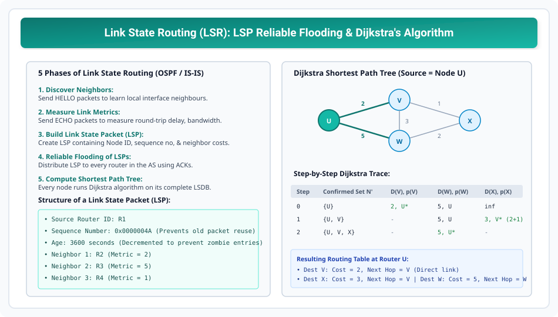

# Link State Routing and Dijkstra Algorithm

> **Unit 3: Network Layer (Core Routing & Addressing)**  
> **Course:** Computer Networks (BCS-603 / GATE CS / IT)  
> **Topic Depth:** Link State Architecture (OSPF / IS-IS), LSP Creation, Reliable Flooding, Dijkstra Shortest Path Tree Algorithm, and DVR vs LSR Comparison

---

## 1. Link State Routing (LSR) Ka Philosophy

Distance Vector Routing me har router "rumors" (neighbors ke claim) par vishwas karta tha. 
**Link State Routing (LSR)** iske bilkul viprit kaam karta hai:
- **Core Principle:** *"Tell everyone in the network about your immediate neighbors only."*
- Har router poore network ki **complete topology graph** (Link State Database - LSDB) apne local memory me store karta hai.
- Router apne local LSDB par independent **Dijkstra's Algorithm** execute karta hai aur source se sabhi destinations tak ka Shortest Path Tree compute karta hai.

---

## 2. The 5 Phases of Link State Routing

LSR 5 sequential phases me execute hota hai:

1. **Discover Immediate Neighbors:** Har interface par **HELLO packets** bhejkar pata lagata hai ki samne kaunsa router connected hai.
2. **Measure Link Metrics:** Neighbor ko **ECHO packet** bhejkar round-trip delay, link throughput, ya cost compute karta hai.
3. **Build Link State Packet (LSP):** Router ek standardized LSP packet create karta hai:
   - Sender Router ID.
   - Sequence Number (duplicate detection ke liye).
   - Age Timer (stale packets expire karne ke liye).
   - List of directly connected neighbors and their corresponding link costs.
4. **Reliable Flooding of LSPs:** LSP ko sabhi interfaces par flood kiya jata hai. Routers LSPs ko aage re-flood karte hain with ACKs. Kuch hi milliseconds me autonomous system ke sabhi routers ke paas identical LSDB ban jata hai!
5. **Compute Shortest Paths via Dijkstra:** Router LSDB ko graph me convert karke source node ko root mankar Dijkstra algorithm run karta hai aur local Forwarding Table generate karta hai.

---

## 3. Step-by-Step Dijkstra Algorithm (AKTU 10-Marks Solved)

### Graph Specifications:
- Nodes: $U, V, W, X$
- Direct Edges:
  - $c(U,V) = 2$, $c(U,W) = 5$
  - $c(V,X) = 1$, $c(V,W) = 3$
  - $c(W,X) = 2$
- **Source Router:** $U$

### Algorithm Steps:
- Let $N'$ = Set of nodes whose least-cost path is definitively known.
- Initially: $N' = \{U\}$, $D(V) = 2$, $D(W) = 5$, $D(X) = \infty$.

| Step | Confirmed Set $N'$ | $D(V), p(V)$ | $D(W), p(W)$ | $D(X), p(X)$ | Notes |
| :--- | :--- | :--- | :--- | :--- | :--- |
| **0** | $\{U\}$ | $\mathbf{2, U}$ (Min) | $5, U$ | $\infty$ | Select $V$ (Minimum tentative cost = 2) |
| **1** | $\{U, V\}$ | Confirmed | $\min(5, 2+3) = 5, U$ | $\mathbf{\min(\infty, 2+1) = 3, V}$ | Select $X$ (Minimum cost = 3) |
| **2** | $\{U, V, X\}$ | Confirmed | $\mathbf{\min(5, 3+2) = 5, U}$ | Confirmed | Select $W$ (Cost = 5) |
| **3** | $\{U, V, X, W\}$ | Confirmed | Confirmed | Confirmed | All nodes permanently visited! |

### Derived Forwarding Table at Router U:

| Destination Node | Shortest Path Metric | Next-Hop Interface |
| :--- | :--- | :--- |
| **V** | 2 | Outgoing link to V |
| **X** | 3 | Outgoing link to V |
| **W** | 5 | Outgoing link to W |

---

## 4. Comprehensive 8-Point Comparison: DVR vs LSR

| Parameter | Distance Vector Routing (DVR / RIP) | Link State Routing (LSR / OSPF) |
| :--- | :--- | :--- |
| **Algorithm Used** | Bellman-Ford Algorithm | Dijkstra's Shortest Path Algorithm |
| **Topology View** | No global view (Knows only neighbor vectors) | Complete global topology map in LSDB |
| **Information Shared**| Entire routing table | List of direct neighbors & costs only |
| **Recipient** | Immediate neighbors only | Flooded to **ALL** routers in the network |
| **Convergence Speed**| Slow (Prone to routing loops & ping-pong) | Extremely fast convergence |
| **Routing Loops** | Suffers from Count-to-Infinity problem | Loop-free (Calculated on consistent graph) |
| **Memory / CPU** | Low memory & CPU overhead | High RAM (LSDB) & CPU overhead for Dijkstra |
| **Scalability** | Limited (Max 15 hops in RIP) | Highly scalable (OSPF Areas & Hierarchy) |
