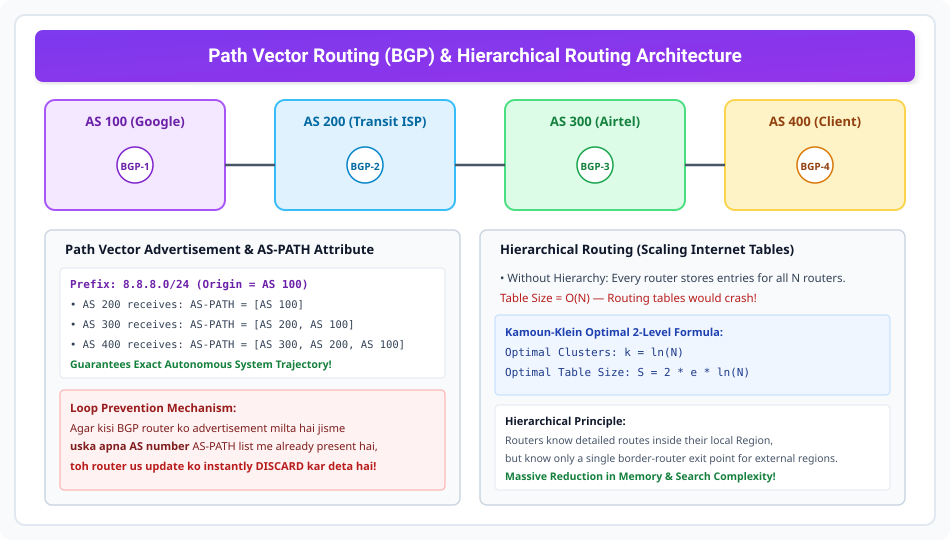

# Path Vector, Hierarchical Routing, and BGP

> **Unit 3: Network Layer (Core Routing & Addressing)**  
> **Course:** Computer Networks (BCS-603 / GATE CS / IT)  
> **Topic Depth:** Inter-Domain Routing Challenges, Path Vector Algorithm, Border Gateway Protocol (BGP-4), AS-PATH Loop Prevention, and Hierarchical Routing Scalability

---

## 1. Global Internet Scale par DVR aur LSR Kyun Fail Ho Jate Hain?

Internet millions of routers aur networks ka collection hai:
1. **DVR Fail Kyun Hua?** Bellman-Ford Count-to-Infinity problem se joojhta hai aur global scale par converge hone me ghanton laga dega. Saath hi yeh business policies support nahi kar sakta.
2. **LSR Fail Kyun Hua?** Link State Routing me har router ko poore Internet ke har link ki information LSDB me rakhni padegi. Millions of links ke LSPs flood hone par router memory crash ho jayegi aur Dijkstra algorithm router CPU ko fry kar dega!
3. **Policy Conflicts:** Organization A chahti hai ki uska traffic competitor B ke network se na guzre. LSR aur DVR strictly shortest path chunte hain, business contracts nahi!

Isliye global Internet inter-domain routing ke liye **Path Vector Routing** aur **BGP (Border Gateway Protocol)** use karta hai.

---

## 2. Path Vector Routing & Border Gateway Protocol (BGP)

Internet multiple **Autonomous Systems (AS)** me divided hai (jaise AS 100 = Google, AS 200 = Airtel, AS 300 = Tata Communications).

### BGP Path Vector Mechanics:
- BGP routers (Border / Speaker nodes) destination network prefix ke saath complete **AS-PATH** list advertise karte hain:
  $$\text{Prefix: } 8.8.8.0/24 \implies \text{AS-PATH: } [\text{AS 300}, \text{AS 200}, \text{AS 100}]$$
- Router ko pata hota hai ki packet exactly kaunse Autonomous Systems se hokar jayega.

### Loop Prevention via AS-PATH:
- Jab kisi BGP router ko advertisement milta hai, to wo dekhta hai: *"Kya is AS-PATH list me mera apna AS Number present hai?"*
- Agar haan, to packet loop create karega! Router us advertisement ko **instantly discard** kar deta hai.
- Yeh zero-latency loop prevention provide karta hai bina count-to-infinity ke!

### Policy-Based Routing:
BGP cost ya distance ke basis par nahi, balki **Commercial Policies** ke basis par faisla karta hai:
- Peering contracts (Transit vs Free peering).
- Geopolitical aur legal data flow constraints.

---

## 3. Hierarchical Routing & Table Size Optimization

Agar flat routing table me $N$ routers ho, to har router ko $N$ entries store karni padti hain ($O(N)$ memory).

### The Solution: Regions and Clusters
Routers ko hierarchically divide kiya jata hai:
- **Internal Routers:** Apne local Region ke routers ka exact address jante hain.
- **Border Routers:** Bahar ke kisi bhi region ke liye sirf ek single border exit entry rakhte hain.

### Kamoun-Klein Optimal 2-Level Formula:
Agar total $N$ routers hain, to optimal routing table size pane ke liye:
- Optimal number of clusters / regions:
  $$k = \ln N$$
- Minimum total routing table size:
  $$S = 2 \cdot e \cdot \ln N$$
- Table size $N$ se ghat kar logarithmic scale par aa jata hai!
