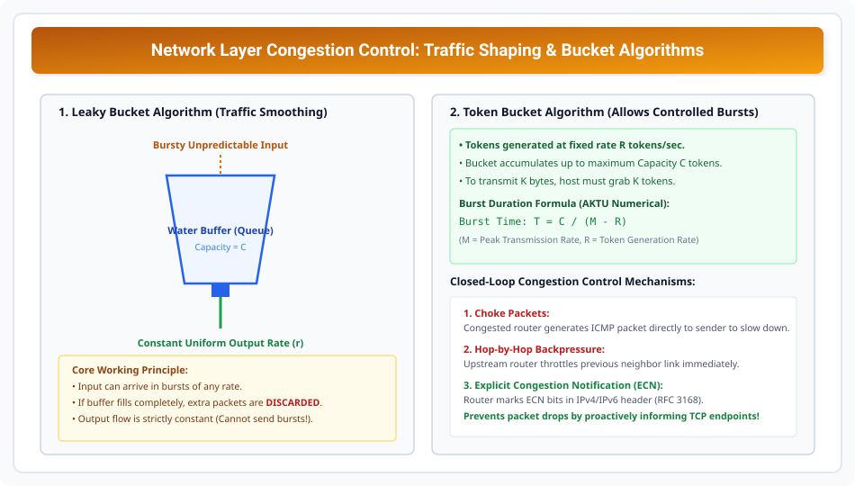

# Congestion Control, QoS, and Unit 3 AKTU PYQs

> **Unit 3: Network Layer (Core Routing & Addressing)**  
> **Course:** Computer Networks (BCS-603 / GATE CS / IT)  
> **Topic Depth:** Network Layer Congestion Mechanisms, Open-Loop vs Closed-Loop Control, Leaky Bucket vs Token Bucket Algorithms, and Solved AKTU Previous Year Questions (PYQs)

---

## 1. Network Layer Congestion Kya Hai?

Jab network me injected packets ki sankhya network links ki carrying capacity aur router queue buffers se zyada ho jaati hai, to **Congestion** create hota hai.
- **Congestion Collapse:** Packets queue me drop hote hain $\implies$ Sender retransmit karta hai $\implies$ Traffic aur badhta hai $\implies$ Network throughput almost ZERO par drop ho jata hai!

### Congestion Control vs Flow Control:
- **Flow Control:** Point-to-point mechanism (Fast sender vs Slow receiver). Transport Layer (TCP sliding window) handle karta hai.
- **Congestion Control:** Global network core mechanism (Routers aur intermediate switches traffic load balance karte hain).

---

## 2. Taxonomies of Congestion Control

### A. Open-Loop Policies (Prevention - Good Design):
Congestion hone se pehle hi use prevent karna:
1. **Retransmission Policy:** Smart timers use karna taki bekar ke retransmissions na ho.
2. **Window Policy:** Selective Repeat instead of Go-Back-N.
3. **Discarding Policy:** Congestion hone par non-essential packets (e.g. low-priority video frames) pehle drop karna.

### B. Closed-Loop Policies (Detection & Reaction):
Congestion hone ke baad dynamically react karna:
1. **Choke Packets:** Router congested hone par source host ko direct ICMP message bhejta hai: *"Slow down your injection rate!"*
2. **Hop-by-Hop Backpressure:** Har intermediate router apne pichle neighbor link ko temporarily throttle karta hai.
3. **Explicit Congestion Notification (ECN - RFC 3168):** Router packet drop karne ke bajaye IP header ke ECN bits (`11`) set kar deta hai. Receiver TCP ACK me ECE flag bhejta hai aur sender window half kar leta hai!

---

## 3. Traffic Shaping: Leaky Bucket vs Token Bucket

Traffic shaping bursty unpredictable traffic ko smooth stream me convert karti hai.

### 1. Leaky Bucket Algorithm:
- **Concept:** Ek bucket jisme bottom me ek chhota hole hai. Chahe upar se paani kisi bhi speed se aaye, bottom se paani **constant uniform rate** par hi bahaega.
- **Property:** Completely eliminates bursts. Rigid constant output rate $r$.
- **Disadvantage:** Bursty nature ko accommodate nahi kar sakta; buffer overflow par packets drop ho jate hain chahe network link idle ho!

### 2. Token Bucket Algorithm:
- **Concept:** Bucket me constant rate $R$ par tokens accumulate hote hain (up to max capacity $C$). Data packet tabhi nikal sakta hai jab wo corresponding tokens grab kare.
- **Property:** Allows controlled **Bursty Transmissions** up to token capacity $C$, while maintaining average rate $R$.

### Token Bucket Numerical (AKTU Long Question Standard):
> **Question:** Ek Token Bucket system me capacity $C = 1 \text{ MegaByte}$ hai. Token generation rate $R = 10 \text{ MB/sec}$ hai. Maximum transmission rate (Burst capacity) $M = 50 \text{ MB/sec}$ hai. Calculate kijiye ki maximum burst kitne time tak sustain ho sakti hai?

#### Formula:
$$T = \frac{C}{M - R}$$

#### Calculation:
$$T = \frac{1 \text{ MB}}{50 \text{ MB/s} - 10 \text{ MB/s}} = \frac{1}{40} \text{ seconds} = \mathbf{25\text{ milliseconds}}$$

---

## 4. Master Solved AKTU Previous Year Questions (PYQs)

### PYQ 1: Differentiate between Virtual Circuit and Datagram Networks. (AKTU 10 Marks)
- **Answer Structure:** Setup phase requirement (Datagram: none vs VC: 3-way handshake), Addressing overhead (32-bit IP vs small VCI tag), Router state (Stateless vs Stateful), Failure impact (Dynamic reroute vs All VCs terminate), QoS guarantees. *(Refer to Module 01 detailed table)*.

### PYQ 2: Explain IPv4 datagram header format with neat diagram. (AKTU 10 Marks)
- **Answer Structure:** 20 to 60 bytes structure, explain 14 fields (VER, HLEN, ToS, Total Length, Identification, Flags DF/MF, Fragment Offset, TTL, Protocol, Header Checksum, Source/Dest IP, Options). *(Refer to Module 02)*.

### PYQ 3: An organization has network address 192.168.10.0/24. Subnet it into 4 equal subnets. Find subnet mask, valid IP ranges, and broadcast addresses. (AKTU 10 Marks)
- **Answer Structure:** Borrow $s=2$ bits ($2^2 = 4$). Mask = `255.255.255.192` (/26). Subnet IDs: `.0`, `.64`, `.128`, `.192`. Valid host ranges: `.1-.62`, `.65-.126`, `.129-.190`, `.193-.254`. Broadcasts: `.63`, `.127`, `.191`, `.255`. *(Refer to Module 05)*.

### PYQ 4: What is Count-to-Infinity problem in Distance Vector Routing? How is it resolved? (AKTU 10 Marks)
- **Answer Structure:** Explain linear 3-node topology with link failure timeline. Show routing loop increment step-by-step. Detail 3 solutions: Infinity cap (16), Split Horizon, and Split Horizon with Poison Reverse. *(Refer to Module 11)*.
