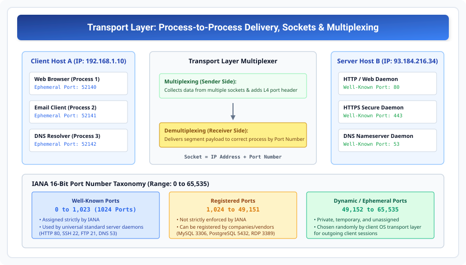

# Transport Layer Services and Port Addressing

> **Unit 4: Transport Layer**  
> **Course:** Computer Networks (BCS-603 / GATE CS / IT)  
> **Topic Depth:** End-to-End Delivery, Process-to-Process Addressing, Port Taxonomy (0-65535), Sockets, Multiplexing vs Demultiplexing, and Connection Paradigms

---

## 1. Transport Layer Ka Core Role (Process-to-Process Delivery)

Network Layer (Layer 3) sirf **Host-to-Host** delivery karti hai (Source Machine se Destination Machine tak IP packet deliver karna). Lekin ek computer par simultaneously multiple applications run ho rahi hoti hain (e.g., Chrome browser, Spotify, Zoom meeting, Email).
- Network Layer yeh nahi jaanti ki incoming packet kis application process ka hai!
- **Transport Layer (Layer 4)** ki main responsibility hoti hai **Process-to-Process Delivery** (end-to-end communication).
- Yeh message ko intact, in-order aur error-free pahunchane ke liye L4 addressing provide karta hai jise **Port Address** kehte hain.

$$\text{Data Link: Node-to-Node (MAC)} \longleftrightarrow \text{Network: Host-to-Host (IP)} \longleftrightarrow \mathbf{Transport:\ Process-to-Process\ (Port)}$$

---

## 2. Port Numbers Taxonomy & Sockets

Port numbers 16-bit unsigned integers hote hain (Range: $0$ to $2^{16} - 1 = 65,535$).

### IANA Classification of Ports:

| Category | Port Range | Assigned By | Purpose / Typical Examples |
| :--- | :--- | :--- | :--- |
| **Well-Known Ports** | `0` – `1,023` | IANA (Strictly controlled) | Universal server daemons: HTTP (80), HTTPS (443), FTP (20/21), SSH (22), DNS (53), SMTP (25). |
| **Registered Ports** | `1,024` – `49,151` | IANA registration (Not restricted) | Vendor services: MySQL (3306), PostgreSQL (5432), RDP (3389), Microsoft SQL (1433). |
| **Dynamic / Ephemeral Ports**| `49,152` – `65,535` | Local OS dynamically assigns | Temporary client ports generated randomly for outgoing sessions. Discarded upon session close. |

### Socket Address:
Kisi bhi network connection ko uniquely identify karne ke liye ek **Socket** banaya jata hai:

$$\mathbf{Socket\ Address = (\text{IP Address}) \ :\ (\text{Port Number})}$$

Example: Client Socket `192.168.1.10:52140` connected to Server Socket `93.184.216.34:80`.
Internet par har TCP/UDP connection **5-Tuple** dwara uniquely define hota hai:
$$\{\text{Source IP}, \text{Source Port}, \text{Destination IP}, \text{Destination Port}, \text{Protocol (TCP/UDP)}\}$$

---

## 3. Multiplexing and Demultiplexing

- **Multiplexing (Sender Side):** Ek single machine par chal rahe different processes apne-apne sockets se data bhejte hain. Transport Layer sabhi data streams ko collect karke unke aage Port headers lagati hai aur ek common Network Layer (IP) ko deliver karti hai.
- **Demultiplexing (Receiver Side):** Jab Network Layer se datagrams aate hain, Transport Layer header me se **Destination Port Number** read karti hai aur packet ko exact destination process ki incoming queue me deliver karti hai.

---

## 4. Connectionless vs Connection-Oriented Services

| Parameter | Connectionless (UDP) | Connection-Oriented (TCP) |
| :--- | :--- | :--- |
| **Handshake Setup** | No connection establishment | Mandatory 3-way handshake before data transfer |
| **Packet Sequence** | Packets treated independently (May arrive out-of-order) | Segments strictly numbered & delivered in-order |
| **Reliability** | Unreliable (No ACK, no retransmission) | Reliable (Positive ACK, RTO retransmissions) |
| **Overhead** | Minimal (8-byte header) | Higher (20 to 60-byte header) |
| **Use Cases** | Real-time audio/video, DNS, gaming | Web browsing, Email, File transfer, Banking |
