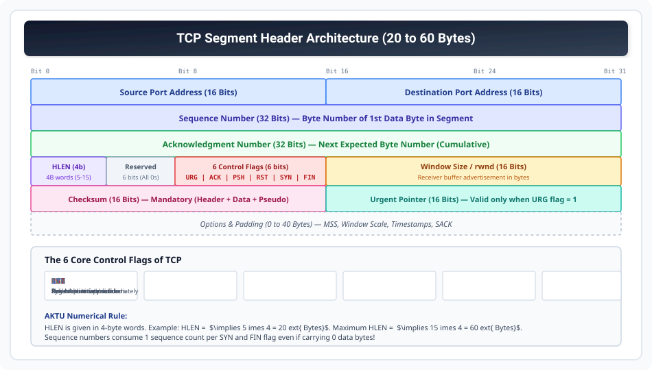

# TCP Foundations and Segment Header Format

> **Unit 4: Transport Layer**  
> **Course:** Computer Networks (BCS-603 / GATE CS / IT)  
> **Topic Depth:** Byte-Stream Abstraction, Circular Buffers, 20-60 Byte Header Format, 14 Fields, 6 Control Flags, and Solved AKTU Hex Header Dump Numericals

---

## 1. TCP Ki Core Characteristics (Transmission Control Protocol)

TCP (**RFC 793**) Internet ka primary reliable, connection-oriented protocol hai:
1. **Byte-Stream Service:** TCP data ko structured blocks ke roop me nahi dekhta, balki continuous stream of bytes ke roop me treat karta hai.
2. **Circular Sending & Receiving Buffers:** Sender aur Receiver dono memory buffers (queues) maintain karte hain jo application write/read speed aur network transmission speed ke mismatch ko balance karte hain.
3. **Full-Duplex Communication:** Ek hi connection par dono parties simultaneously data send aur receive kar sakti hain.
4. **Segment Formation:** TCP byte stream me se chunks collect karta hai, apna header attach karta hai aur **Segment** create karke IP layer ko deta hai.

---

## 2. TCP Segment Header Anatomy (20 to 60 Bytes)

### Field-by-Field Breakdown (32 Bits per Row):

1. **Source Port Address (16 bits):** Sending process ka port number.
2. **Destination Port Address (16 bits):** Receiving process ka port number.
3. **Sequence Number (32 bits):** Segment ke pehle data byte ka sequential byte number. Connection setup ke waqt yeh **ISN (Initial Sequence Number)** hota hai.
4. **Acknowledgment Number (32 bits):** **Cumulative ACK**. Receiver agla kaunsa byte number expect kar raha hai ($N + 1$).
5. **Header Length / HLEN (4 bits):** Header size in **4-byte words**:
   - Minimum: $5 \implies 5 \times 4 = 20\text{ Bytes}$ (No options).
   - Maximum: $15 \implies 15 \times 4 = 60\text{ Bytes}$ (40 bytes options).
6. **Reserved (6 bits):** Future use ke liye reserved (Must be zeros).
7. **Control Flags (6 bits):**
   - **URG:** Urgent pointer field is valid.
   - **ACK:** Acknowledgment number field is valid.
   - **PSH:** Push data to application layer immediately (bypassing receive buffer).
   - **RST:** Reset the connection abruptly.
   - **SYN:** Synchronize sequence numbers during connection establishment.
   - **FIN:** Terminate the connection gracefully.
8. **Window Size / rwnd (16 bits):** Receiver buffer me kitne bytes free hain (Credit-based Flow Control). Maximum value $= 65,535\text{ Bytes}$ (Window scale option se 1 GB tak extend ho sakta hai).
9. **Checksum (16 bits):** Mandatory error detection field covering Header, Data, aur 12-byte Pseudo-header.
10. **Urgent Pointer (16 bits):** Offset indicating end of urgent data when `URG = 1`.
11. **Options (0 to 40 bytes):** MSS (Maximum Segment Size), Window Scale, SACK (Selective ACK), Timestamps.

---

## 3. Solved AKTU Hex Header Dump Numerical (10-Marks Standard)

> **Question (AKTU 2023-24):** TCP header ka hexadecimal dump niche diya gaya hai:
> `05 32 00 17 00 00 00 01 00 00 00 00 50 02 07 FF 00 00 00 00`
> Find kijiye:
> 1. Source Port Number & Destination Port Number kya hai?
> 2. Sequence Number & Acknowledgment Number kya hai?
> 3. Header Length kitni hai?
> 4. Kaunse Flags set hain?
> 5. Window Size kya hai?

### Step-by-Step Solution:
- **Byte 0-1 (`05 32`):** Source Port $= 0x0532 = (5 \times 256) + (3 \times 16) + 2 = 1280 + 48 + 2 = \mathbf{1330}$.
- **Byte 2-3 (`00 17`):** Destination Port $= 0x0017 = (1 \times 16) + 7 = \mathbf{23}$ (Telnet service!).
- **Byte 4-7 (`00 00 00 01`):** Sequence Number $= 0x00000001 = \mathbf{1}$.
- **Byte 8-11 (`00 00 00 00`):** Acknowledgment Number $= \mathbf{0}$.
- **Byte 12 (`50`):** 
  - Pehle 4 bits $= 5$ (HLEN). $\text{Header Length} = 5 \times 4 = \mathbf{20\text{ Bytes}}$.
  - Reserved bits $= 0$.
- **Byte 13 (`02`):** Flags in binary: `00000010_2`.
  - Order: `URG ACK PSH RST SYN FIN`
  - Bit 1 is 1 $\implies$ **SYN Flag is SET!** (Yeh ek Connection Request segment hai).
- **Byte 14-15 (`07 FF`):** Window Size $= 0x07FF = (7 \times 256) + 255 = 1792 + 255 = \mathbf{2047\text{ Bytes}}$.
