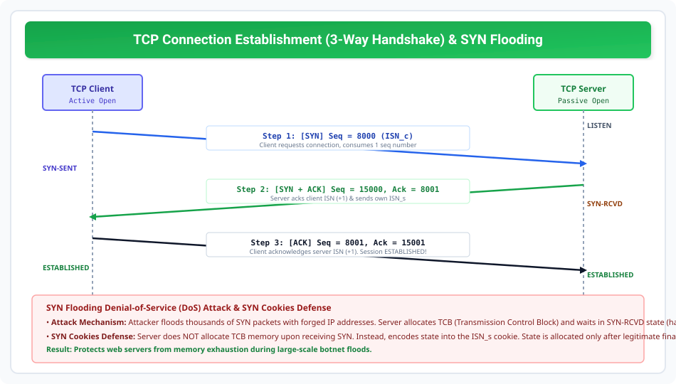

# TCP Connection Establishment and SYN Flooding

> **Unit 4: Transport Layer**  
> **Course:** Computer Networks (BCS-603 / GATE CS / IT)  
> **Topic Depth:** Three-Way Handshake Protocol, Sequence Number Synchronization, SYN Packet Overhead, SYN Flooding DoS Attacks, and SYN Cookies Defense

---

## 1. Three-Way Handshaking Protocol (AKTU 10-Marks)

TCP connection-oriented protocol hai. Data exchange shuru karne se pehle dono endpoints ko connection establish karna padta hai:

### The 3 Steps of Handshake:

1. **Step 1: Client to Server (`SYN` Segment):**
   - Client process active open execute karti hai.
   - Client ek segment bhejta hai jisme **SYN flag = 1** hota hai.
   - Client apna **Initial Sequence Number (ISN_c)** choose karta hai (e.g., `seq = 8000`).
   - *Rule:* SYN segment koi real data carry nahi karta, lekin yeh strictly **1 sequence number consume karta hai!**
   - Client enters `SYN-SENT` state.

2. **Step 2: Server to Client (`SYN + ACK` Segment):**
   - Server passive open state (`LISTEN`) me client ka SYN receive karta hai.
   - Server reply me **SYN = 1** aur **ACK = 1** bhejta hai.
   - Server client ke sequence number ko acknowledge karta hai: `ack = 8001` (ISN_c + 1).
   - Server apna khud ka Initial Sequence Number bhejta hai: `seq = 15000` (ISN_s).
   - Server enters `SYN-RCVD` state.

3. **Step 3: Client to Server (`ACK` Segment):**
   - Client server ke response ko acknowledge karta hai: **ACK = 1**, `ack = 15001` (ISN_s + 1), `seq = 8001`.
   - Yeh 3rd segment real application data bhi carry kar sakta hai!
   - Dono parties `ESTABLISHED` state me enter karti hain. Ab full-duplex data transfer start ho sakta hai.

---

## 2. SYN Flooding Attack (Denial of Service)

### Attack Mechanics:
- Attacker ek automated tool se server par hazaaron **SYN segments** bhejta hai with random/forged (spoofed) source IP addresses.
- Server har request ke liye resources (Transmission Control Block - TCB buffer) allocate karta hai, SYN+ACK bhejta hai, aur Step 3 ke final ACK ka intezaar karta hai.
- Kyunki source IPs fake hain, final ACK kabhi nahi aata!
- Server ka connection table (`SYN-RCVD` half-open connections) completely full ho jata hai.
- Legitimate genuine clients connect nahi kar paate $\implies$ **Denial of Service (DoS)**!

### Mitigation Strategies:
1. **SYN Cache / Reducing Timeout:** Half-open connections ka timer kam kar dena.
2. **SYN Cookies (RFC 4987 - Industry Standard):**
   - Server SYN receive hone par **TCB buffer allocate nahi karta!**
   - Server ISN_s ko ek cryptographic hash banata hai:
     $$\text{ISN}_s = \text{Hash}(\text{Src IP}, \text{Src Port}, \text{Dst IP}, \text{Dst Port}, \text{Secret Key}) + \text{Timestamp}$$
   - Jab legitimate client se Step 3 ACK aata hai, server cookie ko mathematically verify karta hai. Cookie valid hone par hi memory allocate hoti hai!
