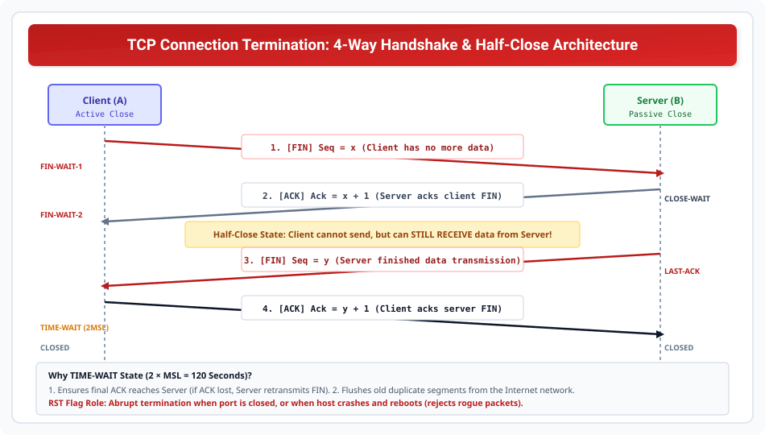

# TCP Connection Termination and Half-Close

> **Unit 4: Transport Layer**  
> **Course:** Computer Networks (BCS-603 / GATE CS / IT)  
> **Topic Depth:** 4-Way Handshake with FIN & ACK, Three-Way Termination, Half-Close State Mechanics, TIME-WAIT (2MSL) Necessity, and RST Flag Applications

---

## 1. TCP Connection Termination (4-Way Handshake)

Jab application data send karna khatam kar leti hai, to connection gracefully close kiya jata hai:

### The 4 Steps:

1. **Step 1: Client to Server (`FIN`):**
   - Client application close call karti hai.
   - Client sends **FIN = 1**, `seq = x`.
   - Message: *"I have no more data to send!"* (FIN consumes 1 sequence number).
   - Client state: `FIN-WAIT-1`.

2. **Step 2: Server to Client (`ACK`):**
   - Server acknowledges client's FIN: **ACK = 1**, `ack = x + 1`.
   - Client state: `FIN-WAIT-2`. Server state: `CLOSE-WAIT`.

3. **Step 3: Server to Client (`FIN`):**
   - Jab server ka pending data transmission complete ho jata hai, server apna **FIN = 1**, `seq = y` bhejta hai.
   - Server state: `LAST-ACK`.

4. **Step 4: Client to Server (`ACK`):**
   - Client server ke FIN ko acknowledge karta hai: **ACK = 1**, `ack = y + 1`.
   - Server receives ACK and enters `CLOSED`.
   - Client enters `TIME-WAIT` state.

---

## 2. Half-Close Option (AKTU 5-Marks)

TCP full-duplex protocol hai. Isliye ek side doosri side se independently data transmission stop kar sakti hai:
- **Client Half-Close:** Client apna FIN bhej kar declaration karta hai ki woh aage koi data nahi bhejega.
- **Server Remains Open:** Server abhi bhi client ko data stream bhej sakta hai (e.g. large file download ya sorting query result).
- Client incoming data packets ko receive aur ACK karta rehta hai jab tak server apna FIN na bhej de!

---

## 3. Why TIME-WAIT State (2 × MSL Timer)?

Client Step 4 me final ACK bhejne ke turant baad `CLOSED` nahi hota, balki **2 × MSL (Maximum Segment Lifetime, typically 120 seconds)** tak `TIME-WAIT` state me rehta hai.

### Do Sabse Bade Reasons:
1. **Reliable Graceful Termination:** Agar client ka final ACK raste me drop ho gaya, to server Step 3 FIN retransmit karega. Agar client instantly close ho jata, to retransmitted FIN par `RST` (error) bhej deta! TIME-WAIT state client ko allow karti hai final ACK resend karne ke liye.
2. **Old Duplicate Segments Elimination:** Internet me delayed ya looping packets ko flush out hone ka time milta hai taki naye connection ke packets se mix na ho sakein.

---

## 4. Role of RST (Reset) Flag (AKTU PYQ)

`RST` flag connection ko immediately abort (reset) karne ke liye use hota hai:
1. **Closed Port Request:** Agar client kisi aise port par SYN bhejta hai jahan koi server listen nahi kar raha, to OS turant `RST + ACK` bhej deta hai (Port Closed).
2. **Crash Recovery:** Agar server machine crash hokar reboot ho jaye aur purane connection ka packet receive kare, to server `RST` bhejkar client ko abort kar deta hai.
3. **Abnormal Abort:** Jab application crash ho jaye aur graceful 4-way FIN handshake possible na ho.
