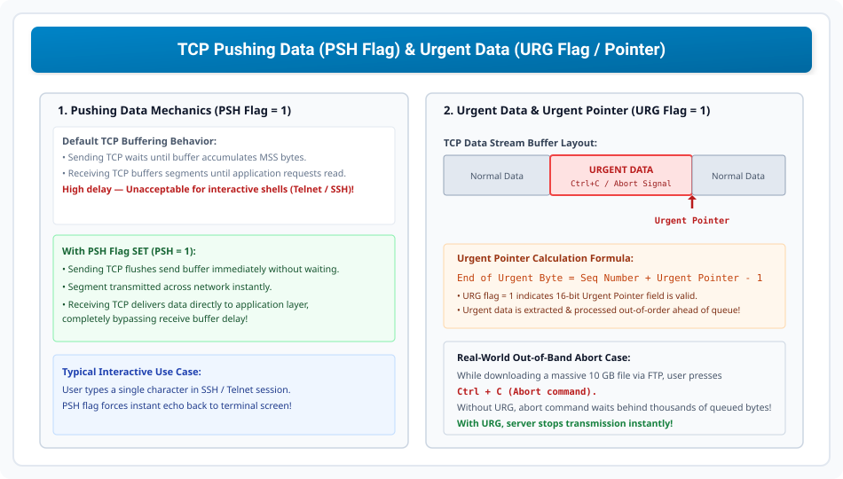

# TCP Data Transfer, Pushing, and Urgent Data

> **Course:** Computer Networks (BCS-603 / GATE CS / IT)  
> **Topic Depth:** Normal Stream Transfer, PUSH (PSH) Flag Dynamics, URG Flag & 16-bit Urgent Pointer, Out-of-Band Signal Transmission, and AKTU PYQs

---

## 1. Normal Stream Transfer vs Pushing Data (PSH Flag)

By default, TCP ek **stream-oriented buffered protocol** hai:
- Sending TCP bytes ko transmit karne se pehle send buffer me accumulate karta hai taki network me bade chunks (MSS) bheje ja sakein.
- Receiving TCP segments aane par unhe receive buffer me hold karta hai jab tak application convenient speed se read na kare.

### Problem with Interactive Applications:
Agar user ek interactive terminal shell (jaise **Telnet** ya **SSH**) use kar raha ho aur command type kare (e.g. `ls`), to buffering ke karan character screen par print hone me seconds ka delay ho sakta hai!

### PSH Flag Solution (PSH = 1):
Jab application `PSH` flag set karti hai:
1. **Sender Side:** Sending TCP send buffer me jitne bhi bytes hain unhe turant flush karke segment transmit kar deta hai (without waiting for buffer to fill).
2. **Receiver Side:** Receiving TCP segment aate hi use receive buffer me hold karne ke bajaye **seedhe Application Layer ko pass** kar deta hai!

---

## 2. Urgent Data & Urgent Pointer (URG Flag = 1)

Kabhi-kabhi application ko aisa data bhejna hota hai jo normal FIFO queue me wait na kare, balki turant process ho. Isise **Out-of-Band Data** ya **Urgent Data** kehte hain.
- **Example:** User ek large 10 GB file download kar raha hai aur bich me **Ctrl + C** (Abort interrupt) press karta hai. Agar abort command normal queue me lage, to wo ghanton tak execute nahi hogi!

### Working of URG Flag & Pointer:
1. Header me **URG Flag = 1** set kiya jata hai.
2. 16-bit **Urgent Pointer** field active ho jata hai.
3. Urgent Pointer segment ke sequence number se ek offset define karta hai jo yeh batata hai ki urgent data segment me kahan khatam ho raha hai:

$$\mathbf{End\ of\ Urgent\ Byte = Sequence\ Number + Urgent\ Pointer - 1}$$

Receiver TCP normal bytes ko pause karke pehle urgent bytes ko extract karta hai aur application ko interrupt provide karta hai!
