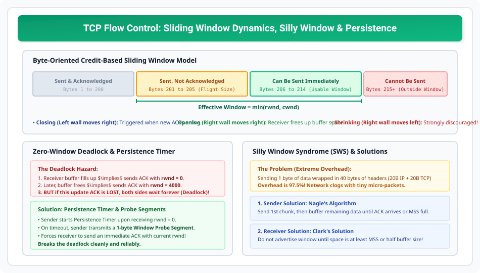

# TCP Flow Control and Sliding Window Mechanics

> **Unit 4: Transport Layer**  
> **Course:** Computer Networks (BCS-603 / GATE CS / IT)  
> **Topic Depth:** Flow Control Principle, Credit-Based Byte-Oriented Sliding Window, Window Opening/Closing/Shrinking, Zero-Window Deadlock, Persistence Timer & Probes, Silly Window Syndrome (Nagle & Clark Algorithms)

---

## 1. Flow Control Ka Concept

Flow control ensure karta hai ki ek fast transmitting sender kisi slow receiver ke buffer memory ko overflow karke packets drop na karwa de.
- TCP **Credit-Based Byte-Oriented Sliding Window Protocol** use karta hai.
- Receiver har ACK packet ke header me apna current available buffer size (**Window Size / rwnd**) advertise karta hai.

$$\mathbf{Effective\ Window\ Size = \min(rwnd,\ cwnd)}$$

---

## 2. Sliding Window Dynamics: Opening, Closing & Shrinking

1. **Closing (Left Wall moves right):** Jab receiver se naye ACKs aate hain, to confirmed sent bytes window se bahar ho jate hain.
2. **Opening (Right Wall moves right):** Jab receiver application data read kar leti hai aur buffer space create hota hai, to window expand hoti hai.
3. **Shrinking (Right Wall moves left):** Agar receiver achanak window chhoti advertise kar de. RFCs ise **strongly discourage** karte hain kyunki sender dwara already sent bytes drop ho sakte hain!

---

## 3. Zero-Window Deadlock & Persistence Timer

Jab receiver ka buffer completely fill ho jata hai, to wo `rwnd = 0` advertise karta hai (Zero Window). Sender transmission stop kar deta hai.
- Kuch time baad receiver buffer free hone par naya ACK bhejta hai: `rwnd = 4000`.
- **The Deadlock Hazard:** Agar yeh update ACK network me LOST ho jaye!
  - Sender sochta hai: *"Receiver buffer full hai, main wait karunga."*
  - Receiver sochta hai: *"Maine window bhej di, sender kab data bhejega?"*
  - Dono permanently block ho jaate hain (Deadlock)!

### Solution: Persistence Timer
Sender zero-window receive hone par **Persistence Timer** start karta hai. Timer expire hone par sender ek **1-byte Window Probe Segment** bhejta hai. Receiver probe drop nahi kar sakta aur turant current `rwnd` ka ACK bhejta hai, jisse deadlock break ho jata hai!

---

## 4. Silly Window Syndrome (SWS) & Solutions

Agar application 1-1 byte karke data generate ya consume kare, to TCP 1 byte data ke liye 40 bytes ka header (20B IP + 20B TCP) bhejta hai. Network bandwidth 97.5% waste ho jati hai!

1. **Sender Solution (Nagle's Algorithm):**
   Pehla chhota piece bhej do. Uske baad naya data tab tak buffer karo jab tak ya to pehle segment ka ACK na aa jaye ya buffer me pura **MSS (Maximum Segment Size)** accumulate na ho jaye!
2. **Receiver Solution (Clark's Solution):**
   Receiver tab tak window update advertise nahi karega jab tak uske paas kam se kam **1 full MSS** ya **buffer ka 50%** free na ho jaye!
