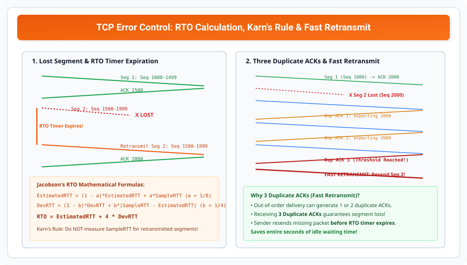

# TCP Error Control and Retransmission Mechanics

> **Unit 4: Transport Layer**  
> **Course:** Computer Networks (BCS-603 / GATE CS / IT)  
> **Topic Depth:** Error Detection via Checksum, Cumulative & Delayed ACKs, RTO Timer Formulation (Jacobson's Algorithm), Karn's Rule, and Fast Retransmit (3 Duplicate ACKs)

---

## 1. TCP Error Control Principles

TCP unreliabile IP layer par **100% reliable end-to-end delivery** ensure karta hai using:
1. **Checksum:** 16-bit 1's complement covering header, data aur 12-byte pseudo-header. Corrupt segment silently discard ho jata hai.
2. **Acknowledgments (ACK):** Cumulative ACKs inform sender of the next expected byte.
3. **Retransmissions:** Lost ya discarded segments ko resend karta hai.

---

## 2. RTO (Retransmission Time-Out) Calculation (Jacobson's Algorithm)

Sender timer expire hone par segment retransmit karta hai. RTO ki value fix nahi hoti; yeh dynamic **Round-Trip Time (RTT)** par calculate hoti hai:

### Mathematical Formulation:
1. **Smoothed RTT (EstimatedRTT):**
   $$\text{EstimatedRTT} = (1 - \alpha)\text{EstimatedRTT} + \alpha \text{SampleRTT} \quad (\alpha = 0.125)$$
2. **RTT Variation (DevRTT):**
   $$\text{DevRTT} = (1 - \beta)\text{DevRTT} + \beta |\text{SampleRTT} - \text{EstimatedRTT}| \quad (\beta = 0.25)$$
3. **Calculated RTO:**
   $$\mathbf{RTO = EstimatedRTT + 4 \times DevRTT}$$

### Karn's Algorithm (Important Rule):
Agar koi segment retransmit hua ho, to uske response ACK ka SampleRTT **kabhi measure mat karo!** Kyunki sender ko nahi pata ki ACK pehle transmit hue segment ka hai ya retransmitted segment ka (Ambiguity).

---

## 3. Fast Retransmit (3 Duplicate ACKs Rule)

RTO timer ka wait karna time-consuming ho sakta hai (several seconds).
- Jab koi segment raste me drop hota hai, lekin baad ke segments destination par pahunchte hain, to receiver har out-of-order segment ke aane par **Duplicate ACK** bhejta hai (same missing byte number).
- **Rule:** Jab sender ko ek hi byte ke liye **3 Duplicate ACKs** mil jaate hain, to sender RTO timer expire hone ka intezaar kiye bina turant missing segment ko **Fast Retransmit** kar deta hai!
- Yeh network throughput ko dramatically increase karta hai.
