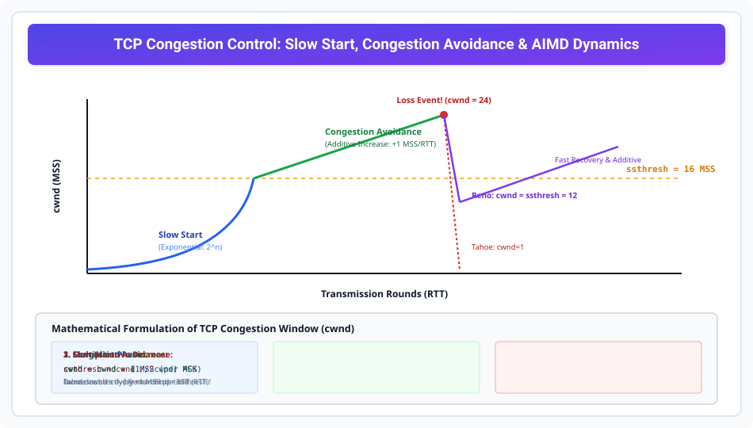

# TCP Congestion Control: Slow Start and Congestion Avoidance

> **Unit 4: Transport Layer**  
> **Course:** Computer Networks (BCS-603 / GATE CS / IT)  
> **Topic Depth:** Congestion Window (cwnd), Additive Increase Multiplicative Decrease (AIMD), Slow Start Exponential Growth, and Congestion Avoidance Linear Growth

---

## 1. Congestion Window (`cwnd`) vs Receiver Window (`rwnd`)

- **Receiver Window (`rwnd`):** Receiver buffer capacity se determine hota hai (Flow Control).
- **Congestion Window (`cwnd`):** Network intermediate routers aur links ke traffic load se determine hota hai (Congestion Control).

$$\mathbf{Actual\ Transmission\ Window = \min(cwnd,\ rwnd)}$$

---

## 2. Phase 1: Slow Start (Exponential Growth)

Jab naya connection start hota hai, sender ko network capacity ka andaza nahi hota.
- **Initial cwnd:** $\text{cwnd} = 1 \text{ MSS}$.
- **Update Rule:** Har valid ACK receive hone par $\text{cwnd} = \text{cwnd} + 1 \text{ MSS}$.
- **Result:** Har round trip time (RTT) me congestion window **double** ho jata hai!
  $$1 \xrightarrow{\text{RTT 1}} 2 \xrightarrow{\text{RTT 2}} 4 \xrightarrow{\text{RTT 3}} 8 \xrightarrow{\text{RTT 4}} 16 \text{ MSS}$$
- Slow Start tab tak chalta hai jab tak window threshold **`ssthresh` (Slow Start Threshold)** tak na pahunch jaye.

---

## 3. Phase 2: Congestion Avoidance (Additive Increase)

Jab $\text{cwnd} \ge \text{ssthresh}$ ho jata hai, tab exponential speed se network collapse na ho isliye linear growth shuru hoti hai:
- **Update Rule:** Har incoming ACK par $\text{cwnd} = \text{cwnd} + \frac{1}{\text{cwnd}} \text{ MSS}$.
- **Result:** Pure ek RTT ke baad window strictly **$+1 \text{ MSS}$** badhti hai!
  $$16 \xrightarrow{\text{RTT}} 17 \xrightarrow{\text{RTT}} 18 \xrightarrow{\text{RTT}} 19 \dots$$
- Yeh additive increase network capacity ko cautiously probe karta hai.

---

## 4. Multiplicative Decrease (Packet Loss Event)

Jab packet drop ya timeout hota hai, sender samajh jata hai ki network congest ho chuka hai:
1. **Threshold Cut:** $\mathbf{ssthresh = \frac{cwnd}{2}}$.
2. **Tahoe Response:** $\text{cwnd}$ ko seedhe **$1 \text{ MSS}$** par drop kar deta hai aur dobara Slow Start se shuru karta hai.
3. **AIMD Principle:** Additive Increase (Cautious climb) + Multiplicative Decrease (Sharp drop). Yeh network fairness aur stability guarantee karta hai!
