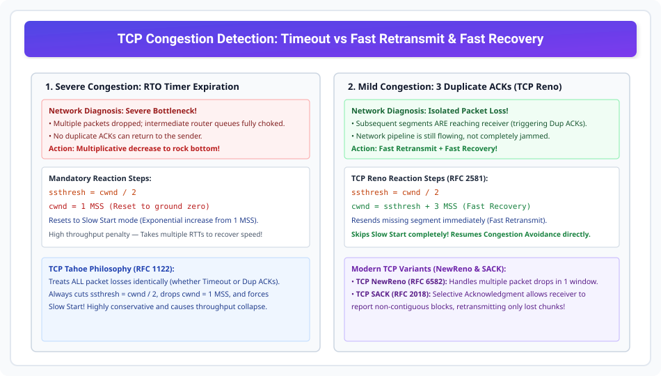

# TCP Congestion Detection: Fast Retransmit and Fast Recovery

> **Unit 4: Transport Layer**  
> **Course:** Computer Networks (BCS-603 / GATE CS / IT)  
> **Topic Depth:** Congestion Signals, RTO Timeout (Severe) vs 3 Duplicate ACKs (Mild), TCP Tahoe vs TCP Reno, Fast Recovery State Machine, and NewReno / SACK Extensions

---

## 1. Congestion Detection: Do Tarah Ke Signals

TCP network me congestion hone ka andaza do fundamentally different signals se lagata hai:

1. **Severe Congestion (RTO Timer Expiration):**
   - Jab network router buffer completely overflow ho jata hai aur packets ke saath-saath ACKs bhi drop ho jate hain.
   - Sender ke paas koi signal nahi aata, aur **RTO Timer expire** ho jata hai.
   - Sender conclude karta hai ki network severely congested hai.
   - **Action:** `ssthresh = cwnd / 2`, aur `cwnd = 1 MSS`! Slow Start scratch se shuru hota hai.

2. **Mild Congestion (3 Duplicate ACKs):**
   - Jab koi single packet drop ho jata hai, lekin uske baad bheje gaye packets destination par safely pahunch rahe hote hain!
   - Receiver har subsequent segment ke aane par **Duplicate ACK** generate karta hai.
   - Jab sender ko ek hi byte ke liye **3 Duplicate ACKs** milte hain, to sender samajh jata hai ki network pipeline abhi bhi chal rahi hai, sirf ek segment loss hua hai.
   - **Action:** Fast Retransmit + Fast Recovery!

---

## 2. TCP Tahoe vs TCP Reno Comparison

| Feature | TCP Tahoe (1988 - RFC 1122) | TCP Reno (1990 - RFC 2581) |
| :--- | :--- | :--- |
| **Timeout Handling** | `ssthresh = cwnd / 2`, `cwnd = 1 MSS` (Slow Start) | `ssthresh = cwnd / 2`, `cwnd = 1 MSS` (Slow Start) |
| **3 Dup ACKs Handling**| `ssthresh = cwnd / 2`, `cwnd = 1 MSS` (Slow Start) | **Fast Recovery!** `ssthresh = cwnd / 2`, `cwnd = ssthresh + 3 MSS` |
| **Post-Loss Phase** | Re-enters Slow Start (Takes many RTTs to ramp up) | **Skips Slow Start!** Enters Congestion Avoidance directly |
| **Throughput Impact** | Throughput collapse (sawtooth drops to baseline) | Smooth high throughput (sawtooth drops to half) |

---

## 3. Fast Recovery State Machine (TCP Reno)

Jab 3 Duplicate ACKs receive hote hain:
1. `ssthresh` ko current `cwnd / 2` par set kiya jata hai.
2. Missing segment ko turant **Fast Retransmit** kiya jata hai.
3. `cwnd` ko `ssthresh + 3 MSS` set kiya jata hai (3 isliye add kiya kyunki 3 duplicate ACKs yeh prove karte hain ki 3 segments successfully network se bahar receiver buffer me pahunch chuke hain!).
4. Jab missing segment ka fresh ACK wapas aata hai, to `cwnd = ssthresh` set karke seedhe **Congestion Avoidance (Additive Increase)** resume kar diya jata hai!

---

## 4. Modern Extensions: TCP NewReno & SACK

- **TCP NewReno (RFC 6582):** Agar ek hi window me 2 ya 3 packets drop ho gaye hon, to purana Reno confused ho jata tha. NewReno "Partial ACKs" ko track karke bina timeout ke sabhi lost packets ko Fast Retransmit kar deta hai.
- **TCP SACK (Selective Acknowledgment - RFC 2018):** Receiver TCP header options me non-contiguous received blocks ki list bhejta hai (e.g. Received: 1000-2000, 3000-4000). Sender sirf missing hole (2001-2999) ko retransmit karta hai!
