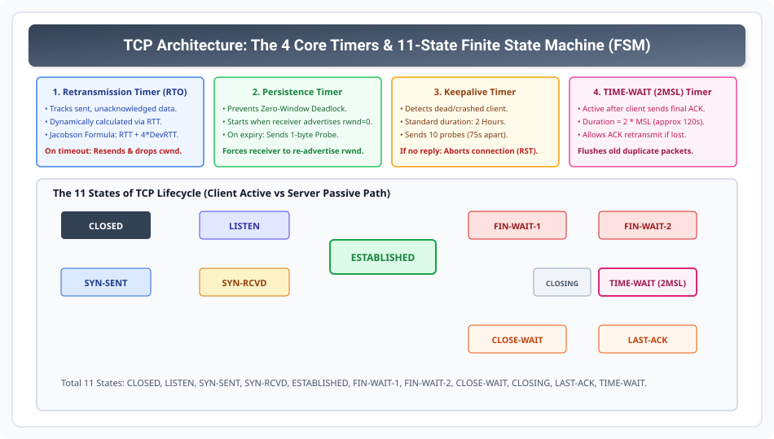

# TCP Timers Architecture and State Transition Diagram

> **Unit 4: Transport Layer**  
> **Course:** Computer Networks (BCS-603 / GATE CS / IT)  
> **Topic Depth:** The 4 Core TCP Timers (RTO, Persistence, Keepalive, TIME-WAIT), Complete 11-State Finite State Machine (FSM), Active vs Passive State Paths

---

## 1. The 4 Essential Timers in TCP

TCP connection ki reliability aur robustness 4 internal timers par depend karti hai:

1. **Retransmission Timer (RTO Timer):**
   - Sent data segments ke loss ko detect karta hai.
   - Dynamic RTT measurement (Jacobson & Karn algorithms) par based hota hai.
   - Timer expire hone par segment retransmit hota hai aur `cwnd` drop hota hai.

2. **Persistence Timer:**
   - **Zero-Window Deadlock** ko prevent karta hai.
   - Jab receiver `rwnd = 0` advertise karta hai, tab yeh timer start hota hai.
   - Expire hone par sender **1-byte Window Probe Segment** bhejta hai jo receiver ko force karta hai current `rwnd` ka ACK re-advertise karne ke liye.

3. **Keepalive Timer:**
   - Long-idle connections par dead/crashed clients ko detect karta hai.
   - Standard timeout = **2 Hours**.
   - Agar 2 hours tak koi traffic na aaye, server 10 probes bhejta hai (75 seconds apart). Reply na aane par connection reset (`RST`) kar diya jata hai.

4. **TIME-WAIT Timer (2MSL Timer):**
   - Active close karne wali party me Step 4 final ACK bhejne ke baad start hota hai.
   - Duration = **$2 \times \text{MSL} \approx 120\text{ seconds}$**.
   - Ensures final ACK is received by server (if lost, server retransmits FIN).
   - Network me ghum rahe purane duplicate packets ko expire karta hai.

---

## 2. Complete 11-State TCP Finite State Machine (FSM)

TCP lifecycle 11 standardized states ke through transition karta hai:

| State | Role / Meaning | Trigger Event / Sent Segment |
| :--- | :--- | :--- |
| **1. CLOSED** | No connection active | Initial baseline state |
| **2. LISTEN** | Server waiting for connection request | Passive Open executed by server daemon |
| **3. SYN-SENT** | Client waiting for server response | Client sends SYN segment (Active Open) |
| **4. SYN-RCVD** | Server waiting for client final ACK | Server received SYN, sent SYN+ACK |
| **5. ESTABLISHED** | Normal bidirectional data transfer | 3-way handshake completed |
| **6. FIN-WAIT-1** | Client initiated termination | Client application closed; sent FIN |
| **7. FIN-WAIT-2** | Client waiting for server's FIN | Client received ACK for its FIN |
| **8. CLOSE-WAIT** | Server waiting for local application close | Server received client's FIN; sent ACK |
| **9. LAST-ACK** | Server waiting for client final ACK | Server application closed; sent FIN |
| **10. TIME-WAIT** | Client waiting for $2\text{MSL}$ duration | Client received server's FIN; sent final ACK |
| **11. CLOSING** | Simultaneous close | Both parties sent FIN simultaneously |
