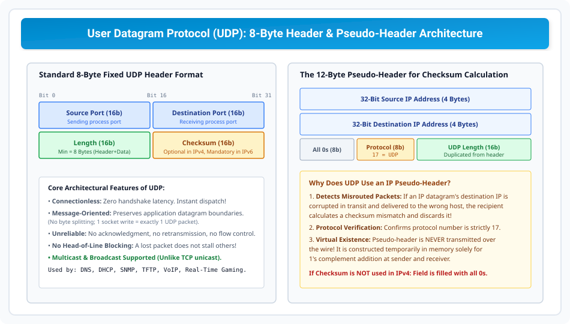

# User Datagram Protocol (UDP) Architecture

> **Unit 4: Transport Layer**  
> **Course:** Computer Networks (BCS-603 / GATE CS / IT)  
> **Topic Depth:** UDP Protocol Design (RFC 768), 8-Byte Fixed Header, 12-Byte Pseudo-Header Checksum Math, Message Boundary Preservation, Queuing Model & Real-World Applications

---

## 1. UDP Ka Architectural Philosophy (RFC 768)

**User Datagram Protocol (UDP)** transport layer ka minimalist, connectionless protocol hai:
1. **Connectionless:** Data transfer shuru karne ke liye koi prior 3-way handshake setup nahi chahiye. Zero connection delay!
2. **Unreliable:** Na koi acknowledgments (ACK), na sequence numbers, na retransmissions, na flow/congestion control.
3. **Message-Oriented:** UDP application message boundaries ko strictly preserve karta hai. Agar application 100 bytes likhti hai, to exactly 100 bytes ka 1 standalone UDP datagram banega (unlike TCP's byte stream).

---

## 2. 8-Byte Fixed Header Format

UDP header strictly **8 Bytes (64 bits)** fixed size ka hota hai:

1. **Source Port Address (16 bits):** Sending process port.
2. **Destination Port Address (16 bits):** Target receiving process port.
3. **Length (16 bits):** Header + Data ka total size in Bytes:
   $$\text{Minimum Length} = 8\text{ Bytes (Zero payload data)}$$
4. **Checksum (16 bits):** 1's complement sum covering Header, Data, aur 12-Byte Pseudo-Header.
   - IPv4 me optional hota hai (all 0s if disabled).
   - IPv6 me **mandatory** hota hai!

---

## 3. The 12-Byte Pseudo-Header Checksum Model

UDP checksum calculate karte waqt ek virtual 12-byte header memory me create kiya jata hai:
- **Source IP Address (32 bits / 4 Bytes)**
- **Destination IP Address (32 bits / 4 Bytes)**
- **All 0s Padding (8 bits / 1 Byte)**
- **Protocol (8 bits / 1 Byte):** Value strictly `17` (UDP protocol number).
- **UDP Length (16 bits / 2 Bytes):** UDP header + data length.

### Pseudo-Header Kyun Use Hota Hai?
Agar Network Layer (IP) kisi packet ke destination IP address ko corrupt kar de aur packet galti se galat host par deliver ho jaye, to receiver jab pseudo-header checksum verify karega, to mismatch detect hoga aur corrupt packet discard ho jayega!

---

## 4. UDP Queuing Model & Applications

- **Queuing:** Har active port ke liye OS Incoming Queue aur Outgoing Queue maintain karta hai. Agar incoming queue full ho jaye aur naya packet aaye, to packet **silently drop** ho jata hai (aur ICMP Port Unreachable generate ho sakta hai).
- **Applications:**
  - **DNS (Port 53):** Single request/response message. Handshake latency eliminate hoti hai.
  - **DHCP (Ports 67/68):** Client ke paas IP nahi hota; broadcast support zaroori hai.
  - **TFTP (Port 69):** Lightweight firmware/boot file transfer.
  - **SNMP (Port 161):** Network management alerts.
  - **Real-Time Multimedia:** VoIP, Zoom, YouTube live streaming, FPS online gaming (jahan delay unacceptable hai).
