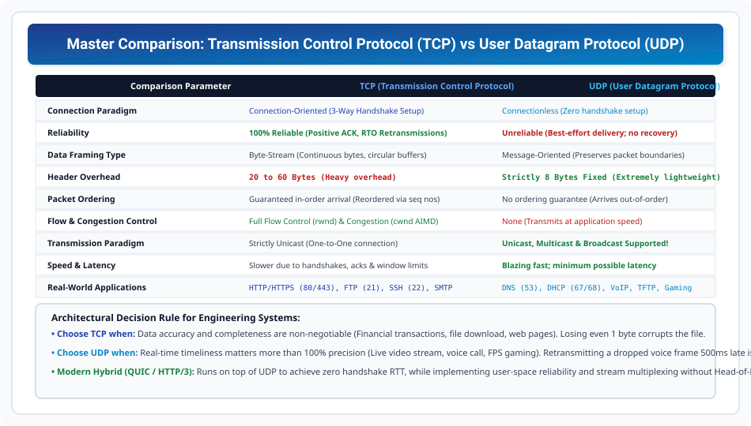

# Master Comparison: TCP vs UDP

> **Unit 4: Transport Layer**  
> **Course:** Computer Networks (BCS-603 / GATE CS / IT)  
> **Topic Depth:** Exhaustive 12-Point Architectural Comparison Table, Performance Tradeoffs, Header Overhead Analysis, and Real-World Application Decision Framework

---

## 1. Master 12-Point Architectural Comparison

| Parameter | TCP (Transmission Control Protocol) | UDP (User Datagram Protocol) |
| :--- | :--- | :--- |
| **1. Connection Paradigm** | **Connection-Oriented** (3-Way Handshake) | **Connectionless** (Immediate packet dispatch) |
| **2. Reliability** | **100% Reliable** (Positive ACKs, RTO Retransmission) | **Unreliable** (Best-effort; dropped packets ignored) |
| **3. Data Abstraction** | **Byte-Stream** (Continuous stream; circular buffers)| **Message-Oriented** (Preserves packet boundaries) |
| **4. Header Size** | **Variable: 20 to 60 Bytes** (Heavy overhead) | **Strictly Fixed: 8 Bytes** (Minimalist overhead) |
| **5. Packet Sequencing** | **Guaranteed In-Order** (Reordered via 32-bit seq nos)| **No Ordering Guarantee** (May arrive out-of-order) |
| **6. Flow Control** | **Yes** (Credit-based sliding window with `rwnd`) | **No** (Transmits at application generation rate) |
| **7. Congestion Control**| **Yes** (Slow Start, Congestion Avoidance, AIMD) | **No** (Blind to network core congestion) |
| **8. Transmission Mode** | **Strictly Unicast** (Point-to-point only) | **Unicast, Multicast & Broadcast** Supported |
| **9. Handshake Latency** | High (1.5 RTT connection setup overhead) | **Zero Handshake Latency** (Instant 0-RTT) |
| **10. Head-of-Line Blocking**| **Present** (Missing packet stalls entire queue) | **Absent** (Independent packets never stall queue) |
| **11. Checksum** | Mandatory in both IPv4 and IPv6 | Optional in IPv4, Mandatory in IPv6 |
| **12. Primary Use Cases** | Web (HTTP/HTTPS), File Transfer (FTP), Email, SSH | DNS, DHCP, VoIP, Live Video, Online Gaming, SNMP |

---

## 2. Engineering Selection Framework

1. **Select TCP When:** Data accuracy aur completeness non-negotiable ho (Financial transactions, file download, database queries). Ek single bit ka loss bhi data corrupt kar deta hai.
2. **Select UDP When:** Real-time speed aur minimum latency matter karti ho (VoIP audio, live streaming, FPS gaming). Dropped voice frame ko 500ms baad retransmit karke sunna user ke liye completely useless hai!
3. **The Modern Frontier (QUIC / HTTP/3):** Google ne HTTP/3 ko UDP ke upar build kiya hai taaki TCP ke connection handshake delay aur Head-of-Line blocking ko eliminate kiya ja sake, jabki reliability application layer par provide ki jati hai!
