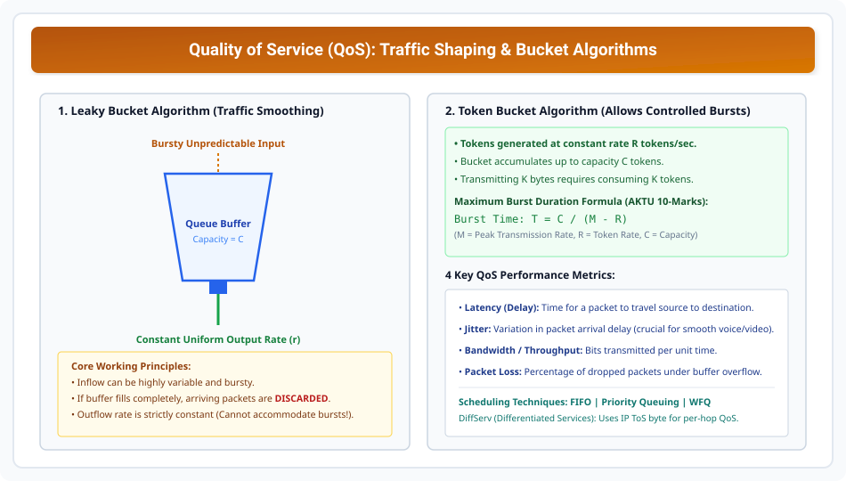

# Quality of Service (QoS) and Traffic Shaping

> **Unit 4: Transport Layer**  
> **Course:** Computer Networks (BCS-603 / GATE CS / IT)  
> **Topic Depth:** QoS Metrics (Delay, Jitter, Bandwidth, Loss), Scheduling Techniques (FIFO, Priority, WFQ), Leaky Bucket Algorithm, Token Bucket Algorithm & Solved Burst Numericals

---

## 1. Quality of Service (QoS) Kya Hai?

**Quality of Service (QoS)** network resources ko manage karne ka framework hai taaki critical application traffic (jaise real-time video aur voice) ko best-effort traffic ke muqable guaranteed performance mil sake.

### 4 Core QoS Performance Metrics:
1. **Delay (Latency):** Packet ko source se destination tak travel karne me lagne wala total time.
2. **Jitter:** Packet arrival delay ki variation (fluctuation). Real-time audio me high jitter choppy sound create karta hai!
3. **Bandwidth / Throughput:** Link par per second kitna data deliver ho raha hai.
4. **Packet Loss Rate:** Congested router buffers dwara drop hone wale packets ka percentage.

---

## 2. Techniques to Improve QoS: Scheduling

1. **FIFO (First In First Out):** Simple queue. Arriving packets queue ke end me lagte hain aur arrival order me dispatch hote hain. No prioritization.
2. **Priority Queuing:** Multiple queues (High, Medium, Low priority). Jab tak High queue empty na ho jaye, Low queue ka ek bhi packet transmit nahi hota (Starvation risk!).
3. **Weighted Fair Queuing (WFQ):** Har flow ko uske assigned weight ke hisab se fair percentage bandwidth assign hoti hai. Starvation prevent hota hai!

---

## 3. Traffic Shaping: Leaky Bucket vs Token Bucket

Traffic shaping bursty unpredictable traffic ko regulated smooth stream me convert karti hai:

### 1. Leaky Bucket Algorithm:
- **Concept:** Bottom me ek chhota hole wala water bucket. Chaahe upar se paani kitna bhi bursty speed se daala jaye, bottom se paani **strictly constant uniform rate** par hi bahaega.
- **Advantage:** Output traffic completely smooth hota hai.
- **Disadvantage:** Bursty traffic accommodate nahi kar sakta; buffer bharte hi packet drop ho jate hain chahe network link free ho!

### 2. Token Bucket Algorithm:
- **Concept:** Bucket me constant rate $R$ par tokens jama hote hain (up to max capacity $C$). Packets tabhi transmit ho sakte hain jab wo corresponding tokens grab karein.
- **Advantage:** **Controlled Bursty Transmissions** allow karta hai up to bucket capacity $C$!

### Master Solved Numerical (AKTU Long Question Standard):
> **Question (AKTU 10 Marks):** Ek Token Bucket system me capacity $C = 1 \text{ MegaByte}$ tokens hai. Token generation rate $R = 10 \text{ MB/sec}$ hai. Maximum transmission link rate (Peak burst rate) $M = 50 \text{ MB/sec}$ hai. Calculate kijiye:
> 1. Maximum burst kitne time tak sustain ho sakti hai?
> 2. Is burst duration me total kitna data transmit hoga?

#### Formulas:
$$\text{Burst Duration: } T = \frac{C}{M - R}$$
$$\text{Total Data Transmitted: } D = M \times T$$

#### Step-by-Step Calculation:
1. **Burst Duration ($T$):**
   $$T = \frac{1 \text{ MB}}{50 \text{ MB/s} - 10 \text{ MB/s}} = \frac{1}{40} \text{ seconds} = \mathbf{0.025\text{ seconds (25 milliseconds)}}$$
2. **Total Data Transmitted ($D$):**
   $$D = 50 \text{ MB/s} \times 0.025 \text{ s} = \mathbf{1.25\text{ MegaBytes}}$$
