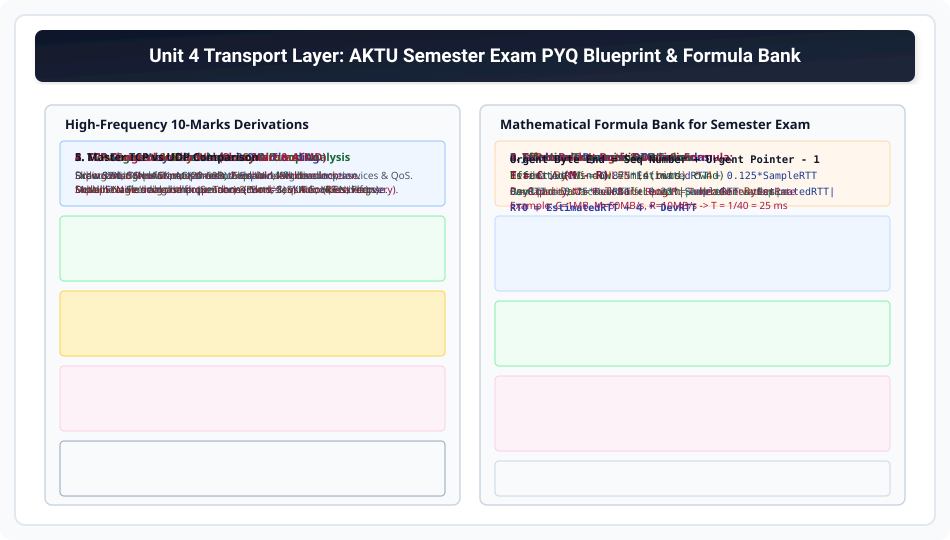

# Unit 4 AKTU Semester Exam PYQs and Numerical Bank

> **Unit 4: Transport Layer**  
> **Course:** Computer Networks (BCS-603 / GATE CS / IT)  
> **Topic Depth:** High-Yield Solved Semester Exam Questions, 10-Marks Long Derivations, Hexadecimal Header Dumps, and Mathematical Numerical Solutions

---

## 1. Exam Blueprint & High-Frequency Topics

---

## 2. Solved AKTU Long Questions (10-Marks Standard)

### Question 1: Explain the Three-Way Handshake protocol to establish a TCP connection. What is the SYN Flooding attack and how is it prevented? (AKTU 2021-22 / 2023-24)
- **Model Answer Structure:**
  1. Define TCP active open vs passive open.
  2. Draw the 3-step timeline: Step 1 (SYN, Seq=ISN_c), Step 2 (SYN+ACK, Seq=ISN_s, Ack=ISN_c+1), Step 3 (ACK, Ack=ISN_s+1).
  3. Explain sequence number consumption rule (SYN consumes 1 sequence count).
  4. Explain SYN Flooding attack: Attacker floods forged SYN packets; server fills TCB queue in SYN-RCVD state causing DoS.
  5. Detail **SYN Cookies defense**: Server does not allocate memory on SYN arrival; encodes connection parameters into cryptographic cookie in ISN_s. Allocation happens only after final ACK returns verified cookie! *(Refer to Module 03)*.

---

### Question 2: Explain TCP segment header format with a neat diagram. (AKTU 2022-23)
- **Model Answer Structure:**
  1. Draw standard 32-bit wide grid layout (Rows 1 to 6).
  2. Explain all 14 fields: Source/Dest Ports (16b), Sequence Number (32b), Acknowledgment Number (32b), HLEN (4b words), Reserved (6b), 6 Control Flags (URG, ACK, PSH, RST, SYN, FIN), Window Size (16b), Checksum (16b), Urgent Pointer (16b), Options (0-40B).
  3. Detail HLEN calculation rule ($5 \implies 20\text{B}, 15 \implies 60\text{B}$). *(Refer to Module 02)*.

---

### Question 3: Differentiate between TCP and UDP in context of header format and services. (AKTU 2022-23)
- **Model Answer Structure:**
  1. Draw TCP header (20-60B) vs UDP header (8B fixed).
  2. Provide comprehensive 10-point comparison table covering: Connection paradigm, Reliability, Sequencing, Flow control, Congestion control, Overhead, Unicast vs Multicast, Application protocols. *(Refer to Module 12)*.

---

### Question 4: Explain TCP Congestion Control mechanism with Slow Start, Congestion Avoidance, Fast Retransmit, and Fast Recovery. (AKTU 2020-21 / 2022-23)
- **Model Answer Structure:**
  1. Define Congestion Window (`cwnd`) vs Receiver Window (`rwnd`).
  2. Explain Slow Start: Exponential doubling of `cwnd` per RTT up to `ssthresh`.
  3. Explain Congestion Avoidance: Linear additive increase (+1 MSS per RTT).
  4. Explain Multiplicative Decrease upon loss:
     - Severe Timeout: `ssthresh = cwnd / 2`, `cwnd = 1 MSS` (Slow Start).
     - 3 Duplicate ACKs (Fast Retransmit & Fast Recovery): `ssthresh = cwnd / 2`, `cwnd = ssthresh` (Skips Slow Start!). *(Refer to Modules 08 & 09)*.

---

### Question 5: What is Silly Window Syndrome and how is it resolved? (AKTU 2019-20)
- **Model Answer Structure:**
  1. Explain extreme overhead problem: 1 byte payload inside 40 bytes headers (97.5% waste).
  2. Sender-side cause & **Nagle's Algorithm** solution.
  3. Receiver-side cause & **Clark's Solution** (advertising window only when space $\ge \text{MSS}$ or $\ge \text{half buffer}$). *(Refer to Module 06)*.
