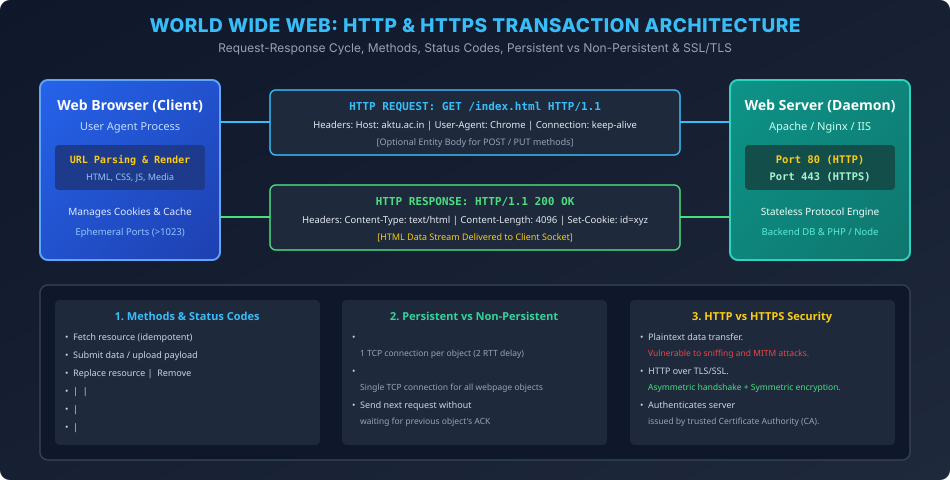

# Module 02: World Wide Web & HTTP / HTTPS Protocols

> **Course:** Computer Networks (BCS603) — Unit 5: Application Layer  
> **Source Material:** Gateway Classes (Dr. Nidhi Parashar Ma'am) Slides 14–18  
> **Topic:** WWW Architecture, HTTP Request-Response Mechanics, Stateless Nature, HTTP/1.0 vs HTTP/1.1, and HTTP vs HTTPS  

---

## 1. World Wide Web (WWW) Architecture & URL

World Wide Web ek client-server information system hai jahan documents aur internet resources **Uniform Resource Locator (URL)** ke through uniquely identify hote hain:
$$\text{URL Structure:} \quad \underbrace{\text{http}}_{\text{Protocol}} :// \underbrace{\text{www.aktu.ac.in}}_{\text{Host / Domain}} : \underbrace{80}_{\text{Port}} / \underbrace{\text{syllabus/cs.html}}_{\text{Path to Resource}}$$

---

## 2. HyperText Transfer Protocol (HTTP)

### 2.1 Core Attributes
- **Application Layer Protocol:** Web browser aur web server ke beech multimedia data (HTML, images, JSON, CSS) transfer karne ke liye use hota hai.
- **Underlying Protocol:** TCP (Transmission Control Protocol) standard **Port 80** par run karta hai.
- **Stateless Protocol:** Server client ke past requests ka koi record ya state maintain nahi karta. Har request completely independent hoti hai. State track karne ke liye web applications **Cookies** aur **Sessions** ka use karti hain.

---

## 3. HTTP Request & Response Architecture

### 3.1 HTTP Request Message Format
```
+--------------------------------------------------------+
| Method | Space | URL / Path | Space | Version | \r\n   |  <- Request Line
+--------------------------------------------------------+
| Header Field Name : Value \r\n                         |  <- Header Lines
| Host: www.aktu.ac.in \r\n                              |
| User-Agent: Mozilla/5.0 \r\n                           |
| Connection: keep-alive \r\n                            |
+--------------------------------------------------------+
| \r\n (Empty Line / Carriage Return + Line Feed)        |
+--------------------------------------------------------+
| [Optional Entity Body - e.g., JSON form payload in POST]|
+--------------------------------------------------------+
```

### 3.2 HTTP Methods Summary
- `GET`: Server se specified resource retrieve karta hai. Safe aur idempotent hota hai (server state modify nahi karta).
- `POST`: Server ko data submit karta hai (forms, file upload, API mutation). Non-idempotent hota hai.
- `HEAD`: `GET` jaisa hi hota hai lekin server response body nahi bhejta, sirf headers bhejta hai (useful for cache validation and content length check).
- `PUT`: Target URL par naye resource ko create ya completely replace karta hai.
- `DELETE`: Target resource ko delete karta hai.

### 3.3 HTTP Status Codes (AKTU Exam High-Frequency)
- **1xx (Informational):** Request received, continuing process (e.g., `100 Continue`).
- **2xx (Success):** Action successfully received and accepted (e.g., `200 OK`, `201 Created`).
- **3xx (Redirection):** Further action needed (e.g., `301 Moved Permanently`, `304 Not Modified` - Cache hit).
- **4xx (Client Error):** Client request invalid (e.g., `400 Bad Request`, `401 Unauthorized`, `403 Forbidden`, `404 Not Found`).
- **5xx (Server Error):** Server failed to fulfill valid request (e.g., `500 Internal Server Error`, `502 Bad Gateway`, `503 Service Unavailable`).

---

## 4. Persistent vs Non-Persistent HTTP

Ek typical webpage par multiple objects hote hain (e.g., 1 HTML file + 5 images). Inhein download karne ka tareeqa:

```
Non-Persistent (HTTP/1.0):
[TCP SYN] -> [TCP SYN-ACK] -> [ACK + GET html] -> [Response html] -> [TCP FIN Close]
[TCP SYN] -> [TCP SYN-ACK] -> [ACK + GET img1] -> [Response img1] -> [TCP FIN Close]
Total Delay per object = 2 * RTT + Transmission Time

Persistent (HTTP/1.1):
[TCP SYN] -> [TCP SYN-ACK] -> [ACK + GET html] -> [Response html]
                              [GET img1]       -> [Response img1]
                              [GET img2]       -> [Response img2] -> [TCP FIN Close]
```

| Parameter | Non-Persistent HTTP (HTTP/1.0) | Persistent HTTP (HTTP/1.1) |
| :--- | :--- | :--- |
| **TCP Connections** | Har object ke liye alag se naya TCP 3-way handshake khulta hai aur close hota hai. | Ek hi open TCP connection par saare objects sequentially transfer hote hain (`Connection: keep-alive`). |
| **Latency / Delay** | $2 \times \text{RTT}$ per object (1 RTT handshake + 1 RTT request/response). | $1 \times \text{RTT}$ handshake initial, then $1 \times \text{RTT}$ per object. |
| **Pipelining** | Not supported. | Supported (ek response ka wait kiye bina agla GET request bhej sakte hain). |
| **Server Overhead** | Server par high CPU/socket buffer churn kyunki bar-bar TCP connection allocate/deallocate hota hai. | Server socket resources bach jate hain. |

---

## 5. Master Comparison: HTTP vs HTTPS (AKTU 2022-23 Question)

| Feature | HTTP (HyperText Transfer Protocol) | HTTPS (HTTP Secure) |
| :--- | :--- | :--- |
| **Standard Port** | **Port 80** | **Port 443** |
| **Security Layer** | No security layer (Data sent in plaintext). | Runs over **SSL / TLS** (Secure Sockets Layer / Transport Layer Security). |
| **Encryption** | None. Packet sniffers (Wireshark) can read passwords, session cookies directly. | Symmetric session encryption (AES) + Asymmetric key exchange (RSA / ECC). |
| **Data Integrity** | No checksum integrity guarantee against tampering. | Message Authentication Code (MAC / HMAC) prevents tampering. |
| **Authentication** | Server authenticity cannot be verified. | Digital Certificate verified by trusted CA (Certificate Authority). |
| **URL Prefix** | `http://` | `https://` (Green padlock in browser). |

---

## 6. Vector Architecture Diagram


