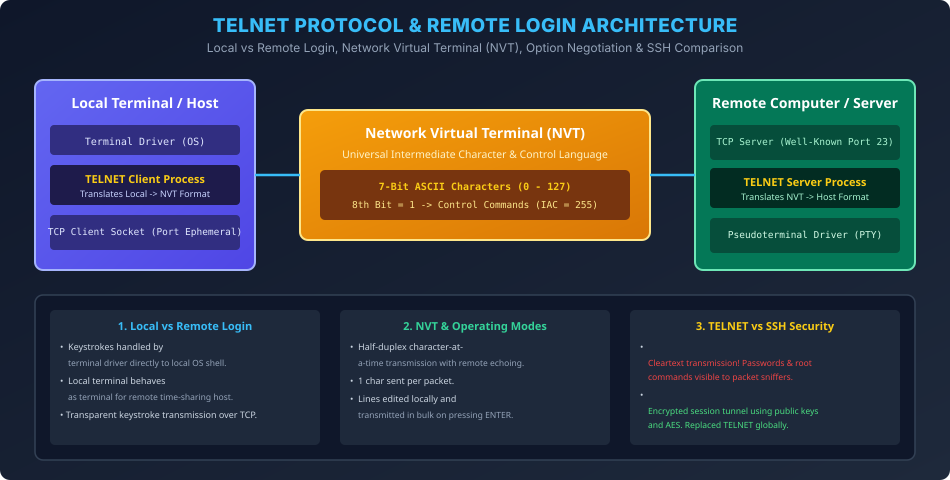

# Module 03: Remote Login & TELNET Architecture

> **Course:** Computer Networks (BCS603) — Unit 5: Application Layer  
> **Source Material:** Gateway Classes (Dr. Nidhi Parashar Ma'am) Slides 19–25  
> **Topic:** Local vs Remote Login, TELNET Client-Server Model, Network Virtual Terminal (NVT), Modes of Operation & SSH Security  

---

## 1. Remote Login Concept vs Local Login

### 1.1 Local Login
Jab koi user directly local computer ke terminal / keyboard par baithkar login karta hai:
- Keystrokes directly operating system ke **Terminal Driver** ko pass hote hain.
- Terminal driver un keystrokes ko evaluate karke local OS shell / application ko forward kar deta hai.

### 1.2 Remote Login (Kyun zaroorat padi?)
Jab user internet ya network ke kisi dusre computer (Remote Server) ko access karke commands execute karna chahta hai:
- User ke local computer par keystrokes type hote hain.
- Local system unhe network packet mein encapsulate karke remote computer ko bhejta hai.
- Remote computer par chal raha program aisa treat karta hai jaise user uske local physical terminal par baithkar kaam kar raha ho.

---

## 2. TELNET (Teletype Network) Protocol

TELNET ek client-server application-layer protocol hai jo users ko remote system par command-line terminal session establish karne ki suvidha deta hai:
- **RFC 854:** Formal protocol specification.
- **Transport Layer:** TCP **Port 23** (Well-Known Server Port).
- **Communication Flow:** Full-duplex byte stream.

```
[User Keystrokes]
       |
       v
[Local Terminal Driver]
       |
       v
[TELNET Client Program]  <=== Translates local keystrokes to NVT
       |
       v
[TCP / IP Network (Internet)]
       |
       v
[TELNET Server (Port 23)] <=== Translates NVT to remote host characters
       |
       v
[Pseudoterminal Driver (PTY)]
       |
       v
[Remote OS Shell (e.g., bash)]
```

---

## 3. Network Virtual Terminal (NVT)

### 3.1 NVT Ka Problem-Solving Role
Different computers alag-alag terminal types aur keyboard encoding use karte hain (e.g., Windows CR+LF, Unix LF, Mac CR, specific control keys).
Agar TELNET client direct character bhejta, to incompatible remote server crash ho jata!
Is heterogeneity ko solve karne ke liye TELNET ne **Network Virtual Terminal (NVT)** ka universal imaginary interface banaya:
- **Sender side:** Local TELNET Client apne local keyboard format ko **NVT format** mein convert karta hai.
- **Receiver side:** Remote TELNET Server NVT format ko apne remote computer ke native format mein translate karta hai.

### 3.2 NVT Character Set & Commands
- **Data Characters (7-bit ASCII):** Most Significant Bit (MSB) = 0. Range: 0 to 127.
- **Control Commands (8-bit):** Jab MSB = 1 hota hai. Command hamesha **IAC (Interpret As Command = 255 / `0xFF`)** se shuru hoti hai.
  - `IAC + WILL`: Sender kisi option ko enable karne ki permission offer karta hai.
  - `IAC + DO`: Receiver sender ko option enable karne ki request karta hai.
  - `IAC + WONT`: Rejection of offer.
  - `IAC + DONT`: Negative response to request.

---

## 4. TELNET Modes of Operation

1. **Default Mode (Half-Duplex / Character-at-a-Time):**
   - User jaise hi 1 character type karta hai, wo turant server ko transmit ho jata hai.
   - Server use process karta hai aur wapas local screen par echo karta hai.
2. **Character Mode:**
   - Har single keystroke alag TCP segment mein send hota hai. Network overhead zyada hota hai (40 bytes header for 1 byte payload).
3. **Line Mode (Modern Standard):**
   - Characters ko local client buffer mein accumulate kiya jata hai.
   - User locally backspace / editing kar sakta hai.
   - Poori line tabhi transmit hoti hai jab user **ENTER / Return** press karta hai.

---

## 5. Security Vulnerability: TELNET vs SSH (AKTU Exam PYQ)

| Feature | TELNET (RFC 854) | SSH - Secure Shell (RFC 4251) |
| :--- | :--- | :--- |
| **Port** | **Port 23** | **Port 22** |
| **Security Mechanism** | **Zero Encryption (Cleartext).** | Strong Cryptographic Tunnel (Public-Key + AES). |
| **Vulnerability** | Passwords, username, sensitive commands Wireshark jaise packet sniffers se easily read ho jaate hain. | Eavesdropping aur Man-in-the-Middle (MITM) attacks impossible hote hain. |
| **Authentication** | Plain text password login. | Password, Public Key (RSA/Ed25519), Two-Factor (2FA). |
| **Current Status** | Deprecated / Obsolete in production. | Global industry standard for remote administration. |

---

## 6. Vector Architecture Diagram


