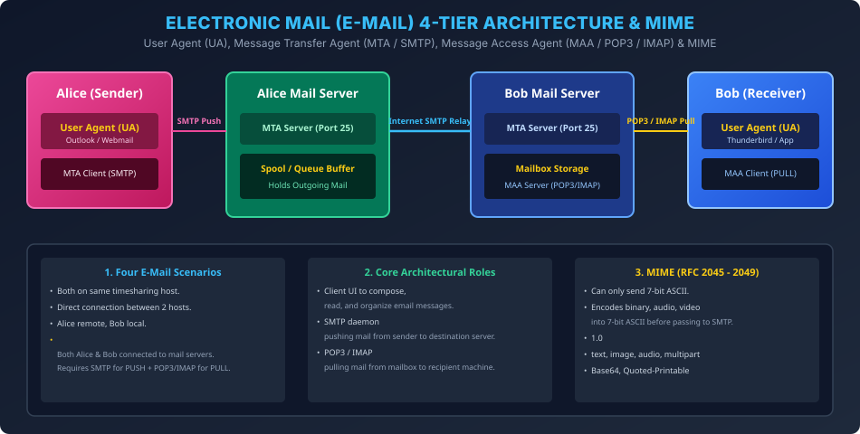

# Module 04: Electronic Mail Architecture and MIME

> **Course:** Computer Networks (BCS603) — Unit 5: Application Layer  
> **Source Material:** Gateway Classes (Dr. Nidhi Parashar Ma'am) Slides 26–36  
> **Topic:** E-Mail Architecture, 4 Operational Scenarios, User Agent (UA), Message Transfer Agent (MTA), Message Access Agent (MAA), and MIME Protocol  

---

## 1. Electronic Mail (E-Mail) Overview

E-mail internet ki sabse purani aur widely used services mein se ek hai. Traditional mail system ki tarah yeh store-and-forward model par kaam karta hai, jismein audio, video, images, formatted text, aur attachments include ho sakte hain.

---

## 2. Four Scenarios of E-Mail Architecture (Slide 27–32)

Dr. Nidhi Parashar Ma'am ke lectures ke anusar e-mail system 4 evolutionary scenarios mein divide kiya gaya hai:

```
Scenario 1: [Alice UA] -> [Bob Mailbox] (Same local time-sharing computer)
Scenario 2: [Alice System / MTA] -------------> [Bob System / MTA] (Both directly online)
Scenario 3: [Alice UA] -> [Alice Mail Server] -> [Bob System (Directly connected)]
Scenario 4: [Alice UA] -> [Alice Server] =====> [Bob Server] -> [Bob UA] (Modern Internet)
```

1. **Scenario 1 (Same System):** Sender aur receiver dono ek hi computer ke users hain. User Agent (UA) message compose karke receiver ke local mailbox file mein directly append kar deta hai. Koi network layer protocol involve nahi hota.
2. **Scenario 2 (Two Different Connected Systems):** Alice aur Bob do alag-alag machines par hain jo directly connected hain. Alice ka MTA client directly Bob ke MTA server ko message transfer karta hai. Requirement: Dono computers simultaneously online hone chahiye.
3. **Scenario 3 (Intermediate Mail Server on One Side):** Alice apne computer par work karti hai aur LAN ke through apne Mail Server ko email push karti hai. Bob directly apne system par available rehta hai.
4. **Scenario 4 (Modern Ubiquitous Internet Architecture):**
   - Alice aur Bob dono apne-apne personal devices (laptop/mobile) par hain aur 24x7 online nahi reh sakte.
   - Alice **User Agent (UA)** use karke email compose karti hai aur **SMTP Push Protocol** ke through apne **Mail Server (MTA)** ko bhejti hai.
   - Alice ka Mail Server internet par Bob ke Mail Server ko email relay karta hai using **SMTP**.
   - Bob jab bhi online aata hai, wo **Message Access Agent (POP3 / IMAP4)** use karke Bob Mail Server ke mailbox se emails **PULL** karta hai.

---

## 3. Core Architectural Components: UA vs MTA vs MAA

| Component | Full Name | Primary Responsibility | Representative Protocols |
| :---: | :--- | :--- | :---: |
| **UA** | **User Agent** | Software program allowing users to compose, read, reply to, forward, and manage mail. | Outlook, Thunderbird, Webmail GUI |
| **MTA** | **Message Transfer Agent** | Transports mail across the internet from client to mail server, and server to server (**PUSH protocol**). | **SMTP** (Port 25, 587) |
| **MAA** | **Message Access Agent** | Retrieves mail from the recipient's mail server spool into the client's local user agent (**PULL protocol**). | **POP3** (Port 110), **IMAP4** (Port 143) |

---

## 4. Multipurpose Internet Mail Extensions (MIME)

### 4.1 The Fundamental Problem of Legacy SMTP
Original SMTP protocol (RFC 821) strictly **7-bit NVT ASCII** format par design kiya gaya tha. Iska matlab:
- Non-English languages (Hindi, Chinese, French accents) support nahi the.
- Binary files (images `.png`, executable `.exe`, audio `.mp3`, video `.mp4`) directly send nahi ho sakte the kyunki inka 8th bit high hota hai.

### 4.2 MIME Architecture & Headers
MIME ek supplementary protocol hai jo non-ASCII aur binary content ko transparently **7-bit ASCII text string** mein transform karta hai taaki existing SMTP servers bina kisi modification ke use route kar sakein.

```
[Binary Data / Image / Audio]
              |
              v
[MIME Encoder (Base64 / Quoted-Printable)]
              |
              v
[7-bit ASCII Text] ===> Transmitted via SMTP ===> [MIME Decoder] ===> [Original File]
```

### 4.3 Five Critical MIME Headers
1. `MIME-Version`: Protocol version specify karta hai (usually `1.0`).
2. `Content-Type`: Data type aur subtype define karta hai:
   - `text/plain`, `text/html`
   - `image/jpeg`, `image/png`
   - `audio/mp3`, `video/mp4`
   - `application/pdf`, `application/octet-stream`
   - `multipart/mixed` (Multiple attachments + text body)
3. `Content-Transfer-Encoding`: Transformation algorithm define karta hai:
   - `7bit` / `8bit` / `binary`
   - `quoted-printable` (mostly ASCII with few special chars)
   - `base64` (har 3 binary bytes (24 bits) ko chaar 6-bit ASCII characters mein encode karta hai).
4. `Content-Id`: Unique identifier for caching and tracking message components.
5. `Content-Description`: Human-readable summary of attachment.

---

## 5. Vector Architecture Diagram


