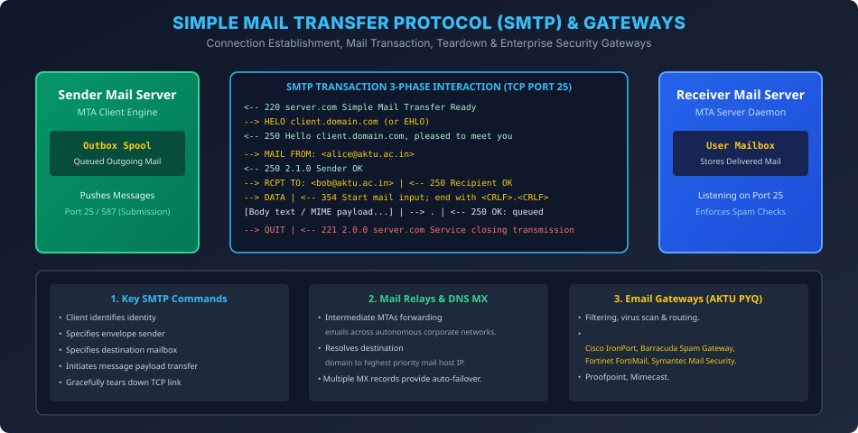

# Module 05: Simple Mail Transfer Protocol (SMTP) and Gateways

> **Course:** Computer Networks (BCS603) — Unit 5: Application Layer  
> **Source Material:** Gateway Classes (Dr. Nidhi Parashar Ma'am) Slides 37–42, 67–68  
> **Topic:** SMTP Architecture, 3-Phase Interaction, Commands & Responses, Intermediate Relays, and Email Gateways  

---

## 1. Simple Mail Transfer Protocol (SMTP) Overview

SMTP ek standard protocol hai jo internet par email messages ko reliably transfer karne ke liye use kiya jata hai:
- **RFC Standard:** RFC 821 (Original), RFC 2821 / RFC 5321 (Modern).
- **Transport Layer:** TCP **Port 25** (Server-to-Server Relay), **Port 587** (Message Submission with STARTTLS).
- **Core Characteristic:** Strictly a **PUSH Protocol** (Sender MTA pushes message to Receiver MTA).

---

## 2. SMTP 3-Phase Working Architecture

Jab Alice ka mail server Bob ke mail server se communicate karta hai, to transfer strictly 3 phases mein complete hota hai:

### Phase 1: Connection Establishment (Handshake)
1. Server listens on TCP Port 25. Client initiates TCP 3-way handshake.
2. Server responds with greeting: `220 mail.bob.com SMTP Ready`.
3. Client introduces itself: `HELO mail.alice.com` (or `EHLO` for Extended SMTP).
4. Server acknowledges: `250 Hello mail.alice.com, pleased to meet you`.

### Phase 2: Mail Transfer (Data Exchange)
1. **Envelope Sender:** Client bhejta hai `MAIL FROM: <alice@aktu.ac.in>`. Server replies: `250 2.1.0 Sender OK`.
2. **Envelope Recipient:** Client bhejta hai `RCPT TO: <bob@aktu.ac.in>`. Server replies: `250 Recipient OK`. (Multiple recipients ke liye alag-alag `RCPT TO` commands bhejte hain).
3. **Data Initiation:** Client bhejta hai `DATA`. Server replies: `354 Start mail input; end with <CRLF>.<CRLF>`.
4. **Message Body Stream:** Client email ke headers (`From:`, `To:`, `Subject:`) aur actual MIME body transmit karta hai.
5. **End of Message Signal:** Client akele line par single dot `.` bhejta hai (`\r\n.\r\n`).
6. Server confirm karta hai: `250 OK: message queued 104928`.

### Phase 3: Connection Termination (Teardown)
1. Client bhejta hai: `QUIT`.
2. Server replies: `221 2.0.0 mail.bob.com Service closing transmission channel`.
3. Dono sides TCP 4-way FIN close handshake execute karke socket close kar deti hain.

---

## 3. High-Frequency SMTP Status Codes

| Code | Meaning | Context |
| :---: | :--- | :--- |
| **220** | Service Ready | Server greeting after TCP connection |
| **250** | Requested Mail Action OK | Command accepted (`HELO`, `MAIL FROM`, `RCPT TO`, final `.`) |
| **354** | Start Mail Input | Server ready to receive raw message body after `DATA` |
| **421** | Service Not Available | Server overloaded or shutting down (temporary failure) |
| **500** | Syntax Error | Unrecognized command syntax |
| **550** | Mailbox Unavailable | User does not exist at destination domain (Bounce) |
| **221** | Closing Transmission Channel | Reply to `QUIT` command |

---

## 4. Intermediate Relays & DNS MX Records

- **Mail Relay:** Jab sender aur receiver alag-alag networks/domains mein hote hain, to message intermediate MTAs (Relays) ke through hop-by-hop travel karta hai.
- **DNS MX Record Resolution:**
  - Sender mail server recipient ke domain ka **MX (Mail Exchanger)** record query karta hai:
    $$\text{Query: } \text{MX aktu.ac.in} \implies \text{Priority 10: mail1.aktu.ac.in, Priority 20: mail2.aktu.ac.in}$$
  - Sender lowest preference number (highest priority) wale IP par connect karta hai. Agar wo down ho, to automatically secondary server par failover ho jata hai.

---

## 5. Email Gateways (AKTU Exam PYQ - Slides 67–68)

### 5.1 Email Gateway Ka Role
Email Gateway ek specialized network security node hai jo incoming aur outgoing email traffic ko scan, filter, aur secure karta hai corporate network ke border par.

### 5.2 Key Functions
1. **Spam & Phishing Filtering:** Malicious links aur spam patterns block karta hai.
2. **Antivirus & Malware Scanning:** Attachments ko sandbox mein execute karke zero-day viruses detect karta hai.
3. **Data Loss Prevention (DLP):** Sensitive company data (Credit cards, passwords) bahar leak hone se rokta hai.
4. **Authentication:** SPF, DKIM, aur DMARC records verify karta hai.

### 5.3 Widely Used Email Gateways (AKTU PYQ List)
- **On-Premises / Appliance-Based:**
  1. *Cisco IronPort (Cisco Email Security Appliance - ESA)*
  2. *Barracuda Email Security Gateway*
  3. *Fortinet FortiMail*
  4. *Symantec Messaging Gateway*
  5. *Sophos Email Appliance*
- **Cloud-Based Gateways:**
  1. *Proofpoint Enterprise Protection*
  2. *Mimecast Secure Email Gateway*

---

## 6. Vector Architecture Diagram

