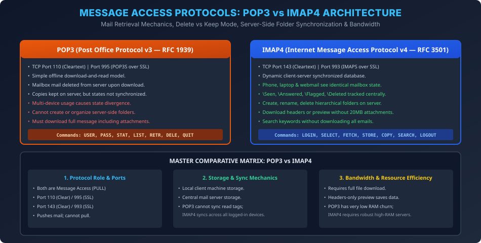

# Module 06: Mail Access Protocols: POP3 vs IMAP4

> **Course:** Computer Networks (BCS603) — Unit 5: Application Layer  
> **Source Material:** Gateway Classes (Dr. Nidhi Parashar Ma'am) Slides 43–45  
> **Topic:** Message Access Protocols, POP3 Delete vs Keep Mode, IMAP4 Features & Comprehensive Comparison  

---

## 1. Kyun Zaroorat Padi Mail Access Protocol Ki? (PULL vs PUSH)

SMTP ek **Push Protocol** hai. Yeh sender se server tak, aur ek server se dusre server tak mail push karne ke liye behtareen hai. Lekin recipient client (jo laptop ya smartphone par hai) 24 ghante internet se connected nahi rehta aur uska public static IP nahi hota. Isliye recipient computer par SMTP server daemon run nahi ho sakta!
Recipient jab bhi online aata hai, use apne server ke mailbox se messages retrieve karne ke liye ek **Pull Protocol** ki zaroorat hoti hai.
Isi purpose ke liye do prominent protocols develop kiye gaye:
1. **POP3 (Post Office Protocol version 3)**
2. **IMAP4 (Internet Message Access Protocol version 4)**

---

## 2. Post Office Protocol Version 3 (POP3 RFC 1939)

### 2.1 Core Characteristics
- **Port:** Standard TCP **Port 110**, Secure SSL/TLS **Port 995 (POP3S)**.
- **Workflow:** Client connect karta hai $\to$ Credentials verify karta hai $\to$ Mail download karta hai $\to$ Connection close karta hai $\to$ User offline baithkar mail padhta hai.

### 2.2 POP3 Modes of Operation (AKTU Exam Question)
1. **Delete Mode:**
   - Client mail download karte hi server ko `DELE` command issue karta hai.
   - Mail server ke spool se permanently delete ho jati hai aur sirf local client ke hard drive par rehti hai.
   - *Limitation:* Agar user doosre device (jaise phone) se login kare, to use purani mails nahi milengi!
2. **Keep Mode:**
   - Mail download hone ke baad bhi server par waise hi store rehti hai.
   - *Limitation:* Agar user ek device par mail read kar leta hai ya delete kar deta hai, to doosre device ko yeh update pata nahi chalta (Zero synchronization).

---

## 3. Internet Message Access Protocol Version 4 (IMAP4 RFC 3501)

### 3.1 Modern Cloud Mail Architecture
IMAP4 ek modern, feature-rich protocol hai jo emails ko locally move karne ke bajaye **Server-Side Centralized Database** ke roop mein maintain karta hai:
- **Port:** Standard TCP **Port 143**, Secure SSL/TLS **Port 993 (IMAPS)**.

### 3.2 IMAP4 Ke Exclusive Features
1. **Multi-Device Synchronization:** User chahe mobile, laptop, tablet, ya web browser se login kare, sabhi jagah mailbox identical rehta hai.
2. **Message State Flags:** Emails ke status flags (`\Seen`, `\Answered`, `\Flagged`, `\Draft`, `\Deleted`) centrally synchronize hote hain.
3. **Hierarchical Folder Management:** User server par folders create, rename, aur delete kar sakta hai (e.g., *Work*, *College*, *Personal*).
4. **Partial Download / Header Preview:** Client poora 25 MB ka attachment download kiye bina sirf email header ya pehle 50 words preview kar sakta hai (Mobile data bandwidth saving).
5. **Server-Side Search:** Client server par direct complex search query (`SEARCH FROM "aktu" SINCE 01-Jan-2024`) run kar sakta hai.

---

## 4. Master 10-Point Comparison: POP3 vs IMAP4 (AKTU Favorite)

| Feature / Criterion | POP3 (Post Office Protocol v3) | IMAP4 (Internet Message Access Protocol v4) |
| :--- | :--- | :--- |
| **RFC Standard** | RFC 1939 | RFC 3501 |
| **Default Ports** | Port 110 (Plain), Port 995 (SSL) | Port 143 (Plain), Port 993 (SSL) |
| **Storage Paradigm** | Local Hard Drive (Download & Delete/Keep) | Central Mail Server Storage |
| **Multi-Device Sync** | Poor / Broken across devices | Seamless Real-time Synchronization |
| **Folder Organization** | Local folders only; no server folders | Full hierarchical folder management on server |
| **Message Status Flags** | Flags not synced across clients | Synced (`\Seen`, `\Flagged`, `\Answered`) |
| **Selective / Partial Fetch**| No (Full message with attachments must be fetched) | Yes (Can fetch only headers or specific MIME parts) |
| **Server Resource Overhead**| Extremely lightweight on server RAM/disk | High memory and disk usage on mail server |
| **Offline Usability** | Excellent once downloaded | Requires local caching for offline access |
| **Primary Use-Case** | Single legacy PC, limited server storage | Modern smartphones, webmail, multiple devices |

---

## 5. Vector Architecture Diagram

