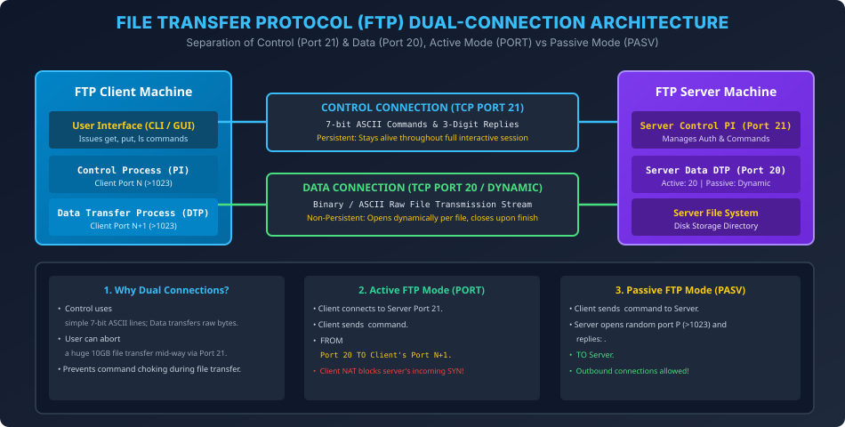

# Module 07: File Transfer Protocol (FTP) Architecture

> **Course:** Computer Networks (BCS603) — Unit 5: Application Layer  
> **Source Material:** Gateway Classes (Dr. Nidhi Parashar Ma'am) Slides 46–56  
> **Topic:** File Transfer Protocol (RFC 959), Dual-Connection Architecture, Control vs Data Connection, Active Mode vs Passive Mode, and Anonymous FTP  

---

## 1. File Transfer Protocol (FTP) Overview

FTP ek standard client-server protocol hai jo do hosts ke beech files copy / transfer karne ke liye use hota hai:
- **RFC Standard:** RFC 959.
- **Underlying Protocol:** TCP (Transmission Control Protocol).
- **Core Characteristic (AKTU Exam Question):** FTP unique hai kyunki yeh **Do Alag TCP Connections (Dual Connections)** use karta hai.

---

## 2. FTP Dual-Connection Architecture

FTP commands aur actual data ko mix nahi karta; dono ke liye completely separate logical channels maintain karta hai:

```
+---------------------+                            +---------------------+
|      FTP CLIENT     |                            |      FTP SERVER     |
|                     |                            |                     |
|  Control Process PI | <==== Port 21 (Control) ==> |  Control Process PI |
|   (Client Port N)   |       (Persistent)         |      (Port 21)      |
|                     |                            |                     |
|   Data Process DTP  | <==== Port 20 / Ephem ===== |   Data Process DTP  |
|  (Client Port N+1)  |       (Non-Persistent)     |   (Port 20 or PASV) |
+---------------------+                            +---------------------+
```

### 2.1 Control Connection (TCP Port 21)
- **Lifetime:** Entire interactive session ke dauran open rehta hai.
- **Port:** Server ka well-known **TCP Port 21**.
- **Data Transferred:** Lightweight 7-bit ASCII text commands (e.g., `USER`, `PASS`, `LIST`, `RETR`, `STOR`, `QUIT`) aur server ke 3-digit numeric status responses (e.g., `220`, `230`, `550`).
- **Purpose:** Authentication, directory navigation, transfer mode selection.

### 2.2 Data Connection (TCP Port 20 / Ephemeral)
- **Lifetime:** Ephemeral / Non-persistent. Har single file transfer ya directory listing ke liye naya open hota hai, aur transfer complete hote hi turant close ho jata hai.
- **Data Transferred:** Actual file contents (binary programs, images, large video streams).

### 2.3 Kyun Zaroorat Padi Do Alag Connections Ki?
1. **Separation of Concerns:** Control connection 7-bit ASCII commands use karta hai jabki data connection complex binary raw bytes handle karta hai.
2. **Interactive Control Mid-Transfer:** Agar 50 GB ki file transfer ho rahi ho aur user use cancel karna chahe, to Control connection open hone ki wajah se wo `ABOR` command bhej sakta hai bina file transmission chump hone ka wait kiye.

---

## 3. Active Mode vs Passive Mode FTP (AKTU 2023-24 PYQ)

### 3.1 Active FTP Mode (Client-Side Firewall Problem)
1. Client Server ke Port 21 par connect hota hai.
2. Client apne system par ek random unreserved port $N+1$ allocate karta hai.
3. Client Control Connection par `PORT h1,h2,h3,h4,p1,p2` command bhejta hai (jahan Port = $p1 \times 256 + p2$).
4. **Data Connection Initiation:** Server apne **Port 20** se client ke port $N+1$ ko connection initiate karta hai!
- **The Problem:** Modern clients NAT router ya Firewall ke peeche hote hain. Client ka firewall bahar se aane wale server ke incoming connection request (`SYN`) ko packet drop kar deta hai!

### 3.2 Passive FTP Mode (Firewall-Friendly Solution)
1. Client Control Connection par `PASV` command bhejta hai.
2. Server apne paas ek random high port $P$ ($>1023$) open karta hai.
3. Server client ko reply karta hai: `227 Entering Passive Mode (h1,h2,h3,h4,p1,p2)`.
4. **Data Connection Initiation:** Client khud server ke port $P$ par connection initiate karta hai!
- **Why it works:** Firewalls outbound connections ko allow karte hain, isliye Passive mode NAT aur firewall ke sath bina kisi problem ke work karta hai.

---

## 4. Transmission Modes & Anonymous FTP

- **Transmission Modes:**
  1. *Stream Mode (Default):* Data raw continuous stream of bytes ke roop mein transfer hota hai. File ka end TCP FIN segment se indicate hota hai.
  2. *Block Mode:* Data headers ke sath blocks mein divide hota hai (har block mein byte count hota hai).
  3. *Compressed Mode:* Simple Run-Length Encoding (RLE) use karke consecutive repeated bytes ko compress kiya jata hai.
- **Anonymous FTP:** Public servers par public access ke liye enable hota hai:
  - Username: `anonymous`
  - Password: User ka valid email address (e.g., `guest@domain.com`).

---

## 5. Vector Architecture Diagram


