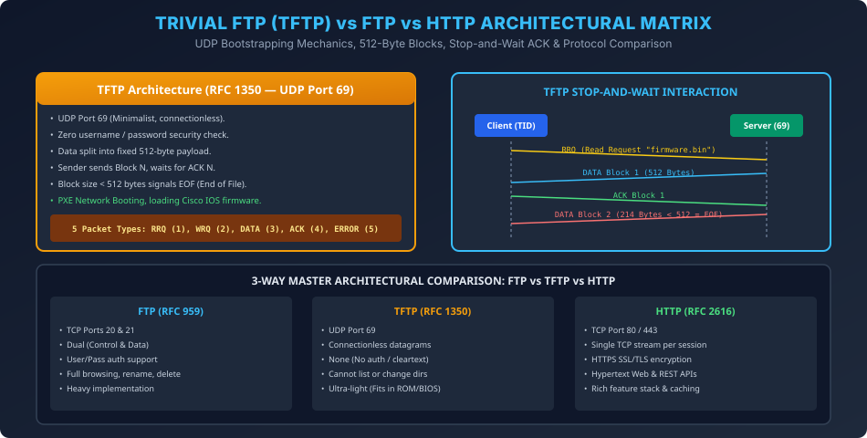

# Module 08: Trivial File Transfer Protocol (TFTP) vs FTP and HTTP

> **Course:** Computer Networks (BCS603) — Unit 5: Application Layer  
> **Source Material:** Gateway Classes (Dr. Nidhi Parashar Ma'am) Slides 57–59  
> **Topic:** TFTP Architecture (RFC 1350), UDP Port 69, 512-Byte Blocks, Stop-and-Wait Recovery & Master 3-Way Comparison (FTP vs TFTP vs HTTP)  

---

## 1. Trivial File Transfer Protocol (TFTP) Overview

TFTP ek extremely lightweight protocol hai jo un scenarios ke liye banaya gaya tha jahan full-fledged FTP implementation possible ya zaroori nahi hoti:
- **RFC Standard:** RFC 1350.
- **Transport Layer:** **UDP Port 69** (Connectionless transport).
- **Core Design Objective:** Itna chhota code footprint hona chahiye ki yeh kisi diskless workstation ki **ROM / BIOS / Bootloader** memory mein fit ho sake (PXE Boot / Cisco IOS upgrade).

---

## 2. TFTP Protocol Mechanics

### 2.1 Salient Technical Features
1. **Zero Authentication:** TFTP mein koi username ya password validation nahi hota. Client seedha file read ya write request bhejta hai.
2. **Fixed 512-Byte Block Size:** Data hamesha strictly 512 bytes ke blocks mein break kiya jata hai.
3. **Stop-and-Wait Reliability:** TFTP UDP par run karta hai, isliye error control yeh khud application layer par manage karta hai:
   - Sender Block 1 bhejta hai aur timer start karta hai.
   - Jab tak receiver se `ACK 1` nahi milta, tab tak sender `Block 2` transmit nahi karta!
4. **End of File (EOF) Detection:**
   - Jab bhi kisi block ka data size strictly $< 512$ bytes hota hai (e.g., 200 bytes, ya exactly 0 bytes agar original file 512 ka multiple ho), client aur server samajh jaate hain ki file transfer successfully complete ho gaya!

### 2.2 Five TFTP Packet Types (Opcodes)
1. `RRQ` (Opcode 1): Read Request (file download karne ke liye).
2. `WRQ` (Opcode 2): Write Request (file server par upload karne ke liye).
3. `DATA` (Opcode 3): Carries 2-byte Block Number + up to 512 bytes data payload.
4. `ACK` (Opcode 4): 2-byte Block Number acknowledge karta hai.
5. `ERROR` (Opcode 5): Error Code aur human-readable error string convey karta hai.

---

## 3. Master 3-Way Architectural Comparison: FTP vs TFTP vs HTTP (AKTU 2023-24 PYQ)

| Parameter | FTP (RFC 959) | TFTP (RFC 1350) | HTTP (RFC 2616 / RFC 7540) |
| :--- | :--- | :--- | :--- |
| **Transport Layer** | **TCP (Ports 20 & 21)** | **UDP (Port 69)** | **TCP (Port 80 / 443)** |
| **Connection Nature** | Dual Connections (Control + Data) | Connectionless Datagrams | Single Persistent Connection |
| **Authentication** | Username & Password mandatory | **No authentication (Zero)** | Basic, Bearer Token, OAuth, Cookies |
| **Directory Operations**| Full directory listing (`ls`), rename, mkdir | **No directory browsing** | Restricted by web server routes / REST |
| **Error Handling** | Handled natively by TCP layer | Handled via Stop-and-Wait ACKs in TFTP | Handled natively by TCP layer |
| **Overhead & Complexity**| Heavy (Full stateful stack) | Minimal (Fits in ROM / PXE boot) | Medium to Heavy (Headers, caching) |
| **Typical Use-Case** | Bulk administrative file transfers | Bootstrapping, router firmware flashing | Web page delivery, multimedia, REST APIs |

---

## 4. Vector Architecture Diagram

