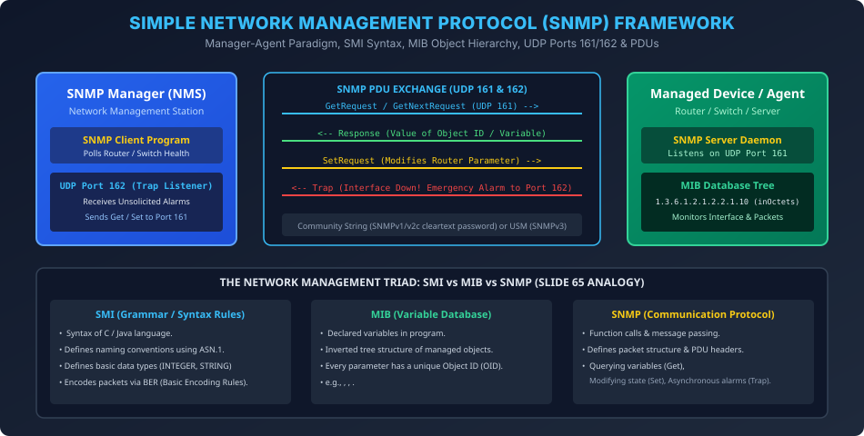

# Module 09: Network Management and SNMP Architecture

> **Course:** Computer Networks (BCS603) — Unit 5: Application Layer  
> **Source Material:** Gateway Classes (Dr. Nidhi Parashar Ma'am) Slides 60–66  
> **Topic:** SNMP Framework, Manager-Agent Paradigm, SMI Syntax, MIB Tree, UDP Ports 161/162 & Protocol PDUs  

---

## 1. Network Management Overview & Kyun Zaroorat Padi?

Modern internet mein hazaron routers, switches, servers, aur firewalls 24x7 run karte hain. Network Administrator ke liye har ek switch ke paas jaakar uski physical health, interface link status, CPU temperature, aur packet drop count manually check karna impossible hai.
**SNMP (Simple Network Management Protocol)** ek standardized framework provide karta hai jisse ek central computer (NMS - Network Management Station) poore network ke devices ko remotely monitor aur configure kar sakta hai.

---

## 2. Manager and Agent Paradigm

```
+-----------------------------------+             UDP 161 (Get / Set)            +-----------------------------------+
|      SNMP Manager (NMS Host)      | -----------------------------------------> |       SNMP Agent (Router/Switch)  |
|                                   | <----------------------------------------- |                                   |
| Client Process / Admin Dashboard  |            UDP 161 (Response)              | Server Daemon + MIB Local DB      |
| Listening on UDP Port 162 (Trap)  | <========================================= | Unsolicited Link Down Trap (162)  |
+-----------------------------------+             UDP 162 (Trap Alert)           +-----------------------------------+
```

- **Manager (Client):** Central management console par run hota hai. Yeh regular intervals par agents ko poll karta hai.
- **Agent (Server):** Har managed network device (Cisco Router, Switch, Linux Server) par run hone wala daemon hai. Yeh local hardware sensors aur traffic counters ko MIB variables mein update karta rehta hai.
- **Port Numbers (AKTU Exam High-Frequency):**
  - **UDP Port 161:** Agent listens on Port 161. Manager sends `GetRequest`, `GetNextRequest`, `SetRequest` here.
  - **UDP Port 162:** Manager listens on Port 162. Agent sends unsolicited **Trap** notifications here.

---

## 3. The Management Triad: SMI, MIB, and SNMP (Slide 65 Analogy)

Dr. Nidhi Parashar Ma'am ke lectures ke anusar network management ko ek software program ki analogy se samjha ja sakta hai:

| Component | Programming Analogy | Technical Function in Network Management |
| :---: | :--- | :--- |
| **SMI** *(Structure of Management Information)* | Programming Language Syntax (C / Java rules) | Defines grammar, naming rules, data types (ASN.1), and binary encoding rules (BER). |
| **MIB** *(Management Information Base)* | Declared Variables & Objects | Inverted hierarchical tree database defining all measurable attributes and their OIDs. |
| **SNMP** *(Simple Network Management Protocol)* | Program Execution & Function Calls | Formats packets, encapsulates PDUs, and handles message exchange over UDP. |

### 3.1 MIB Object Identifier (OID) Hierarchy
Har measurable attribute ka ek unique numerical path hota hai:
$$\text{Root} \to \text{iso (1)} \to \text{org (3)} \to \text{dod (6)} \to \text{internet (1)} \to \text{mgmt (2)} \to \text{mib-2 (1)}$$
Prefix: `1.3.6.1.2.1`
- `1.3.6.1.2.1.1`: `system` group (Hostname, uptime, contact).
- `1.3.6.1.2.1.2`: `interfaces` group (Speed, MTU, inOctets, outOctets).

---

## 4. Five Core SNMP Operations / PDUs (AKTU 2018-19 PYQ)

What three functions can SNMP perform?
1. **GetRequest / GetNextRequest (Monitoring / Reading):**
   - Manager agent se kisi specific OID ka current value retrieve karta hai (e.g., *"Port 2 par kitne bytes receive hue?"*).
2. **SetRequest (Configuration / Writing):**
   - Manager agent ke kisi parameter ko remotely change karta hai (e.g., *"Interface Gi0/1 ko administratively shutdown kar do"*).
3. **Trap (Proactive Alerting / Reporting):**
   - Agent bina kisi request ka wait kiye turant manager ke Port 162 par emergency alert bhejta hai (e.g., *"Power supply failed! Link cut!"*).

---

## 5. Vector Architecture Diagram


