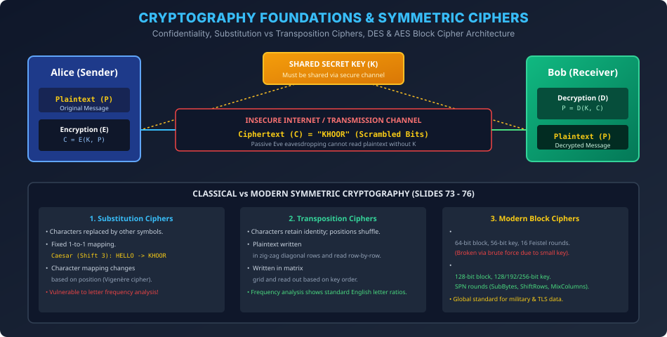

# Module 10: Cryptography Foundations and Symmetric Ciphers

> **Course:** Computer Networks (BCS603) — Unit 5: Application Layer  
> **Source Material:** Gateway Classes (Dr. Nidhi Parashar Ma'am) Slides 69–76  
> **Topic:** Cryptographic Goals, Symmetric vs Asymmetric Cryptography, Substitution vs Transposition Ciphers, DES & AES  

---

## 1. Cryptography Foundations & Security Goals

Cryptography ek aisi science aur art hai jismein messages ko is tarah transform (encrypt) kiya jata hai taaki unauthorized parties unhe padh na sakein.
Network Security ke **Chaar Core Pillars (Goals)** hote hain:
1. **Confidentiality (Privacy):** Sirf intended receiver hi message content padh sake (Sniffing prevention).
2. **Integrity:** Message raste mein kisi adversary ke dwara alter ya tamper na kiya gaya ho.
3. **Authentication:** Sender aur receiver ek dusre ki actual identity confirm kar sakein (Spoofing prevention).
4. **Non-repudiation:** Sender baad mein yeh inkar na kar sake ki usne message bheja tha (Digital signatures).

---

## 2. Symmetric-Key Cryptography (Secret-Key Ciphers)

Symmetric Cryptography mein sender aur receiver **ek hi shared secret key ($K$)** use karte hain:
$$\text{Encryption: } C = E_K(P) \qquad \text{Decryption: } P = D_K(C)$$

```
[Plaintext P] ---> [Encryption Engine E] ---> [Ciphertext C] ---> [Decryption Engine D] ---> [Plaintext P]
                          ^                                             ^
                          |                                             |
                  [Secret Key K] =============================== [Secret Key K]
```

### 2.1 The Key Distribution Dilemma
Symmetric key encryption extremely fast hota hai, lekin iska sabse bada limitation **Key Distribution Problem** hai:
- Agar $N$ users ko aapas mein securely baat karni ho, to unhe $\frac{N(N-1)}{2}$ unique keys manage karni padti hain!
- Sender aur receiver ko secret key share karne ke liye ek alag secure channel chahiye hota hai.

---

## 3. Traditional Classical Ciphers (Slides 73–76)

### 3.1 Substitution Ciphers
Plaintext ke characters ko doosre characters, numbers, ya symbols se replace kiya jata hai:
1. **Monoalphabetic Cipher (Caesar / Shift Cipher):**
   - Har letter ko alphabet mein $k$ positions aage shift kiya jata hai ($k=3$ for Caesar):
     $$C = (P + k) \bmod 26 \qquad P = (C - k) \bmod 26$$
   - **Slide 75 Example:** Plaintext `"HELLO"`
     - $H(7) + 3 = 10 (K)$
     - $E(4) + 3 = 7 (H)$
     - $L(11) + 3 = 14 (O)$
     - $L(11) + 3 = 14 (O)$
     - $O(14) + 3 = 17 (R)$
     - Ciphertext = `"KHOOR"`
   - *Weakness:* Letter Frequency Analysis! English mein 'E', 'T', 'A' sabse zyada frequent hote hain. Agar ciphertext mein 'O' sabse zyada appear ho, to attacker turant $O \implies L$ deduct kar leta hai.
2. **Polyalphabetic Cipher (Vigenère Cipher):**
   - Har character ki substitution uski position aur repeating key word par depend karti hai. Flat frequency curve provide karta hai.

### 3.2 Transposition Ciphers
Isme characters ko replace nahi kiya jata; unki **positions shuffle / rearrange** ki jaati hain:
1. **Rail Fence Cipher:** Message ko zig-zag diagonals mein likhte hain aur rows ke roop mein read karte hain.
2. **Columnar Transposition:** Plaintext ko rectangular grid mein likha jata hai aur columns ko key permutation ke order mein read kiya jata hai.

---

## 4. Modern Symmetric Block Ciphers: DES vs AES

| Feature | DES (Data Encryption Standard) | AES (Advanced Encryption Standard) |
| :--- | :--- | :--- |
| **Year / Standard** | 1977 (IBM / NIST) | 2001 (Rijndael Algorithm / NIST) |
| **Block Size** | **64 bits** | **128 bits** |
| **Key Size** | **56 bits** (8 parity bits discarded) | **128, 192, or 256 bits** |
| **Cipher Structure** | **Feistel Network** (16 Rounds) | **Substitution-Permutation Network (SPN)** |
| **Round Operations** | Expansion, S-Boxes, P-Boxes, XOR | SubBytes, ShiftRows, MixColumns, AddRoundKey |
| **Security Status** | **Vulnerable / Broken** (Brute-force crackable within hours) | **Extremely Secure** (Current global gold standard for TLS & Government) |

---

## 5. Vector Architecture Diagram


