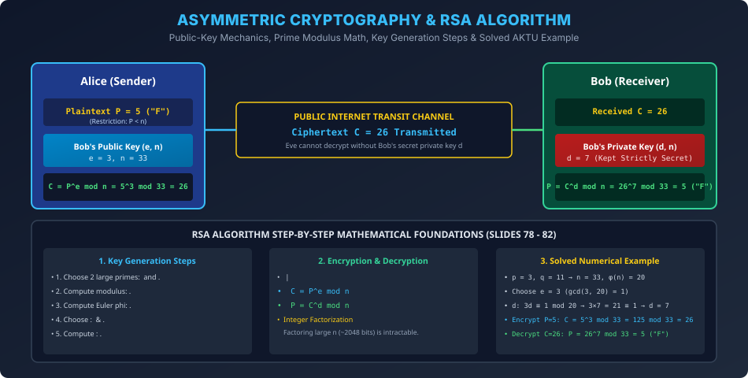

# Module 11: Asymmetric Cryptography and RSA Algorithm

> **Course:** Computer Networks (BCS603) — Unit 5: Application Layer  
> **Source Material:** Gateway Classes (Dr. Nidhi Parashar Ma'am) Slides 77–83  
> **Topic:** Asymmetric (Public-Key) Cryptography Principles, RSA Algorithm Steps, Mathematical Proof & Solved Numerical Bank (Character 'F')  

---

## 1. Asymmetric Cryptography Overview

Symmetric cryptography mein sabse badi mushkil shared key distribution ki thi.
1976 mein Diffie aur Hellman ne **Asymmetric (Public-Key) Cryptography** ka concept introduce kiya, jismein har entity ke paas **Do Mathematically Related Keys (Key Pair)** hoti hain:
1. **Public Key ($K_{\text{pub}}$):** Poori duniya ko openly distribute ki jaati hai (Directories, DNS, Certificates).
2. **Private Key ($K_{\text{priv}}$):** Sirf owner ke paas confidential aur encrypted form mein safe rehti hai.

$$\text{Rule: } \text{Data encrypted with Public Key can ONLY be decrypted by corresponding Private Key!}$$
$$\text{Encryption: } C = E_{K_{\text{pub}}}(P) \qquad \text{Decryption: } P = D_{K_{\text{priv}}}(C)$$

---

## 2. RSA Algorithm (Rivest, Shamir, Adleman — 1977)

RSA algorithm number theory ke **Prime Factorization Problem** par based hai (Do bade prime numbers ko multiply karna aasan hai, lekin unke product $n$ se wapas primes $p$ aur $q$ discover karna practically impossible hai).

### 2.1 Step-by-Step RSA Key Selection Algorithm (AKTU Exam Favorite)
1. **Step 1:** Do bahut bade prime numbers select karein: $p$ aur $q$.
2. **Step 2:** Modulus compute karein:
   $$n = p \times q$$
3. **Step 3:** Euler's Totient Function $\phi(n)$ compute karein:
   $$\phi(n) = (p - 1)(q - 1)$$
4. **Step 4:** Public Exponent $e$ select karein such that:
   $$1 < e < \phi(n) \quad \text{and} \quad \gcd(e, \phi(n)) = 1 \quad (\text{co-prime to } \phi(n))$$
5. **Step 5:** Private Exponent $d$ compute karein using Extended Euclidean Algorithm:
   $$d \cdot e \equiv 1 \pmod{\phi(n)} \implies d = e^{-1} \pmod{\phi(n)}$$
6. **Step 6:** Keys define karein:
   - **Public Key:** $\text{PU} = \{e, n\}$ (Announced publicly).
   - **Private Key:** $\text{PR} = \{d, n\}$ (Kept secret by receiver).

---

## 3. Encryption & Decryption Formulas

- **Encryption (by Sender):**
  $$C = P^e \bmod n \quad (\text{Restriction: } P < n)$$
- **Decryption (by Receiver):**
  $$P = C^d \bmod n$$

---

## 4. Solved AKTU Numerical: Transmission of Character 'F' (AKTU 2022-23 PYQ)

> **Question:** *Explain asymmetric cryptography. Write the steps of RSA algorithm and demonstrate the transmission of character "F" using RSA with prime numbers $p=3$ and $q=11$.*

### Step 1: Modulus and Totient Calculation
- Given primes: $p = 3, q = 11$.
- Modulus:
  $$n = p \times q = 3 \times 11 = 33$$
- Totient:
  $$\phi(n) = (p - 1)(q - 1) = (3 - 1)(11 - 1) = 2 \times 10 = 20$$

### Step 2: Selecting Public Exponent $e$
- We need $1 < e < 20$ such that $\gcd(e, 20) = 1$.
- Let us choose $e = 3$.
- Verify: $\gcd(3, 20) = 1$ (Valid!).

### Step 3: Computing Private Exponent $d$
- Formula: $d \times e \equiv 1 \pmod{\phi(n)} \implies 3d \equiv 1 \pmod{20}$.
- We find integer $k$ such that:
  $$d = \frac{k \cdot \phi(n) + 1}{e} = \frac{k(20) + 1}{3}$$
  - For $k = 1$: $d = \frac{21}{3} = 7$.
- Thus, Private Key $d = 7$.
- **Key Summary:** Public Key = $\{e=3, n=33\}$, Private Key = $\{d=7, n=33\}$.

### Step 4: Representing Character "F"
- In alphabet index ($A=0, B=1, C=2, D=3, E=4, F=5$):
  $$P = 5$$
  (Check condition: $P < n \implies 5 < 33$ holds true!).

### Step 5: Encryption (Alice sends to Bob)
$$C = P^e \bmod n = 5^3 \bmod 33$$
$$5^3 = 125$$
$$125 \div 33 = 3 \text{ with remainder } 26 \quad (33 \times 3 = 99; 125 - 99 = 26)$$
$$C = 26$$
**Ciphertext $C = 26$ is transmitted over the network.**

### Step 6: Decryption (Bob receives $C=26$)
$$P = C^d \bmod n = 26^7 \bmod 33$$
We compute modular powers using successive squaring:
- $26 \equiv -7 \pmod{33}$
- $26^2 \equiv (-7)^2 = 49 \equiv 16 \pmod{33}$
- $26^4 \equiv 16^2 = 256 = 7 \times 33 + 25 \equiv 25 \equiv -8 \pmod{33}$
- $26^6 = 26^4 \times 26^2 \equiv (-8) \times 16 = -128 = -4 \times 33 + 4 \equiv 4 \pmod{33}$
- $26^7 = 26^6 \times 26 \equiv 4 \times (-7) = -28 \equiv 33 - 28 = 5 \pmod{33}$
$$P = 5 \implies \text{Character "F" recovered successfully!}$$

---

## 5. Advantages & Disadvantages of RSA (Slide 83)

### Advantages:
1. **No Secret Key Exchange:** Do anjaan parties bina kisi prior secret meeting ke secure communication initiate kar sakti hain.
2. **Digital Signatures:** Private key se encrypt karke authentication aur non-repudiation provide karta hai.

### Disadvantages:
1. **Slow Computational Speed:** Heavy modular exponentiation ki wajah se yeh symmetric algorithms (AES) ke comparison mein 1000x slower hota hai (isliye bulk payload ke liye AES use karte hain, aur AES session key transfer karne ke liye RSA use karte hain - **Hybrid Cryptosystem**).
2. **Side-Channel Attacks:** Power consumption aur execution timing leaks se attackers private key extract kar sakte hain.

---

## 6. Vector Architecture Diagram

