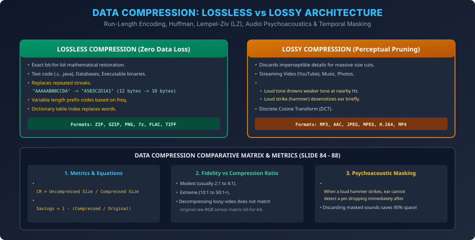

# Module 12: Data Compression Techniques (Lossless & Lossy)

> **Course:** Computer Networks (BCS603) — Unit 5: Application Layer  
> **Source Material:** Gateway Classes (Dr. Nidhi Parashar Ma'am) Slides 84–88  
> **Topic:** Data Compression Need, Lossless Algorithms (RLE, Huffman, Lempel-Ziv), Lossy Audio Psychoacoustics & Temporal Masking  

---

## 1. Data Compression Overview & Motivation

Data compression data ke representation size ko reduce karne ki technique hai:
- **Primary Objectives:**
  1. Network bandwidth ka maximum utilization (Fast streaming & download).
  2. Disk storage space ka optimization.
- **Key Metrics:**
  $$\text{Compression Ratio (CR)} = \frac{\text{Uncompressed Data Size}}{\text{Compressed Data Size}}$$
  $$\text{Space Savings} = 1 - \frac{\text{Compressed Size}}{\text{Uncompressed Size}}$$

---

## 2. Lossless Compression Algorithms

Lossless compression mein decompression ke baad **exact original bits** wapas mil jaate hain (Zero error). Yeh text documents, source code, executables, aur medical imaging ke liye mandatory hota hai.

### 2.1 Run-Length Encoding (RLE)
Repeated identical characters (runs) ko single character aur uske frequency count se replace kiya jata hai:
- **Example:**
  $$\text{Original String: } \text{AAAAABBBCCDA} \quad (\text{12 bytes})$$
  $$\text{RLE Compressed: } \text{A5B3C2D1A1} \quad (\text{10 bytes})$$
- *Best Case:* High-contrast black-and-white fax images ya binary masks.
- *Worst Case:* Text with no repetitions (`ABCDE` $\to$ `A1B1C1D1E1` - doubles size!).

### 2.2 Huffman Coding
Frequency of characters ke basis par variable-length binary codes assign karta hai:
- High-frequency characters ko short bit codes (e.g., 1 or 2 bits) milte hain.
- Low-frequency characters ko long bit codes milte hain.
- Prefix property ensure karti hai ki koi code doosre code ka prefix na ho (Unambiguous decoding).

### 2.3 Dictionary-Based Encoding (Lempel-Ziv LZ77 / LZ78 / LZW)
Data stream ko read karte waqt algorithm dynamically ek **Dictionary (Symbol Table)** construct karta hai:
- Jab bhi koi word ya phrase dobara repeat hota hai, to original string bhejne ke bajaye dictionary ka numerical index pointer bhej diya jata hai.
- Used in: `ZIP`, `GZIP`, `PNG`, `GIF`.

---

## 3. Lossy Compression Techniques

Lossy compression un data types ke liye use hota hai jahan human senses (aankh aur kaan) minor quality degradation notice nahi kar paati (Multimedia: Images, Audio, Video).

### 3.1 Audio Compression & Psychoacoustics (Slides 87–88)
Human ear har frequency aur sound ko equally detect nahi kar sakta. Lossy audio compression (jaise MP3, AAC) **Psychoacoustic Masking** use karta hai:
1. **Frequency Masking:** Agar 1000 Hz par ek loud drum sound baj raha ho, to uske bilkul paas 1005 Hz par baja soft flute sound human ear ko sunai nahi deta. Algorithm us soft sound ko discard kar deta hai.
2. **Temporal Masking (Hammer Analogy from Slide 88):**
   - Jab koi loud sound bajta hai (e.g., hammer hitting an anvil), to uske turant pehle (5 ms) aur turant baad (50–100 ms) tak human ear temporarily desensitize ho jata hai.
   - Is time window ke dauran agar koi pin bhi gire, to hum use detect nahi kar sakte.
   - MP3 encoder in temporary masked sounds ko drop karke 90% bandwidth save kar leta hai!

---

## 4. Vector Architecture Diagram

