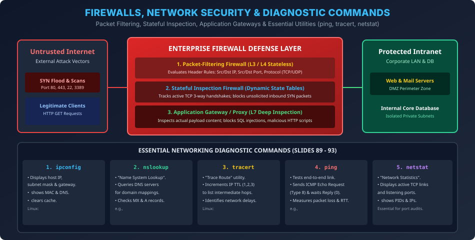

# Module 13: Firewalls, Network Security & Diagnostic Commands

> **Course:** Computer Networks (BCS603) — Unit 5: Application Layer  
> **Source Material:** Gateway Classes (Dr. Nidhi Parashar Ma'am) Slides 89–93 + Security Architecture  
> **Topic:** Firewalls (Packet Filtering, Stateful, Proxy), Digital Signatures & 5 Core Diagnostic Utilities (`ipconfig`, `nslookup`, `tracert`, `ping`, `netstat`)  

---

## 1. Firewalls Architecture & Classification

Firewall ek network security system hai jo incoming aur outgoing traffic ko pre-defined security rules ke basis par monitor aur filter karta hai:

```
[Untrusted Public Internet] ===> [FIREWALL BARRIER] ===> [Protected Corporate Intranet]
                                  /       |       \
               Packet Filter (L3/L4)   Stateful    Application Proxy (L7)
```

### 1.1 Three Generations of Firewalls
1. **Packet-Filtering Firewall (Stateless — Layer 3/4):**
   - Har individual packet ke headers ko inspect karta hai: Source IP, Destination IP, Source Port, Destination Port, Protocol (TCP/UDP/ICMP).
   - *Limitation:* Stateless hota hai (connection history yaad nahi rakhta; packets ke relationship ko samajh nahi sakta).
2. **Stateful Inspection Firewall (Layer 4):**
   - Active TCP connections ki state track karta hai (State Table: `SYN`, `ESTABLISHED`, `FIN`).
   - Sirf wahi incoming packets allow karta hai jo internal host ke dwara initiate kiye gaye valid connection ka part hote hain.
3. **Application Gateway / Proxy Firewall (Layer 7):**
   - Client aur server ke beech full proxy ki tarah act karta hai.
   - Application payload ko deeply scan karta hai (e.g., HTTP request mein hidden SQL injection, Cross-Site Scripting XSS ko block karta hai).

---

## 2. Digital Signatures & Integrity (Security Pillar)

Digital Signature paper signature ka cryptographic equivalent hai jo **Authentication**, **Integrity**, aur **Non-repudiation** ensure karta hai:
1. **Signing (by Sender Alice):**
   $$\text{Hash: } H = \text{SHA-256}(M) \qquad \text{Signature: } S = E_{\text{PR}_A}(H) \quad (\text{Encrypted with Alice's Private Key})$$
2. **Verification (by Receiver Bob):**
   $$\text{Decrypted Hash: } H' = D_{\text{PU}_A}(S) \quad (\text{Decrypted with Alice's Public Key})$$
   $$\text{Bob computes: } H'' = \text{SHA-256}(M)$$
   $$\text{If } H' == H'' \implies \text{Signature Verified! Authentic and Untampered!}$$

---

## 3. Five Essential Networking Diagnostic Commands (Slides 89–93)

Dr. Nidhi Parashar Ma'am ke syllabus mein network troubleshoot karne ke liye 5 core commands discuss kiye gaye hain:

### 3.1 `ipconfig` (Windows) / `ifconfig` (Linux)
- **Purpose:** Current network adapter settings aur IP configuration display karta hai.
- **Key Parameters:**
  - `ipconfig`: Displays IPv4 Address, Subnet Mask, and Default Gateway.
  - `ipconfig /all`: Displays MAC physical address, DHCP lease timestamps, and DNS server IPs.
  - `ipconfig /release` & `/renew`: Releases and re-requests IP from DHCP server.
  - `ipconfig /flushdns`: Clears DNS resolver cache to remove poisoned/stale records.

### 3.2 `nslookup` (Name System Lookup)
- **Purpose:** DNS server se kisi domain name ka IP address ya reverse PTR query karta hai.
- **Example Usage:**
  ```cmd
  C:\> nslookup aktu.ac.in
  Server:  google-public-dns-a.google.com
  Address: 8.8.8.8

  Non-authoritative answer:
  Name:    aktu.ac.in
  Address: 14.139.233.10
  ```

### 3.3 `tracert` (Windows) / `traceroute` (Linux)
- **Purpose:** Source se destination tak packet jin-jin intermediate routers (hops) se guzarta hai, unka path aur Round-Trip Time latency trace karta hai.
- **Working Mechanism:**
  - Packet ka **IP TTL (Time-To-Live)** field sequentially $1, 2, 3, \dots$ increment karta hai.
  - Har router par TTL 0 hote hi wo **ICMP Time Exceeded (Type 11)** packet wapas bhejta hai, jisse router ka IP address discover ho jata hai.

### 3.4 `ping` (Packet Internet Groper)
- **Purpose:** End-to-end network connectivity aur reachability test karta hai.
- **Protocol Used:** **ICMP (Internet Control Message Protocol)**.
- **Mechanism:** Sender bhejta hai **ICMP Echo Request (Type 8)**; destination reply karta hai **ICMP Echo Reply (Type 0)**.
- Measures packet loss percentage aur minimum/average/maximum round-trip time in milliseconds.

### 3.5 `netstat` (Network Statistics)
- **Purpose:** Local machine ke active TCP connections, listening ports, routing tables, aur network interface statistics display karta hai.
- **Key Parameters:**
  - `netstat -a`: Displays all active connections and listening ports.
  - `netstat -n`: Displays numerical IP addresses and ports instead of resolving domain names.
  - `netstat -o`: Displays Process ID (PID) associated with each connection (critical for identifying malware listening on ports).

---

## 4. Vector Architecture Diagram


