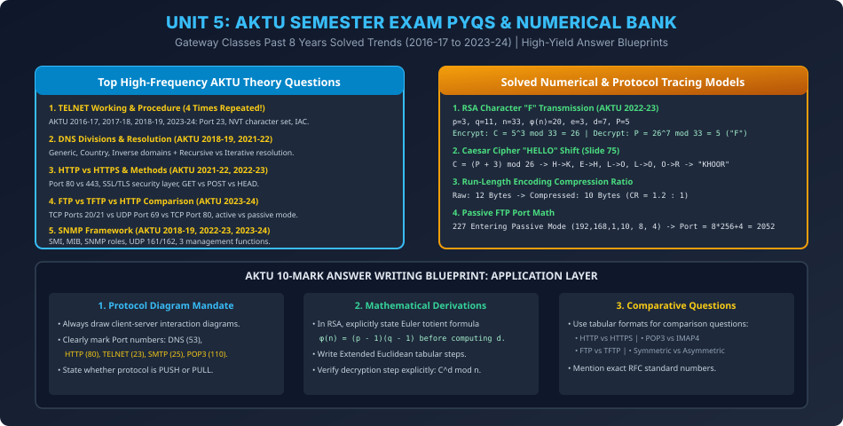

# Module 14: Unit 5 AKTU Semester Exam PYQs & Numerical Bank

> **Course:** Computer Networks (BCS603) — Unit 5: Application Layer  
> **Source Material:** Gateway Classes (Dr. Nidhi Parashar Ma'am) Slides 3, 4, 75, 80–82 + Past 8 Years AKTU Papers  
> **Topic:** Comprehensive Solved University Examination PYQ Bank & Numerical Derivations  

---

## 1. Top High-Frequency AKTU Theory Questions Solved

### Q1: Elaborate about TELNET and its working procedure. (AKTU 2016-17, 2017-18, 2018-19, 2023-24 — 10 Marks)
- **Answer Blueprint:**
  1. **Definition:** Teletype Network (RFC 854) is a client-server application-layer protocol for bidirectional interactive remote terminal access over TCP Port 23.
  2. **Components:** Local terminal $\to$ Terminal Driver $\to$ TELNET Client $\to$ TCP Socket $\to$ Network $\to$ TELNET Server $\to$ Pseudoterminal Driver (PTY) $\to$ Remote Shell.
  3. **Network Virtual Terminal (NVT):** Universal intermediate character representation eliminating terminal incompatibility. 7-bit ASCII for characters, 8th bit for control commands starting with IAC (`0xFF`).
  4. **Operating Modes:** Default Mode (half-duplex character echo), Character Mode, and Line Mode.
  5. **Security Defect:** Transmits cleartext passwords; modern networks replace it with SSH (Port 22).

---

### Q2: What is the purpose of Domain Name System? Discuss the three main divisions of domain name space. (AKTU 2018-19 — 10 Marks)
- **Answer Blueprint:**
  1. **Purpose:** Distributed, hierarchical database translating human-readable hostnames to 32-bit/128-bit numerical IP addresses over UDP/TCP Port 53.
  2. **3 Divisions:**
     - *Generic Domains (gTLD):* `.com`, `.edu`, `.gov`, `.mil`, `.org`, `.net`.
     - *Country Domains (ccTLD):* 2-letter country codes (`.in`, `.us`, `.uk`, `.jp`).
     - *Inverse Domains (PTR):* `in-addr.arpa` domain for reverse DNS lookups (IP $\to$ Hostname).
  3. **Resolution:** Explain Recursive (server completes full lookup) vs Iterative (server returns referrals).

---

### Q3: Differentiate between FTP and TFTP. (AKTU 2018-19, 2023-24 — 7 Marks)
- **Answer Blueprint:** Present complete tabular comparison:
  - Transport: TCP Ports 20 & 21 vs UDP Port 69.
  - Architecture: Dual connections (Control + Data) vs Single datagram stream.
  - Authentication: User/Password validation vs Zero authentication.
  - Block size: Variable stream vs Fixed 512-byte blocks with Stop-and-Wait ACK.
  - Primary use: Bulk file management vs Bootstrapping (PXE) & router firmware flashing.

---

### Q4: Explain SNMP in detail. What three functions can SNMP perform? (AKTU 2018-19, 2022-23, 2023-24 — 10 Marks)
- **Answer Blueprint:**
  1. **Triad Architecture:** SMI (Syntax rules & typing using ASN.1), MIB (Hierarchical database tree of managed objects with OIDs), SNMP (Protocol packet format over UDP 161/162).
  2. **Manager & Agent Model:** Central NMS polls distributed agents.
  3. **Three Core Functions:**
     - *Monitoring / Reading:* `GetRequest` / `GetNextRequest` to inspect counters and link health.
     - *Configuration / Writing:* `SetRequest` to modify device parameters remotely.
     - *Proactive Event Alerting:* `Trap` messages sent asynchronously by agent to NMS Port 162 upon critical failures.

---

### Q5: Differentiate between HTTP and HTTPS. (AKTU 2021-22, 2022-23 — 7 Marks)
- **Answer Blueprint:**
  - Port 80 vs Port 443.
  - Cleartext vs SSL/TLS encrypted tunnel.
  - Vulnerable to MITM vs Encrypted using AES session keys and verified by CA Digital Certificates.

---

## 2. Solved Numerical Bank

### Numerical 1: Character "F" Transmission using RSA (AKTU 2022-23)
- Given: Primes $p = 3, q = 11$, character to transmit = `"F"`.
- Step 1: $n = 3 \times 11 = 33$.
- Step 2: $\phi(n) = (3 - 1)(11 - 1) = 2 \times 10 = 20$.
- Step 3: Choose $e = 3$ since $\gcd(3, 20) = 1$.
- Step 4: Compute $d$: $3d \equiv 1 \pmod{20} \implies 3 \times 7 = 21 \equiv 1 \pmod{20} \implies d = 7$.
- Step 5: Encode character "F": In 0-indexed alphabet ($A=0, \dots, F=5$), Plaintext $P = 5$.
- Step 6: Encryption:
  $$C = P^e \bmod n = 5^3 \bmod 33 = 125 \bmod 33 = 26$$
- Step 7: Decryption:
  $$P = C^d \bmod n = 26^7 \bmod 33 = 5 \implies \text{Character "F" recovered!}$$

---

### Numerical 2: Passive Mode FTP Port Number Extraction
- Receiver receives FTP reply: `227 Entering Passive Mode (192,168,1,50, 16, 32)`
- Formula:
  $$\text{Port} = p_1 \times 256 + p_2 = 16 \times 256 + 32 = 4096 + 32 = 4128$$
- Client connects to IP `192.168.1.50` on TCP Port `4128` for data transmission.

---

## 3. Vector Architecture Diagram

