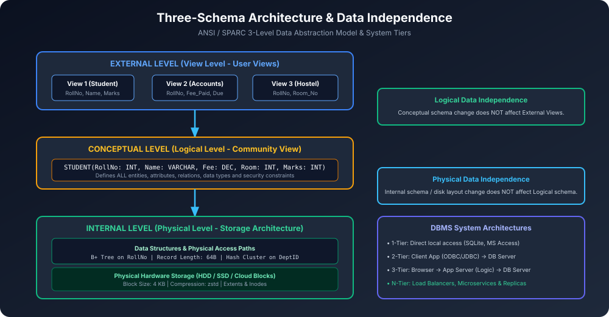

# Module 01: Database System Concepts and Architecture

Yeh module Database Management System (DBMS) ke core fundamentals, 3-tier data abstraction, ANSI/SPARC Three-Schema Architecture, Data Independence aur system deployment models ko in-depth machine-level context ke sath cover karta hai.

---

## 1. Data vs Information vs Database

### 1.1 Data (Raw Facts)
- **Definition:** Data raw, unprocessed aur isolated facts ya observations hote hain jinka bina context ke koi specific meaning nahi hota.
- **Example:** `"Shivam"`, `21`, `98.5`. Yeh sirf numbers aur strings hain.

### 1.2 Information (Processed Data)
- **Definition:** Jab raw data ko organize, structure aur process karke meaningful context diya jaata hai, toh woh **Information** banta hai.
- **Example:** *"Student Shivam (Age 21) scored 98.5% marks in Database Management Systems."*

### 1.3 Database
- **Definition:** Interrelated data ka ek logically organized aur persistent collection jo kisi enterprise ya real-world system ki activities ko represent karta hai.
- **Properties:**
  1. **Persistent:** Data secondary storage (HDD/SSD/NVMe) par permanently store hota hai.
  2. **Interrelated:** Data items ke beech explicit logical relationships hote hain (e.g. Student enrolled in Course).
  3. **Self-Describing:** Database me user data ke sath-sath uska metadata (Schema, data types, constraints) **Data Dictionary / System Catalog** me store hota hai.

---

## 2. What is a DBMS? (Database Management System)

DBMS ek complex system software package hai jo users aur application programs ko database create, maintain, query, modify aur administer karne ki suvidha provide karta hai.

### Core Kernel Subsystems of a DBMS:
1. **Query Processor:** User queries ko parse, validate, optimize aur execute plan me translate karta hai.
2. **Storage Manager:** In-memory buffer pool aur disk blocks ke beech data transfer manage karta hai.
3. **Transaction Manager:** ACID properties (Atomicity, Consistency, Isolation, Durability) guarantee karta hai.
4. **Buffer Manager:** Frequently accessed disk blocks ko RAM memory buffers me cache karta hai taaki physical I/O minimize ho sake.

---

## 3. The Three-Schema Architecture (ANSI / SPARC Model)



1975 me ANSI/SPARC committee ne database systems ke liye **Three-Level Architecture** propose kiya jiska main objective tha **User applications ko physical storage details se isolate karna**.

### 3.1 External Level (View Level)
- Sabse top level abstraction.
- Har user group ya application program ko database ka sirf woh hissa dikhata hai jo unke kaam ka hai (**Tailored User View**).
- Baki pure database ka structure user se hide kar diya jaata hai (Security + Simplicity).
- **Example:** 
  - Student Portal: Sirf `RollNo`, `Name`, `Attendance`, `Marks` dikhega.
  - Accounts Portal: `RollNo`, `Tuition_Fee`, `Fine_Due` dikhega.

### 3.2 Conceptual Level (Logical Level)
- Middle level abstraction (**Community View**).
- Yeh define karta hai ki **database me kaun sa data store hai aur entities ke beech kya relationships hain**.
- Pure enterprise ka global view:
  - Entities, Attributes, Data Types.
  - Integrity Constraints (Primary Key, Foreign Key, Check constraints).
  - Security aur Authorization rules.
- **Example:** Table schema definition:
  ```sql
  CREATE TABLE Student (
      RollNo INT PRIMARY KEY,
      Name VARCHAR(50) NOT NULL,
      Fee_Paid DECIMAL(10,2),
      Marks INT CHECK (Marks >= 0 AND Marks <= 100)
  );
  ```

### 3.3 Internal Level (Physical Level)
- Lowest level abstraction (**Physical Storage View**).
- Yeh define karta hai ki **data physical storage disk par actually kaise store hai**.
- Storage structures:
  - Record layout (Fixed vs Variable length records).
  - Block clustering, file organization (Heap, Sequential, B+ Tree).
  - Indexing schemes (Primary, Secondary, Hash indexes).
  - Data compression aur encryption mechanisms.

---

## 4. Data Independence (Physical vs Logical)

Three-Schema architecture ka sabse bada benefit **Data Independence** hai:

### 4.1 Physical Data Independence
- **Definition:** Internal Schema (physical storage structure) ko modify karne par Conceptual Schema ya Application Programs ko change na karna pade.
- **Kyu zaroorat hai?** Performance improve karne ke liye jab DBA B+ Tree index add karta hai, RAID level badalta hai, ya HDD se fast NVMe SSD par data migrate karta hai.
- **Impact:** Application SQL queries me koi code change nahi karna padta!

### 4.2 Logical Data Independence
- **Definition:** Conceptual Schema ko modify karne par External Views ya Existing Application Programs par koi adverse effect na pade.
- **Examples:**
  - Nayi entity ya naya attribute add karna (e.g. Student table me `Email_ID` column add karna).
  - Existing attributes ko expand karna.
- **Degree of Difficulty:** Logical data independence achieve karna Physical data independence se **kahi zyada mushkil** hota hai kyunki schema badalne par view mappings complicate ho sakti hain.

---

## 5. DBMS System Architectures (Tiers)

| Architecture | Component Placement | Advantages | Disadvantages | Real-World Use Case |
| :--- | :--- | :--- | :--- | :--- |
| **1-Tier** | Client, Application Logic & DB same machine par | Fastest response, zero network overhead | Single-user only, no remote collaboration | SQLite, MS Access, embedded apps |
| **2-Tier** | Fat Client (App Logic) $\rightarrow$ DB Server (Data) via ODBC/JDBC | Direct control, simple deployment for LAN | Heavy network load, security risk, hard to update client code | Legacy banking desktop terminals |
| **3-Tier** | Thin Client (Browser) $\rightarrow$ App Server (Business Logic) $\rightarrow$ DB Server | High security, scalable, central business logic, thin client | Network latency between tiers, complex infra | Web apps (React $\rightarrow$ Node/Django $\rightarrow$ PostgreSQL) |
| **N-Tier** | Client $\rightarrow$ Load Balancer $\rightarrow$ Microservices $\rightarrow$ Cache (Redis) $\rightarrow$ Sharded DB | Extreme scalability, fault isolation, geo-distributed | High operational complexity | Large cloud platforms (Amazon, Netflix, Uber) |
