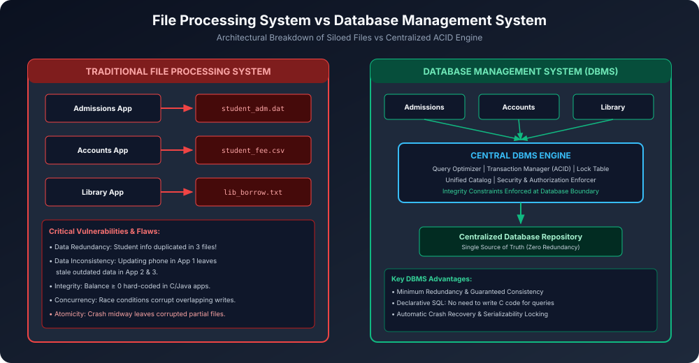

# Module 02: File Processing System vs DBMS

Traditional computer applications data ko store karne ke liye Operating System ke file system (Flat files, CSVs, Binary dat files) par rely karti thi. Lekin jaise-jaise enterprise applications grow hui, file systems me severe architectural limitations saamne aayi jinhone DBMS ke emergence ko mandatory bana diya.

---

## 1. Architectural Architecture Comparison

---

## 2. Critical Limitations of File Processing Systems

### 2.1 Data Redundancy and Inconsistency
- **Redundancy (Duplication):** Alag-alag departments apni alag files maintain karte hain. E.g. College me Admissions department, Library department aur Accounts department teeno student ka Name, Roll No aur Phone Number apni alag files me store karte hain. Isse storage waste hoti hai.
- **Inconsistency (Out-of-Sync Data):** Agar student apna Phone Number update karwata hai aur sirf Admissions file update hoti hai jabki Library me purana number rehta hai, toh database **inconsistent state** me chala jaata hai.

### 2.2 Difficulty in Accessing Data
- File system me koi declarative query language (SQL) nahi hoti.
- Agar Principal ko ye dekhna ho: *"Kaun se students hain jinki attendance < 75% hai aur fees unpaid hai?"*, toh programmer ko ek naya C ya Java program likhna padega jo dono files ko line-by-line read karke filter kare.

### 2.3 Data Isolation
- Data alag-alag files me alag-alag formats (Binary, CSV, Fixed-width text) me scattered hota hai.
- Naye applications likhna jo in multiple formats ko parse aur correlate karein extremely tedious aur error-prone hota hai.

### 2.4 Integrity Problems
- Data integrity constraints (e.g. `Account_Balance >= 500`, `Age >= 18`) ko application code ke andar `if-else` blocks me hard-code karna padta hai.
- Agar business rule change ho kar `Account_Balance >= 1000` ho jaye, toh bank ke saare alag-alag programs ko dhoondh kar recompile karna padta hai.

### 2.5 Atomicity Problems (Transaction Failures)
- Ek transaction multi-step hoti hai (e.g. Account A se ₹5000 kat kar Account B me credit hona).
- Agar Account A se paisa debit hone ke baad system crash ya power failure ho jaye, toh file system me koi automated rollback mechanism nahi hota. Paisa hawa me gayab ho jaata hai!

### 2.6 Concurrent Access Anomalies
- Agar do users ek hi file ko parallel update kar rahe hain, toh file locking coarse-grained hoti hai (entire file locked).
- Lock na lagane par **Lost Updates** aur **Dirty Reads** create hote hain jisse data corrupt ho jaata hai.

### 2.7 Security Problems
- OS file permissions sirf all-or-nothing hoti hain (Read/Write/Execute on whole file).
- File system me yeh restrict karna impossible hai ki: *"Clerk sirf student ke Marks dekh sake, lekin uski Fee ya Medical record na dekh sake"*.

---

## 3. Comprehensive Master Comparison Matrix

| Parameter | File Processing System | Database Management System (DBMS) |
| :--- | :--- | :--- |
| **Data Redundancy** | High (Har application apni separate file rakhti hai) | **Minimal** (Controlled centralized data sharing) |
| **Data Consistency** | Poor (Duplicate files out-of-sync ho sakti hain) | **Guaranteed** (Single source of truth) |
| **Data Independence** | Zero (File format badla toh code rewrite karo) | **High** (Physical & Logical data independence) |
| **Querying Mechanism** | Manually C/Java procedural code likhna padta hai | **Declarative SQL** (Query Optimizer handles execution) |
| **Integrity Constraints** | Application programs me hard-coded | Centralized schema me define (`CHECK`, `FK`, `NOT NULL`) |
| **Transaction & Atomicity** | No built-in transaction support | **ACID Transactions** (Rollback via Write-Ahead Log) |
| **Concurrent Access** | Dangerous (Race conditions, lost updates) | **Sophisticated Concurrency Control** (2PL, Locks, MVCC) |
| **Security Granularity** | Low (File-level OS permissions) | **High** (Table-level, Column-level, Row-level ACLs) |
| **Crash Recovery** | Manual file backups restore karna padta hai | **Automated** (WAL log, checkpointing, undo/redo) |
| **Cost & Overhead** | Inexpensive (Built into OS) | High (Software license, RAM/CPU requirements, DBA salary) |

---

## 4. When is a Traditional File System Preferred?
DBMS hamesha best choice nahi hota. Kuch cases me simple file system better hota hai:
1. **Ultra-Resource Constrained Embedded Systems:** Jahan RAM < 2 MB ho aur CPU low-power microcontroller ho.
2. **Hard Real-Time Systems:** Jahan microsecond deterministic timing chahiye aur DBMS query planner ka overhead tolerate nahi ho sakta.
3. **Single-User Static Tools:** Simple command-line tools jo static config file (`config.json`, `.env`) read karte hain.
