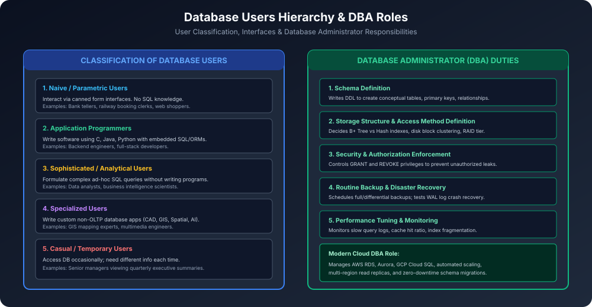

# Module 03: Database Users and DBA Roles

Database system ke sath interact karne wale logon ko unki technical expertise aur interaction ke purpose ke basis par 5 distinct categories me divide kiya jaata hai. Saath hi **Database Administrator (DBA)** pure system ka central guardian hota hai.

---

## 1. Classification of Database Users

### 1.1 Naive / Parametric Users
- **Description:** Inhe DBMS ya SQL ka koi technical knowledge nahi hota.
- **Interaction:** Yeh pre-built, fixed application interfaces (Forms, Web UIs, Mobile Apps) ke through pre-programmed transactions (**Canned Transactions**) execute karte hain.
- **Real-World Examples:**
  - Bank Tellers (Cash deposit/withdrawal form fill karna).
  - Railway Ticket Booking Clerks (IRCTC reservation window).
  - Online shoppers Amazon/Flipkart par order place karte waqt.

### 1.2 Application Programmers
- **Description:** Software engineers jo enterprise applications design aur code karte hain.
- **Interaction:** Yeh programming languages (C, C++, Java, Python, Go) me code likhte hain jisme database interaction ke liye **Embedded SQL**, **JDBC/ODBC**, ya **ORM (Object-Relational Mapping)** tools use kiye jaate hain.
- **Examples:** Backend developers building REST APIs in Spring Boot, Django, Node.js.

### 1.3 Sophisticated / Analytical Users
- **Description:** Inhe database structure aur SQL query languages ka thorough knowledge hota hai, lekin yeh standalone programs nahi likhte.
- **Interaction:** Yeh DBMS query tools me direct ad-hoc queries run karte hain complex data analysis, forecasting aur reports generate karne ke liye.
- **Examples:** Data Scientists, Business Analysts, Financial Quants.

### 1.4 Specialized Users
- **Description:** Yeh advanced users hote hain jo custom, non-traditional database applications develop karte hain.
- **Interaction:** Unstructured, spatial ya complex multi-dimensional data models ke sath kaam karte hain.
- **Examples:**
  - Computer-Aided Design (CAD) engineers.
  - Geographic Information Systems (GIS) mapping scientists.
  - AI Expert Systems aur Knowledge Base engineers.

### 1.5 Casual / Temporary Users
- **Description:** Yeh log database ko occasionally access karte hain, aur har baar unhe alag information ki zaroorat hoti hai.
- **Interaction:** Sophisticated query interface ya dashboard charts ke through data review karte hain.
- **Examples:** Company CEO, Managing Directors viewing annual performance summaries.

---

## 2. Role and Responsibilities of Database Administrator (DBA)

DBA woh individual ya team hoti hai jiske paas database management system ka **complete centralized control** hota hai.

### Key DBA Responsibilities:
1. **Schema Definition:**
   - Conceptual Schema design karna using DDL.
   - Tables, Primary Keys, Foreign Keys, Datatypes aur Constraints specify karna.
2. **Storage Structure & Access Method Definition:**
   - Physical disk layout decide karna (Block size, File clustering).
   - Query speed badhane ke liye indexes choose karna (B+ Tree, Hash indexing).
3. **Schema & Physical Organization Modification:**
   - Database growth hone par tables ko partition karna, data archive karna, ya index rebuild karna.
4. **Granting User Authorization & Security:**
   - Privilege allocation manage karna (`GRANT SELECT, INSERT ON ... TO user_a`).
   - Unauthorized access, SQL injections aur data breaches se database secure karna.
5. **Routine Backup & Disaster Recovery:**
   - Automated daily/weekly backups setup karna (Full, Incremental, Differential).
   - System crash ya hardware failure ke baad **WAL log (Write-Ahead Log)** se point-in-time recovery execute karna.
6. **Performance Tuning & Monitoring:**
   - Slow queries ko diagnose karna via `EXPLAIN ANALYZE`.
   - RAM Buffer Cache hit ratio monitor karna taaki disk reads minimum hon.

---

## 3. Database User Interfaces
1. **Menu-based Interfaces:** User ko drop-down options ki list milti hai (Web portals).
2. **Form-based Interfaces:** Input fields jisme user data enter karta hai (Admissions form).
3. **Graphical User Interfaces (GUI):** Schema ko visual diagrams me display karta hai; user mouse se click karke queries build karta hai.
4. **Natural Language Interfaces:** User plain English me prompt deta hai; system use SQL query me translate karta hai (e.g. Modern AI-assisted Text-to-SQL).
