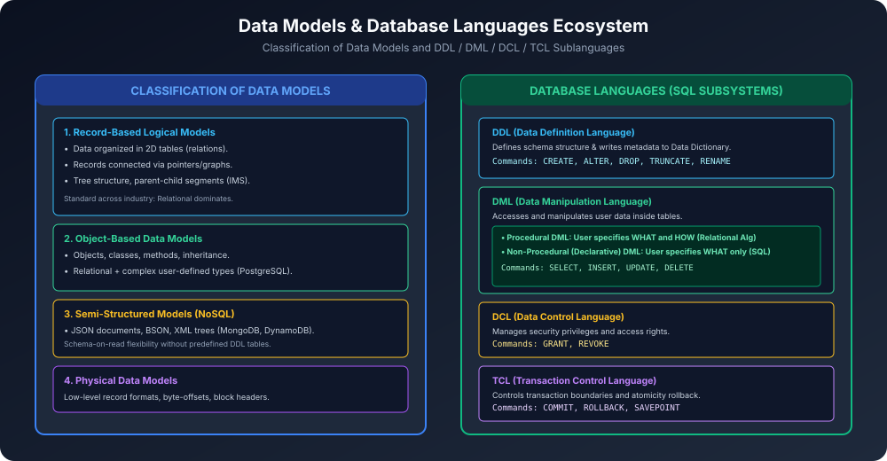

# Module 04: Data Models and Languages

Data model ek conceptual toolkit hai jo describe karta hai ki database me data, data relationships, data semantics aur integrity constraints kaise structure kiye jaate hain. Saath hi DBMS ke sath communicate karne ke liye standardized languages use ki jaati hain.

---

## 1. Classification of Data Models

### 1.1 Record-Based Logical Models
In models me database ko fixed-format records ke collection ke roop me structure kiya jaata hai:
1. **Relational Data Model:**
   - E.F. Codd (1970) dwara invent kiya gaya.
   - Data ko 2-Dimensional **Tables (Relations)** me store kiya jaata hai jisme Rows ko **Tuples** aur Columns ko **Attributes** kaha jaata hai.
   - Yeh aaj industry ka sabse dominant standard hai (MySQL, PostgreSQL, Oracle).
2. **Network Data Model (CODASYL):**
   - Data ko records aur pointers ke **Graph structure** me represent kiya jaata hai.
   - Many-to-Many (M:N) relationships natively support karta hai, lekin pointer complexity bahut zyada hoti hai.
3. **Hierarchical Data Model:**
   - Data ko **Tree structure** me represent kiya jaata hai (Parent-Child hierarchy).
   - Har child record ka sirf ek single parent ho sakta hai (1:N only). M:N relationships represent karna complex hota hai (e.g. IBM IMS).

### 1.2 Object-Based Data Models
1. **Object-Oriented Data Model (OODBMS):**
   - Object-oriented programming concepts (Objects, Classes, Methods, Encapsulation, Polymorphism, Inheritance) ko database me integrate karta hai.
2. **Object-Relational Data Model (ORDBMS):**
   - Relational model ke base par complex user-defined data types, arrays, composite attributes aur methods allow karta hai (e.g. PostgreSQL).

### 1.3 Semi-Structured Models (NoSQL)
- Data item ke pass fixed rigid schema nahi hota. Har individual record ka alag structure ho sakta hai (**Schema-on-read**).
- **Formats:** JSON, BSON, XML, Key-Value stores, Document stores (MongoDB, CouchDB).

---

## 2. Database Languages (SQL Sublanguages)

Database Management Systems multiple sublanguages provide karte hain:

### 2.1 DDL (Data Definition Language)
- **Purpose:** Database schema, tables, views, indexes aur integrity constraints ko define aur alter karna.
- **Output:** DDL commands ka result **Data Dictionary (System Catalog)** me metadata ke roop me save hota hai.
- **Commands:**
  - `CREATE`: Naya table, database ya index create karna.
  - `ALTER`: Existing table ka structure modify karna (column add/remove/datatype change).
  - `DROP`: Table ko structure aur data samet permanently delete karna.
  - `TRUNCATE`: Table ke saare rows delete karna, lekin structure retain rakhna.
  - `RENAME`: Table ya column ka name rename karna.

### 2.2 DML (Data Manipulation Language)
- **Purpose:** Database ke andar actual data tuples ko retrieve, insert, update aur delete karna.
- **Two Major Paradigms:**
  1. **Procedural DML:**
     - User specify karta hai **WHAT** data is required **AND HOW** to retrieve it (step-by-step navigational traversal).
     - **Example:** Relational Algebra, PL/SQL loops.
  2. **Non-Procedural / Declarative DML:**
     - User specify karta hai **WHAT** data is required **WITHOUT** specifying how to get it.
     - DBMS ka built-in **Query Optimizer** internally evaluate karta hai ki kaun sa index use karna hai aur kaun sa join algorithm execute karna hai.
     - **Example:** Standard SQL (`SELECT * FROM Student WHERE Marks > 80`).
- **Core Commands:** `SELECT`, `INSERT`, `UPDATE`, `DELETE`.

### 2.3 DCL (Data Control Language)
- **Purpose:** Database security, permissions aur access control manage karna.
- **Commands:**
  - `GRANT`: User ko specific table/view par rights dena (e.g. `GRANT SELECT ON Student TO rahul;`).
  - `REVOKE`: User se pehle di gayi permissions wapas lena.

### 2.4 TCL (Transaction Control Language)
- **Purpose:** Database me transactions ki atomicity aur durability manage karna.
- **Commands:**
  - `COMMIT`: Transaction ke changes ko permanently disk par save karna.
  - `ROLLBACK`: Failure hone par transaction ke saare intermediate changes undo karke purani consistent state me revert karna.
  - `SAVEPOINT`: Long transaction ke beech checkpoint create karna taaki partial rollback kiya ja sake.
