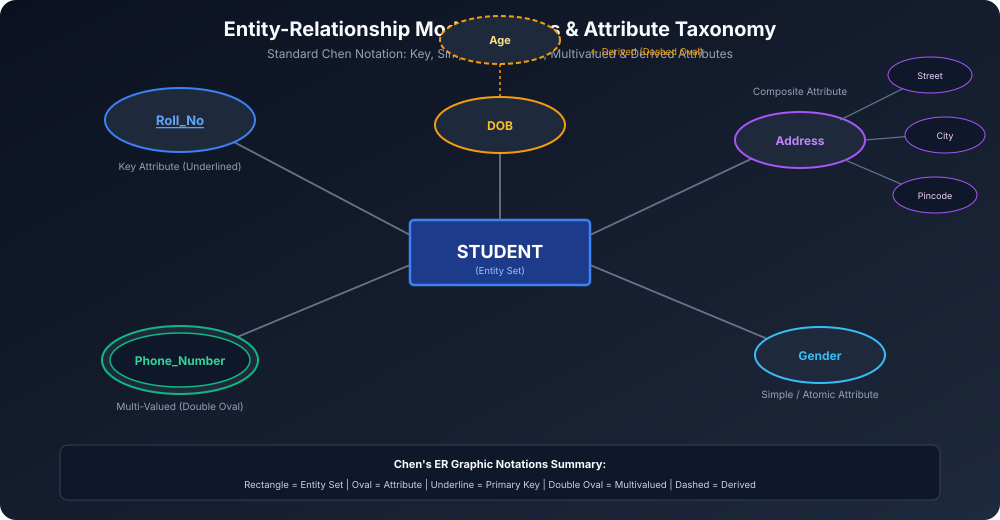

# Module 05: ER Model Entities and Attributes

Entity-Relationship (ER) Model Peter Chen dwara 1976 me propose kiya gaya ek high-level conceptual data model hai jo database design ke initial phase me real-world requirements ko visually map karne ke liye use hota hai.

---

## 1. Entities and Entity Sets

### 1.1 Entity
- **Definition:** Real world ka koi bhi distinguishable object, concept ya event jiska independent existence ho aur jiske baare me hum database me information store karna chahte hain.
- **Examples:**
  - Physical Entities: Ek specific Student (*"Akhil"*), Car, Employee.
  - Conceptual Entities: Bank Account, Course (*"Data Structures"*), Job.

### 1.2 Entity Set
- Ek hi category/type ki similar entities ka collection **Entity Set** kehlata hai.
- **Example:** Saare students ka collection $\rightarrow$ `STUDENT` entity set.
- **Diagrammatic Notation:** Chen notation me entity set ko **Rectangle** se represent kiya jaata hai.

---

## 2. Attributes Taxonomy in ER Modeling

Attributes entity ki properties ya characteristics hote hain. ER modeling me attributes ko 5 core categories me classify kiya jaata hai:

### 2.1 Simple (Atomic) vs Composite Attributes
1. **Simple / Atomic Attribute:**
   - Jise further sub-parts me divide nahi kiya ja sakta.
   - **Example:** `Gender`, `Roll_No`, `Salary`.
2. **Composite Attribute:**
   - Jo multiple smaller component attributes se milkar banta hai.
   - **Example:** `Address` $\rightarrow$ (`House_No`, `Street`, `City`, `State`, `Pincode`).
   - `Name` $\rightarrow$ (`First_Name`, `Middle_Name`, `Last_Name`).
   - **Advantage:** Queries specific sub-components par efficiently search kar sakti hain (e.g. `WHERE City = 'Lucknow'`).

### 2.2 Single-Valued vs Multi-Valued Attributes
1. **Single-Valued Attribute:**
   - Kisi entity ke liye exactly ek single value hoti hai.
   - **Example:** `Aadhar_Number`, `Date_of_Birth`.
2. **Multi-Valued Attribute:**
   - Ek hi entity ke liye multiple values ho sakti hain.
   - **Example:** Ek person ke multiple `Phone_Numbers` ya multiple `College_Degrees` ho sakte hain.
   - **Diagrammatic Notation:** **Double Oval** (Double Ellipse).

### 2.3 Stored vs Derived Attributes
1. **Stored Attribute:**
   - Data physical database me directly store rehta hai.
   - **Example:** `Date_of_Birth (DOB)`.
2. **Derived Attribute:**
   - Iski value physically store nahi hoti, balki kisi dusre stored attribute se on-the-fly calculate ki jaati hai.
   - **Example:** `Age = Current_Date - DOB`.
   - **Diagrammatic Notation:** **Dashed Oval** (Dashed Ellipse).

### 2.4 Key Attributes
- Woh attribute jo entity set ke andar har entity ko uniquely identify karta hai.
- **Diagrammatic Notation:** Oval ke andar attribute name ko **Underline** kiya jaata hai (e.g. $\underline{\text{Roll\_No}}$).

### 2.5 Null-Valued Attributes
- Jab kisi entity ke liye attribute ki value applicable na ho ya unknown ho.
- **Example:** Jiske paas apartment na ho uska `Apartment_Number` NULL hoga.

---

## 3. Summary of Chen's ER Notations

| Component | ER Geometric Shape | Example |
| :--- | :--- | :--- |
| **Entity Set** | Rectangle | `STUDENT`, `EMPLOYEE` |
| **Attribute** | Oval (Ellipse) | `Name`, `Salary` |
| **Key Attribute** | Oval with Underline | $\underline{\text{Roll\_No}}$ |
| **Multivalued Attribute** | Double Oval | `Phone_Number` |
| **Derived Attribute** | Dashed Oval | `Age` |
| **Composite Attribute** | Oval connected to sub-ovals | `Address` $\rightarrow$ (`City`, `Pin`) |
