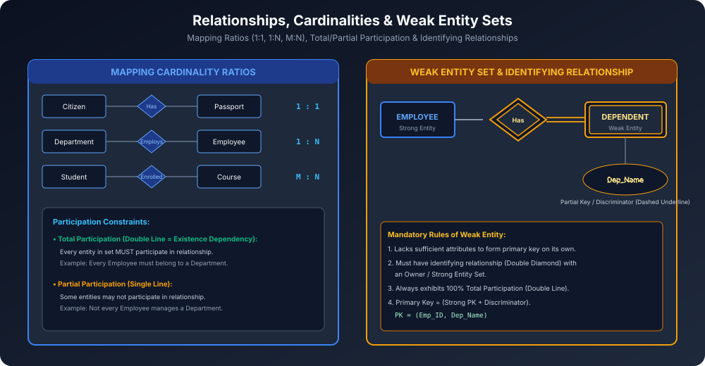

# Module 06: Relationships, Cardinalities and Weak Entities

Relationship do ya do se zyada entities ke beech logical association ko represent karta hai. Yeh module mapping cardinalities, participation constraints aur **Weak Entity Sets** ke machine-level architectural rules ko cover karta hai.

---

## 1. Relationships & Degree of Relationship

- **Relationship Instance:** Entities ke beech association ka ek specific occurrence (e.g., Student 101 enrolled in Course CS501).
- **Degree of Relationship:** Ek relationship set me kitne entity sets participate karte hain:
  1. **Unary / Recursive Relationship (Degree 1):** Same entity set do alag roles me participate karta hai (e.g. Employee *manages* other Employees).
  2. **Binary Relationship (Degree 2):** Do distinct entity sets ke beech association (e.g. Student *enrolled in* Course). Sabse common!
  3. **Ternary Relationship (Degree 3):** Teen entity sets ek saath associate hote hain (e.g. Supplier *supplies* Part *for* Project).
  4. **n-ary Relationship (Degree $n$):** $n$ entity sets simultaneously associate hote hain.

---

## 2. Mapping Cardinalities (Cardinality Ratios)

Binary relationships me ek entity dusre entity set ke kitne entities se associate ho sakti hai:

### 2.1 One-to-One (1:1)
- Entity set $A$ ka ek entity set $B$ ke at most ek entity se associate ho sakta hai, aur vice versa.
- **Example:** Citizen $\rightarrow$ `Has` $\rightarrow$ Passport.

### 2.2 One-to-Many (1:N)
- Entity set $A$ ka ek entity set $B$ ke multiple ($N$) entities se associate ho sakta hai, lekin $B$ ka ek entity $A$ ke sirf at most ek entity se associate ho sakta hai.
- **Example:** Department $\rightarrow$ `Employs` $\rightarrow$ Employees.

### 2.3 Many-to-One (N:1)
- Entity set $A$ ke multiple entities $B$ ke at most ek entity se associate ho sakte hain.
- **Example:** Employees $\rightarrow$ `Works_In` $\rightarrow$ Department.

### 2.4 Many-to-Many (M:N)
- Entity set $A$ ka ek entity $B$ ke multiple entities se, aur $B$ ka ek entity $A$ ke multiple entities se associate ho sakta hai.
- **Example:** Students $\rightarrow$ `Enrolled_In` $\rightarrow$ Courses.

---

## 3. Participation Constraints (Total vs Partial)

### 3.1 Total Participation (Existence Dependency)
- **Rule:** Entity set $E$ ka **har ek individual member** relationship $R$ me lazmi taur par participate kare.
- **Representation:** **Double Line** (Double line connecting Entity to Diamond).
- **Example:** Har student ka kisi college me enrolled hona compulsory hai.

### 3.2 Partial Participation
- **Rule:** Entity set $E$ ke sirf kuch members relationship me participate karte hain; sabhi ka participate karna zaroori nahi.
- **Representation:** **Single Line**.
- **Example:** Har employee company ka manager nahi hota (sirf kuch employees hi Department ko *manage* karte hain).

---

## 4. Weak Entity Sets in Depth

Ek aisa entity set jiske paas apna khud ka **Primary Key** banane ke liye sufficient attributes na hon, use **Weak Entity Set** kaha jaata hai.

### Core Architectural Rules:
1. **Identifying Entity Set (Owner Entity):** Weak entity set ko exist karne ke liye kisi **Strong Entity Set** par depend hona padta hai.
2. **Identifying Relationship:** Weak entity aur strong entity ke beech ka relationship **Double Diamond** se represent hota hai.
3. **Discriminator / Partial Key:** Weak entity ke paas ek partial key hoti hai (jo same owner entity ke context me uske weak entities ko differentiate karti hai). Isse **Dashed Underline** se represent kiya jaata hai.
4. **Mandatory Total Participation:** Weak entity set hamesha identifying relationship me **Double Line (Total Participation)** show karta hai.

### Primary Key Formation Rule:
$$\text{Primary Key of Weak Entity} = \{\text{Primary Key of Identifying Entity}\} \cup \{\text{Discriminator / Partial Key}\}$$

**Concrete Example:**
- Strong Entity: `EMPLOYEE` ($\underline{\text{Emp\_ID}}$, `Name`)
- Weak Entity: `DEPENDENT` ($\dashuline{\text{Dep\_Name}}$, `Relation`, `Age`)
- Primary Key of `DEPENDENT`:
  $$\mathbf{(\text{Emp\_ID}, \text{Dep\_Name})}$$
