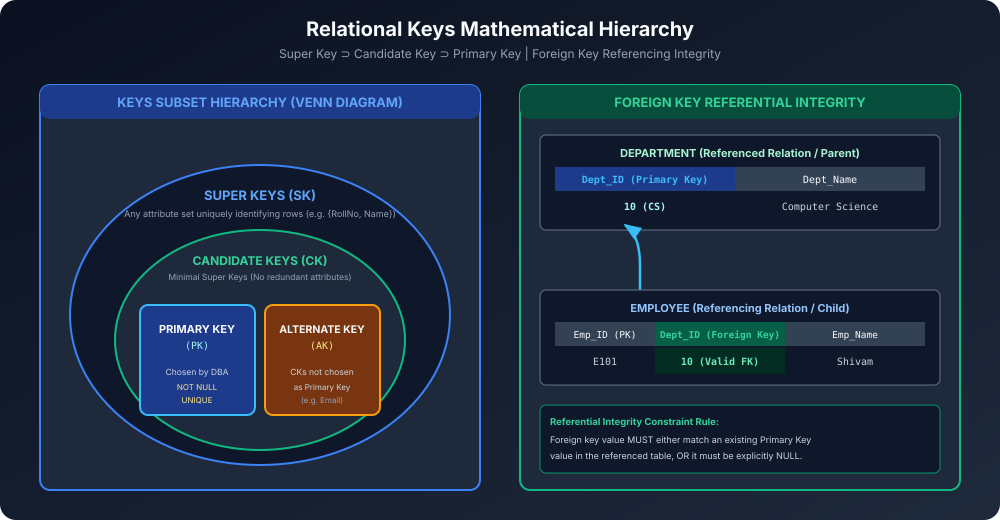

# Module 07: Relational Keys in Depth

Relational model me **Keys** data integrity aur tuple uniqueness enforce karne ke foundational building blocks hain. Yeh module Super Keys, Candidate Keys, Primary Keys, Alternate Keys aur Foreign Keys ke mathematical derivations aur solved questions ko cover karta hai.

---

## 1. Mathematical Hierarchy of Keys

$$\text{Super Keys} \supset \text{Candidate Keys} \supset \text{Primary Key}$$

### 1.1 Super Key (SK)
- **Definition:** Relation $R$ ke attributes ka koi bhi aisa set jisme table ke har tuple (row) ko uniquely identify karne ki power ho.
- **Mathematical Condition:** Agar $K$ ek super key hai, toh koi bhi do distinct tuples $t_1, t_2 \in R$ ke liye:
  $$t_1[K] \ne t_2[K]$$
- **Note:** Super key me extra / redundant attributes shamil ho sakte hain (e.g., $\{\text{RollNo}, \text{Name}\}$ bhi ek super key hai).

### 1.2 Candidate Key (CK)
- **Definition:** Ek **Minimal Super Key** — jisme se agar koi bhi single attribute hata diya jaye, toh woh uniquely identify karne ki property kho dega.
- **Properties:**
  1. **Uniqueness:** No two tuples have identical candidate key values.
  2. **Irreducibility (Minimality):** No proper subset of $CK$ is a super key.
- Ek table me multiple Candidate Keys ho sakti hain!

### 1.3 Primary Key (PK)
- **Definition:** Database Designer dwara Candidate Keys me se choose ki gayi **Single Principal Key**.
- **Crucial Rules:**
  1. Hamesha **UNIQUE** honi chahiye.
  2. Kabhi bhi **NULL** nahi ho sakti (**Entity Integrity Constraint**).
  3. Immutable / rarely changing honi chahiye.

### 1.4 Alternate / Secondary Key (AK)
- **Definition:** Woh saari Candidate Keys jinhe Primary Key nahi banaya gaya:
  $$\text{Alternate Keys} = \text{Candidate Keys} - \{\text{Primary Key}\}$$
- **Example:** Agar table me `Roll_No` aur `Email` dono candidate keys hain aur `Roll_No` ko PK chuna gaya, toh `Email` **Alternate Key** ban jaata hai.

### 1.5 Foreign Key (FK)
- **Definition:** Referencing relation (Child table) ka ek attribute jo Referenced relation (Parent table) ke **Primary Key** ko refer karta hai.
- **Referential Integrity Rule:** Foreign key ki value ya toh parent table me exist karti hui valid primary key honi chahiye, ya phir **NULL** honi chahiye.
- **Actions on Delete/Update:**
  - `ON DELETE CASCADE`: Parent row delete hone par matching child rows bhi auto-delete hon.
  - `ON DELETE SET NULL`: Parent delete hone par child ka FK field NULL ban jaye.
  - `ON DELETE RESTRICT / NO ACTION`: Agar child rows exist karti hain toh parent deletion block ho jaye.

---

## 2. Step-by-Step Solved Problem: Finding Keys

> **Numerical Problem:**
> Ek table hai `STUDENT(Roll_No, Reg_No, Email, Name, Age)`.
> Diya gaya hai:
> - `Roll_No` unique hai.
> - `Reg_No` unique hai.
> - `Email` unique hai.
> - `Name` aur `Age` me duplicate values ho sakti hain.
> 
> 1. Find all Candidate Keys.
> 2. If `Roll_No` is Primary Key, what are the Alternate Keys?
> 3. Total number of possible Super Keys kitni hongi?

### Solution:
1. **Candidate Keys:**
   Minimal sets jo unique hain:
   $$CK_1 = \{\text{Roll\_No}\}, \quad CK_2 = \{\text{Reg\_No}\}, \quad CK_3 = \{\text{Email}\}$$
   Total Candidate Keys = **3**.

2. **Alternate Keys:**
   Agar `Roll_No` PK hai:
   $$\text{Alternate Keys} = \{\text{Reg\_No}\}, \{\text{Email}\}$$

3. **Total Super Keys Calculation Formula:**
   Total attributes $n = 5$.
   Kisi single attribute candidate key $A$ ko contain karne wale super keys ka formula:
   $$\text{Count} = 2^{n - 1} = 2^{5 - 1} = 2^4 = 16$$
   Using Principle of Inclusion-Exclusion for 3 keys:
   $$|S_1 \cup S_2 \cup S_3| = \sum |S_i| - \sum |S_i \cap S_j| + |S_1 \cap S_2 \cap S_3|$$
   - Single keys: $3 \times 2^{5-1} = 3 \times 16 = 48$
   - Pairs: $\binom{3}{2} \times 2^{5-2} = 3 \times 8 = 24$
   - Triplet: $1 \times 2^{5-3} = 1 \times 4 = 4$
   $$\text{Total Super Keys} = 48 - 24 + 4 = \mathbf{28\text{ Super Keys}}!$$
