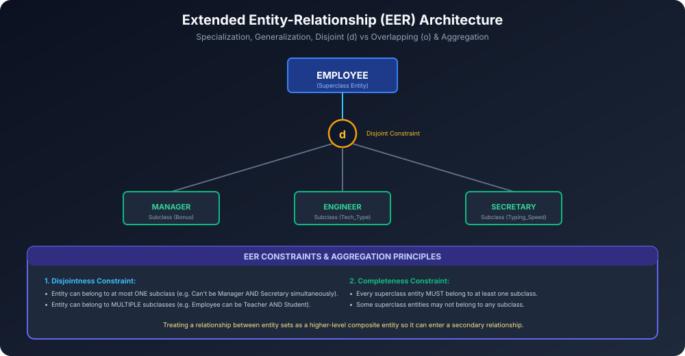

# Module 08: Extended ER Features (EER)

Traditional ER Model simple business applications ke liye sufficient tha, lekin complex engineering, CAD, GIS aur multi-tiered enterprise systems ke liye **Extended Entity-Relationship (EER)** model develop kiya gaya.

---

## 1. Specialization and Generalization

### 1.1 Specialization (Top-Down Approach)
- Ek general superclass entity set ko uske specific characteristics ke basis par **subclasses** me divide karne ka process.
- **Direction:** Top-Down (Higher-level entity $\rightarrow$ Lower-level specialized entities).
- **Example:**
  - `EMPLOYEE` superclass entity ko specialize kiya gaya:
    - `MANAGER` (Attributes: `Bonus`, `Dept_Supervised`)
    - `ENGINEER` (Attributes: `Technical_Skill`, `Certification`)
    - `SECRETARY` (Attributes: `Typing_Speed`)

### 1.2 Generalization (Bottom-Up Approach)
- Multiple lower-level entities ke common attributes ko identify karke ek common higher-level **Superclass** banane ka process.
- **Direction:** Bottom-Up (Subclasses $\rightarrow$ Superclass).
- **Example:**
  - `CAR`, `TRUCK`, aur `MOTORCYCLE` ke common attributes (`Vehicle_ID`, `Price`, `Model`) ko generalize karke ek higher-level entity `VEHICLE` banayi gayi.

### 1.3 Attribute Inheritance
- EER model me object-oriented concept ki tarah **Inheritance** apply hota hai:
- Subclass entity apne superclass ke **saare attributes aur relationships ko automatically inherit** karti hai, plus apne specific local attributes bhi hold karti hai.

---

## 2. Constraints on Specialization & Generalization

EER diagrams me circle ke andar do important constraints specify kiye jaate hain:

### 2.1 Disjointness Constraint
1. **Disjoint (`d`):**
   - Superclass ka koi bhi member **at most ek subclass** ka part ho sakta hai (Mutual exclusion).
   - E.g. Ek `Employee` ya toh `Full_Time` hoga ya `Part_Time`; dono ek sath nahi ho sakta.
2. **Overlapping (`o`):**
   - Superclass ka ek member **ek se zyada subclasses** me simultaneously belong kar sakta hai.
   - E.g. University me ek person simultaneously `Student` bhi ho sakta hai aur `Teaching_Assistant (Employee)` bhi.

### 2.2 Completeness Constraint
1. **Total Specialization (Double Line):**
   - Superclass ka **har ek member lazmi taur par** kisi na kisi subclass me belong kare.
2. **Partial Specialization (Single Line):**
   - Kuch superclass members aise ho sakte hain jo kisi bhi defined subclass ka part na hon.

### 4 Possible Constraint Combinations:
| Combination | Meaning | Real-World Example |
| :--- | :--- | :--- |
| **Disjoint, Total ($d, \text{Total}$)** | Must belong to exactly one subclass | `VEHICLE` is either `CAR` or `TRUCK` (no other vehicles exist) |
| **Disjoint, Partial ($d, \text{Partial}$)** | Can belong to at most one subclass | `EMPLOYEE` is either `ENGINEER` or `SECRETARY`, or other generic staff |
| **Overlapping, Total ($o, \text{Total}$)** | Must belong to at least one subclass | Hospital `PERSON` must be `DOCTOR`, `NURSE`, or both |
| **Overlapping, Partial ($o, \text{Partial}$)** | May belong to zero, one, or multiple | `EMPLOYEE` can be `CONSULTANT`, `AUTHOR`, both, or neither |

---

## 3. Aggregation

ER model me relationships do entity sets ke beech bante hain, lekin agar hume **kisi relationship par hi dusra relationship create karna ho**, toh kya karein?
- **Problem:** ER model relationship-to-relationship associations allow nahi karta.
- **Solution (Aggregation):** Ek relationship aur uske associated entity sets ko ek single **Higher-Level Abstract Entity Set** treat kiya jaata hai (enclose in an outer rectangle).
- **Example:**
  - `Employee` works on `Project`.
  - Is combination (`Employee - Works_On - Project`) ko aggregate karke uske sath `Machinery` / `Tools` entity ko associate kiya jaata hai (`Uses_Machinery`).
