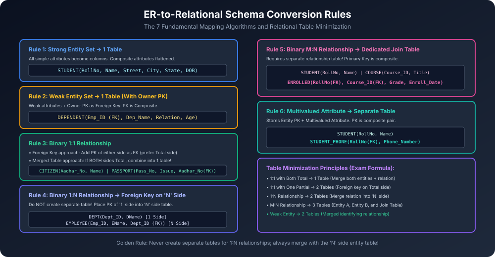

# Module 09: ER-to-Relational Mapping and Table Reduction

ER conceptual model ko relational physical database (SQL Tables) me convert karne ke liye standardized 7-step mapping algorithm follow kiya jaata hai. Saath hi semester exams (AKTU) me **Minimization of Tables** ek mandatory 10-mark question hota hai.

---

## 1. Architectural Conversion Rules Overview

---

## 2. The 7 Core Mapping Algorithms

### Rule 1: Mapping Regular Strong Entity Sets
- Har strong entity set ke liye ek dedicated table banegi.
- Entity ke saare simple attributes table ke columns banenge.
- **Composite Attributes:** Inhe flatten karke sirf inke simple components ko column banaya jaata hai (e.g. `Address` $\rightarrow$ `Street`, `City`, `State`, `Pincode`).
- Entity ka Key attribute table ka **Primary Key** banega.
- **Example:**
  $$\text{STUDENT}(\underline{\text{RollNo}}, \text{Name}, \text{Street}, \text{City}, \text{DOB})$$

### Rule 2: Mapping Weak Entity Sets
- Weak entity set ke liye ek dedicated table banegi.
- Is table me weak entity ke saare simple attributes aayenge.
- Saath me **Owner (Strong) Entity ka Primary Key** as a **Foreign Key** add kiya jayega.
- **Composite Primary Key:**
  $$\text{Primary Key} = (\text{Owner\_PK}, \text{Discriminator / Partial Key})$$
- **Example:**
  $$\text{DEPENDENT}(\underline{\text{Emp\_ID (FK)}}, \underline{\text{Dep\_Name}}, \text{Relation}, \text{Age})$$

### Rule 3: Mapping Binary 1:1 Relationship Types
Do alternatives hote hain:
1. **Foreign Key Approach (Preferred):**
   - Dono entities ke liye separate tables banti hain.
   - Kisi ek table me dusri table ka Primary Key as Foreign Key daal diya jaata hai.
   - **Optimization Rule:** Foreign key ko us entity table me daalein jiska **Total Participation** ho, taaki column me `NULL` values na aayein!
2. **Merged Relation Approach:**
   - Agar relationship me **dono entity sets ka Total Participation** ho, toh dono entities aur relationship ko merge karke **ek single unified table** bana di jaati hai (Minimum 1 Table)!

### Rule 4: Mapping Binary 1:N Relationship Types
- **Golden Rule:** 1:N relationship ke liye **kabhi bhi separate table nahi banayi jaati**!
- "1" side entity ki Primary Key ko "N" (Many) side entity ki table me **Foreign Key** ke roop me add kar diya jaata hai.
- Agar relationship ke paas koi descriptive attributes hain, toh woh bhi "N" side table me add ho jaate hain.
- **Example:** `Department` (1) $\rightarrow$ `Employs` $\rightarrow$ `Employee` (N):
  $$\text{DEPARTMENT}(\underline{\text{Dept\_ID}}, \text{DName})$$
  $$\text{EMPLOYEE}(\underline{\text{Emp\_ID}}, \text{EName}, \text{Dept\_ID (FK)}, \text{Joining\_Date})$$

### Rule 5: Mapping Binary M:N Relationship Types
- M:N relationship ke liye **compulsorily ek alag dedicated Table (Join / Cross-reference Table)** create karni padti hai!
- Is table me:
  1. Entity A ki Primary Key (Foreign Key)
  2. Entity B ki Primary Key (Foreign Key)
  3. Relationship ke descriptive attributes
- **Primary Key:** Dono Foreign Keys ka composite pair:
  $$\text{ENROLLED}(\underline{\text{RollNo (FK)}}, \underline{\text{Course\_ID (FK)}}, \text{Grade}, \text{Enroll\_Date})$$

### Rule 6: Mapping Multivalued Attributes
- Multivalued attribute ko original entity table me nahi rakha ja sakta (1NF violation).
- Iske liye ek **separate table** create hoti hai:
  - Entity ka Primary Key (Foreign Key)
  - Multivalued attribute itself
- **Composite Primary Key:** Dono attributes milkar primary key bante hain.
- **Example:** Student ke multiple phone numbers:
  $$\text{STUDENT\_PHONE}(\underline{\text{RollNo (FK)}}, \underline{\text{Phone\_Number}})$$

### Rule 7: Mapping $n$-ary Relationships ($n > 2$)
- Ternary ya higher-order relationships ke liye ek dedicated table banegi jisme saare participating entities ke Primary Keys as Foreign Keys aayenge.

---

## 3. Table Minimization Rules (AKTU Exam Formula)

Semester exam me aksar pucha jaata hai: *"Given ER diagram ko represent karne ke liye minimum kitni relational tables ki requirement hogi?"*

| ER Relationship Structure | Participation Constraints | Minimum Tables Required |
| :--- | :--- | :---: |
| **1 : 1 Relationship** | Both Total Participation | **1 Table** |
| **1 : 1 Relationship** | One Total, One Partial | **2 Tables** |
| **1 : 1 Relationship** | Both Partial Participation | **2 Tables** |
| **1 : N Relationship** | Any Participation | **2 Tables** |
| **M : N Relationship** | Any Participation | **3 Tables** |
| **Weak Entity with Owner** | Total Participation (Mandatory) | **2 Tables** |
| **Entity with Multivalued Attribute** | Strong Entity | **2 Tables** |
