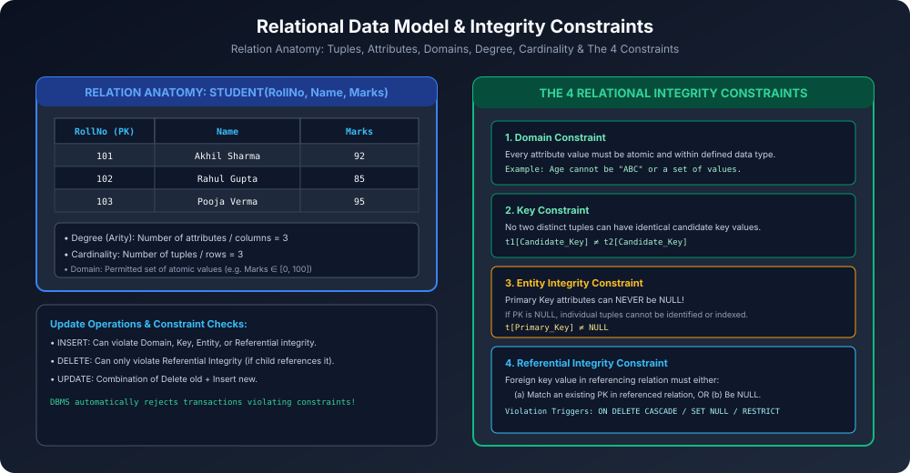

# Module 10: Relational Data Model and Integrity Constraints

Relational model database systems ka theoretical aur mathematical foundation hai. Isme data ko mathematically relations ke roop me structure kiya jaata hai aur data validity guarantee karne ke liye **4 Fundamental Integrity Constraints** enforce kiye jaate hain.

---

## 1. Relational Model Terminology

- **Relation (Table):** Tuples (rows) ka ek unordered mathematical set.
- **Tuple (Row / Record):** Ek single entity instance ki values ka ordered sequence $\langle v_1, v_2, \dots, v_n \rangle$.
- **Attribute (Column / Field):** Relation me named header jo kisi specific property ko denote karta hai.
- **Domain:** Permitted atomic values ka set jisme se attribute apni value le sakta hai (e.g. `Domain(Marks) = Integers between 0 and 100`).
- **Degree (Arity):** Relation me total attributes (columns) ki sankhya.
- **Cardinality:** Relation me currently present total tuples (rows) ki sankhya.
- **Relational Schema vs Relational Instance:**
  - **Schema $R(A_1, A_2, \dots, A_n)$:** Relation ka structural blueprint (static skeleton).
  - **Instance $r(R)$:** Kisi specific point in time par table ke andar stored actual data ka snapshot (dynamic).

---

## 2. The 4 Core Relational Integrity Constraints

### 2.1 Domain Constraint
- **Rule:** Har attribute $A_i$ ki value uske declared domain $\text{dom}(A_i)$ ka **atomic value** honi chahiye.
- Composite ya Multivalued values strictly prohibited hain (1st Normal Form / Atomic requirement).
- **Example:** `Phone_Number` me alphabet text daalna ya `Age` me negative value allow na hona.

### 2.2 Key Constraint
- **Rule:** Ek relation me koi bhi do alag-alag tuples kisi Candidate Key $K$ ke liye identical values share nahi kar sakte:
  $$\forall t_1, t_2 \in r(R), \quad t_1 \ne t_2 \implies t_1[K] \ne t_2[K]$$

### 2.3 Entity Integrity Constraint
- **Rule:** Kisi bhi relation ka **Primary Key attribute kabhi bhi NULL nahi ho sakta**:
  $$\forall t \in r(R), \quad t[\text{Primary\_Key}] \ne \mathbf{NULL}$$
- **Kyu zaroori hai?** Agar primary key null hogi, toh individual records ko identify, retrieve ya join karna mathematically impossible ho jayega.

### 2.4 Referential Integrity Constraint
- **Rule:** Do relations ke beech consistency maintain karne ke liye use hota hai. Referencing relation $R_1$ ka Foreign Key $FK$, Referenced relation $R_2$ ke Primary Key $PK$ ko point karta hai:
  $$\forall t_1 \in R_1, \quad t_1[FK] \text{ must either match } t_2[PK] \text{ for some } t_2 \in R_2, \quad \text{OR } t_1[FK] = \mathbf{NULL}$$

---

## 3. Update Operations and Constraint Violations

| Operation | Can Violate Domain Constraint? | Can Violate Key Constraint? | Can Violate Entity Integrity? | Can Violate Referential Integrity? |
| :--- | :---: | :---: | :---: | :---: |
| **INSERT** | Yes (Invalid datatype) | Yes (Duplicate PK) | Yes (PK is NULL) | Yes (Foreign Key value not in parent) |
| **DELETE** | No | No | No | **Yes** (Parent deleted while child references it) |
| **UPDATE** | Yes | Yes (Modifying PK) | Yes (PK set to NULL) | Yes (Updating FK or referenced PK) |

### Actions on Referential Integrity Violations:
1. `ON DELETE CASCADE`: Parent tuple delete hone par saare dependent child tuples automatically delete ho jaate hain.
2. `ON DELETE SET NULL`: Parent delete hone par child ka Foreign Key attribute `NULL` set ho jaata hai.
3. `ON DELETE RESTRICT / NO ACTION`: Agar child table me koi record parent ko refer kar raha hai, toh parent deletion transaction ko immediately abort kar diya jaata hai!
