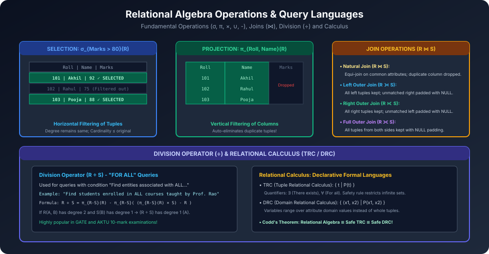

# Module 11: Relational Algebra and Calculus

Formal query languages DBMS query processing aur query optimization ke theoretical pillars hain. **Relational Algebra** ek procedural query language hai jabki **Relational Calculus** ek non-procedural (declarative) mathematical language hai.

---

## 1. Relational Algebra Operations

### 1.1 Fundamental Relational Algebra Operations

#### 1. Selection ($\sigma$)
- **Purpose:** Predicate (condition) satisfy karne wale tuples (rows) ko horizontally filter karta hai.
- **Notation:** $\sigma_p(R)$ jahan $p$ propositional logic formula hai ($\land, \lor, \neg, =, \ne, <, >$).
- **Degree & Cardinality:** Degree remains **same**; Cardinality $\le |R|$.
- **Example:** $\sigma_{\text{Marks} > 80}(\text{STUDENT})$

#### 2. Projection ($\pi$)
- **Purpose:** Columns ko vertically select karta hai aur baaki attributes ko drop kar deta hai.
- **Notation:** $\pi_{A_1, A_2, \dots, A_k}(R)$
- **Duplicate Elimination:** Mathematical relation ek **Set** hota hai, isliye Projection automatically duplicate rows ko discard kar deta hai!
- **Example:** $\pi_{\text{Name, City}}(\text{STUDENT})$

#### 3. Cartesian Product ($\times$)
- **Purpose:** Do relations $R$ (degree $n_1$) aur $S$ (degree $n_2$) ke saare pairwise tuple combinations banata hai.
- **Degree:** $n_1 + n_2$
- **Cardinality:** $|R| \times |S|$
- **Notation:** $R \times S$

#### 4. Set Union ($\cup$)
- **Purpose:** Dono relations ke tuples ko combine karta hai.
- **Union-Compatibility Condition:**
  1. Dono relations ka degree (number of columns) same hona chahiye.
  2. Corresponding attributes ke domains compatible hone chahiye.
- **Notation:** $R \cup S$

#### 5. Set Difference ($-$)
- **Purpose:** Un tuples ko return karta hai jo $R$ me belong karte hain lekin $S$ me nahi hain.
- **Notation:** $R - S$

#### 6. Rename ($\rho$)
- **Purpose:** Relation ya uske attributes ke names change karna taaki self-joins ya intermediate queries me ambiguity solve ho sake.
- **Notation:** $\rho_{S(B_1, B_2, \dots)}(R)$

---

### 1.2 Additional / Derived Relational Operations

#### 1. Set Intersection ($\cap$)
- $R$ aur $S$ dono me present common tuples.
- Fundamental operators se derivation:
  $$R \cap S = R - (R - S)$$

#### 2. Natural Join ($\bowtie$)
- Dono relations me common named attributes par equality test apply karta hai aur duplicate attribute column ko eliminate kar deta hai.
- Formula:
  $$R \bowtie S = \pi_{\text{schema}} (\sigma_{R.A = S.A}(R \times S))$$

#### 3. Outer Joins
- **Left Outer Join ($R \mathbin{⟕} S$):** Natural join + unmatched left tuples (right columns padded with NULL).
- **Right Outer Join ($R \mathbin{⟖} S$):** Natural join + unmatched right tuples (left columns padded with NULL).
- **Full Outer Join ($R \mathbin{⟗} S$):** Unmatched tuples from both relations padded with NULL.

#### 4. Division Operator ($\div$)
- **Primary Use Case:** **"FOR ALL"** queries ko answer karne ke liye.
- **Example Problem:** *"Un students ke RollNo find karo jinhone Prof. Sharma dwara padhaye gaye SABHI courses me enroll kiya ho."*
- **Mathematical Definition:**
  $$R \div S = \pi_{R - S}(R) - \pi_{R - S}\Big( \big(\pi_{R - S}(R) \times S\big) - R \Big)$$

---

## 2. Relational Calculus (Declarative Languages)

### 2.1 Tuple Relational Calculus (TRC)
- Non-procedural; user describe karta hai ki kaun se tuples chahiye:
  $$\{ t \mid P(t) \}$$
  *(Set of all tuples $t$ such that predicate $P(t)$ is TRUE)*.
- **Quantifiers:**
  - Existential Quantifier: $\exists t \in R$ ("There exists")
  - Universal Quantifier: $\forall t \in R$ ("For all")
- **Safety of Expressions:** Ek calculus expression **Safe** hota hai agar woh sirf database me maujood domain values se tuples generate kare (infinite domain sets prevent karne ke liye).

### 2.2 Domain Relational Calculus (DRC)
- Variable tuple ke badle individual attribute values (domain values) par range karte hain:
  $$\{ \langle x_1, x_2, \dots, x_n \rangle \mid P(x_1, x_2, \dots, x_n) \}$$

### 2.3 Codd's Theorem
> **Codd's Equivalence Theorem:**
> Relational Algebra, Safe Tuple Relational Calculus, aur Safe Domain Relational Calculus teeno ki **expressive power exactly EQUIVALENT** hoti hai!
> Jis query language me Relational Algebra ki tarah expressiveness ho, use **Relationally Complete** kaha jaata hai (e.g. Core SQL).
