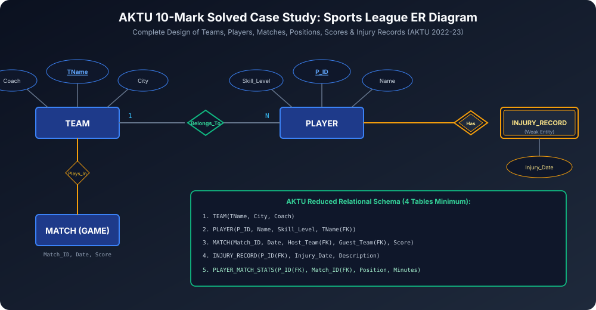

# Module 12: Unit 1 AKTU PYQs and Solved Case Studies

Yeh module AKTU Semester Exam (BCS501) ke past 5 years ke high-weightage 10-mark conceptual questions, numericals aur case study designs ka complete solved bank hai.

---

## 1. Solved AKTU Case Study: Sports League ER Diagram

> **AKTU Question (2022-23 - 10 Marks):**
> *"A database is being constructed to keep track of the teams and games of a sports league. A team has a number of players, not all of whom participate in each game. It is desired to keep track of players participating in each game for each team, the positions they play in that game, and the result of the game. Also keep track of injury records of players.*
> *(i) Design an E-R schema diagram for this application.*
> *(ii) Map the E-R diagram into relational model."*

### Step 1: Entity Sets and Attributes Identification
1. **`TEAM` (Strong Entity):**
   - $\underline{\text{TName}}$ (Primary Key)
   - `City`, `Coach`
2. **`PLAYER` (Strong Entity):**
   - $\underline{\text{P\_ID}}$ (Primary Key)
   - `Name`, `Skill_Level`
3. **`MATCH / GAME` (Strong Entity):**
   - $\underline{\text{Match\_ID}}$ (Primary Key)
   - `Date`, `Score`
4. **`INJURY_RECORD` (Weak Entity):**
   - Partial Key (Discriminator): $\dashuline{\text{Injury\_Date}}$
   - `Description`
   - Identifying Entity: `PLAYER`

### Step 2: Relationships and Cardinalities
- **`Belongs_To` (Binary 1:N):** One Team has Many Players; each player belongs to at most one team.
- **`Plays_In` (Ternary / Binary M:N):** Two Teams participate in each Match (Host Team vs Guest Team).
- **`Participates_In` (M:N):** Players participate in Matches with descriptive attributes: `Position`, `Minutes_Played`.
- **`Has_Injury` (Identifying Relationship):** Player has Injury Record with Total Participation on Injury side.

### Step 3: Relational Table Mapping (Reduced Schema)
1. **`TEAM` Table:**
   $$\text{TEAM}(\underline{\text{TName}}, \text{City}, \text{Coach})$$
2. **`PLAYER` Table:**
   $$\text{PLAYER}(\underline{\text{P\_ID}}, \text{Name}, \text{Skill\_Level}, \text{TName (FK)})$$
3. **`MATCH` Table:**
   $$\text{MATCH}(\underline{\text{Match\_ID}}, \text{Date}, \text{Host\_Team (FK)}, \text{Guest\_Team (FK)}, \text{Score})$$
4. **`INJURY_RECORD` Table (Weak Entity Reduction):**
   $$\text{INJURY\_RECORD}(\underline{\text{P\_ID (FK)}}, \underline{\text{Injury\_Date}}, \text{Description})$$
5. **`PLAYER_MATCH_STATS` Table (M:N Join Table):**
   $$\text{PLAYER\_MATCH\_STATS}(\underline{\text{P\_ID (FK)}}, \underline{\text{Match\_ID (FK)}}, \text{Position}, \text{Minutes\_Played})$$

---

## 2. Past 5-Year Solved AKTU 10-Markers

### PYQ 1: Three-Schema Architecture & Data Independence
> **Question (AKTU 2021, 2023 - 10 Marks):**
> Explain Three-Schema Architecture of DBMS. How does it achieve physical and logical data independence? Explain with suitable diagram.
>
> **Key Answer Points:**
> 1. ANSI/SPARC 3 levels: External (Views), Conceptual (Community/Logical Schema), Internal (Storage/Physical).
> 2. Mappings: External/Conceptual Mapping and Conceptual/Internal Mapping.
> 3. Physical Data Independence: Modifying internal schema (B+ tree indexes, disk partitioning) does not alter conceptual schema.
> 4. Logical Data Independence: Modifying conceptual schema (adding new tables/columns) does not break existing external views. Logical independence is harder to achieve due to view maintenance.

### PYQ 2: Drawbacks of Traditional File Processing System
> **Question (AKTU 2020, 2022 - 10 Marks):**
> Discuss drawbacks of file system over DBMS with suitable examples.
>
> **Key Answer Points:**
> 1. Data Redundancy & Inconsistency (e.g. Student phone number out-of-sync across Admissions and Accounts files).
> 2. Data Isolation (heterogeneous file formats).
> 3. Difficulty in Accessing Data (lack of declarative SQL).
> 4. Integrity Problems (hardcoded `if-else` constraints in procedural code).
> 5. Atomicity & Crash Recovery Failures (system crashes during bank fund transfer).
> 6. Concurrent Access Anomalies (lost updates, dirty reads).

### PYQ 3: Solved Relational Algebra Queries
> **Question (AKTU 2022 - 10 Marks):**
> Given Schema:
> `EMPLOYEE(Emp_ID, Name, Salary, Dept_ID)`
> `DEPARTMENT(Dept_ID, DName, Location)`
> 
> Write Relational Algebra expressions for:
> 1. Find names of employees who work in department 'Research'.
> 2. Find employee names whose salary is greater than ₹50,000 and location is 'Noida'.
> 3. Find department names that have no employees.

#### Solutions:
1. **Query 1:**
   $$\pi_{\text{Name}}\Big( \sigma_{\text{DName} = \text{'Research'}}(\text{EMPLOYEE} \bowtie \text{DEPARTMENT}) \Big)$$
2. **Query 2:**
   $$\pi_{\text{Name}}\Big( \sigma_{\text{Salary} > 50000 \land \text{Location} = \text{'Noida'}}(\text{EMPLOYEE} \bowtie \text{DEPARTMENT}) \Big)$$
3. **Query 3:**
   $$\pi_{\text{DName}}(\text{DEPARTMENT}) - \pi_{\text{DName}}(\text{EMPLOYEE} \bowtie \text{DEPARTMENT})$$

---

## 3. High-Yield Interview Q&A (FAANG / Core Systems)

### Q1: Why can Primary Key NOT be NULL, but Unique Key can be NULL?
**Answer:**
Relational model ka **Entity Integrity Constraint** demand karta hai ki table ka har individual record universally addressable hona chahiye. Agar Primary Key NULL allow karegi, toh SQL me `NULL = NULL` is UNKNOWN (three-valued logic), jisse do NULL rows ko uniquely identify ya index karna mathematically impossible ho jayega. Unique key sirf uniqueness verify karti hai, identity define nahi karti.

### Q2: What is the Relational Completeness of a Query Language?
**Answer:**
A query language is called **Relationally Complete** if it can express any query that can be formulated in basic Relational Algebra. Codd showed that both Tuple Relational Calculus (TRC) and Domain Relational Calculus (DRC) are relationally complete. Modern SQL is more than relationally complete because it adds aggregate functions (`COUNT`, `SUM`), sorting (`ORDER BY`), and transitive closures (`WITH RECURSIVE`).
