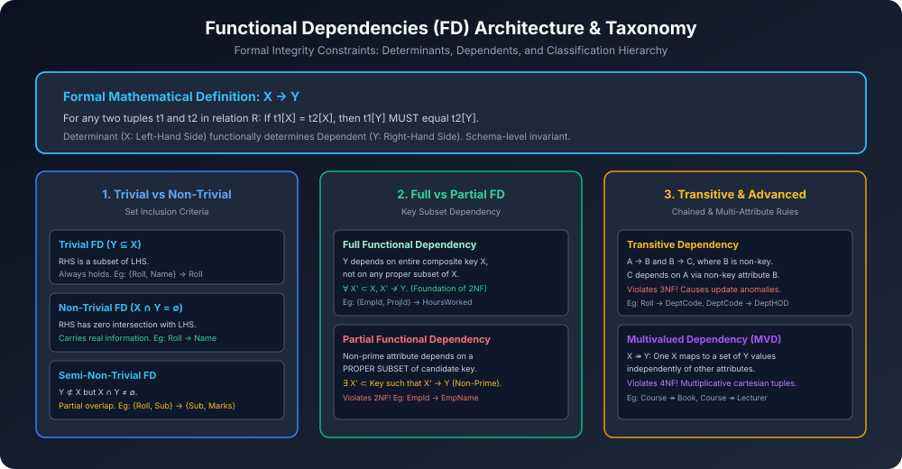

# Module 01: Functional Dependencies & Types (FD Foundations)

> **Course:** Database Management Systems (AKTU Code: **BCS501**)  
> **Topic Focus:** Formal Definition of FD, Determinant vs Dependent, Schema Constraints vs Instance Data, Trivial, Non-Trivial, Semi-Trivial, Full vs Partial FDs.

---

## 1. Functional Dependency (FD) Core Concept & Philosophy

Database design mein Functional Dependency relation ke attributes ke beech ka ek **semantic integrity constraint** hota hai. Yeh decide karta hai ki ek table ke andar values kis tarah interrelated hain aur redundancy kahan paida ho rahi hai.

### 1.1 Formal Mathematical Definition
Ek relation schema $R(A_1, A_2, \dots, A_n)$ par, jisme $X \subseteq R$ aur $Y \subseteq R$ attributes ke sets hain:
$$\mathbf{X 
ightarrow Y}$$
Yeh Functional Dependency tabhi valid maani jaati hai jab relation $R$ ke kisi bhi valid legal instance mein:
$$orall t_1, t_2 \in R, \quad 	ext{if } t_1[X] = t_2[X] \implies t_1[Y] = t_2[Y]$$

- **Bilingual Explanation:** Agar do tuples (rows) $t_1$ aur $t_2$ ke paas attribute set $X$ ki value exactly same hai, toh unke attribute set $Y$ ki value bhi compulsory roop se **same honi chahiye**!
- **Determinant ($X$):** Left-Hand Side (LHS) attribute jo decide karta hai.
- **Dependent ($Y$):** Right-Hand Side (RHS) attribute jo decide hota hai.

```
+---------------+                      +---------------+
|   LHS: X      | ───────────────────> |    RHS: Y     |
| (Determinant) |                      |  (Dependent)  |
+---------------+                      +---------------+
 Eg: Roll_No                            Eg: Student_Name, Branch
```

> [!IMPORTANT]
> **Schema Constraint vs Instance Property:**
> Functional Dependency table ke current snapshot ya instance ko dekh kar final nahi ki ja sakti! Yeh **real-world business logic aur schema rules** par depend karti hai.
> Instance me do alag students ka naam same ho sakta hai ya coincidence se kuch rows match kar sakti hain, par FD schema level rule hota hai jo har bhavishya (future) ke instance par bhi hold karna chahiye.

---

## 2. Comprehensive Taxonomy of Functional Dependencies

Functional Dependencies ko unke attribute relationship aur mathematical properties ke basis par classify kiya jaata hai:

### 2.1 Trivial Functional Dependency
- **Condition:** $Y \subseteq X$ (RHS is a subset of LHS).
- **Explanation:** Jab right side ka attribute already left side ke attribute set ka part ho.
- **Validity:** Yeh har relation instance par **hamesha true** hoti hai, bina kisi data ko check kiye!
- **Examples:**
  - $\{A, B\} 
ightarrow A$
  - $\{Roll\_No, Name\} 
ightarrow Roll\_No$
  - $A 
ightarrow A$

### 2.2 Non-Trivial Functional Dependency
- **Condition:** $X \cap Y = \emptyset$ (LHS and RHS have zero common attributes).
- **Explanation:** Jab right side ka koi bhi attribute left side me present nahi hota.
- **Significance:** Real-world database design me Non-Trivial FDs hi meaningful information aur constraints capture karti hain!
- **Examples:**
  - $Roll\_No 
ightarrow Student\_Name$
  - $Emp\_ID 
ightarrow Salary$
  - $\{Dept\_ID, Project\_ID\} 
ightarrow Budget$

### 2.3 Semi-Non-Trivial (Semi-Trivial) FD
- **Condition:** $Y 
ot\subseteq X$ and $X \cap Y 
e \emptyset$.
- **Explanation:** Jab RHS ka kuch part LHS me common ho, par RHS poori tarah LHS ka subset na ho.
- **Example:**
  - $\{A, B\} 
ightarrow \{B, C\}$
  - By Decomposition Rule: $\{A, B\} 
ightarrow B$ (Trivial) and $\{A, B\} 
ightarrow C$ (Non-Trivial).

---

## 3. Full vs Partial Functional Dependencies (Gateway to 2NF)

Yeh distinction Normalization ke **Second Normal Form (2NF)** ka core pillar hai!

| Parameter | Full Functional Dependency | Partial Functional Dependency |
| :--- | :--- | :--- |
| **Formal Definition** | $X 
ightarrow Y$ holds, and $orall X' \subset X$, $X' 
ot
ightarrow Y$ | $\exists X' \subset X$ such that $X' 
ightarrow Y$ |
| **Simple Meaning** | $Y$ poore composite key par depend karta hai, kisi akele tukde par nahi. | $Y$ composite key ke kisi ek chote hisse (proper subset) par depend kar jata hai. |
| **Candidate Key Type** | Composite Candidate Key required | Composite Candidate Key required |
| **Impact on Database** | Normalization ke liye desirable (2NF satisfied) | Redundancy paida karta hai (**Violates 2NF!**) |
| **Real Example** | $\{Emp\_ID, Project\_ID\} 
ightarrow Hours\_Worked$ | $\{Emp\_ID, Project\_ID\} 
ightarrow Emp\_Name$ ($Emp\_ID 
ightarrow Emp\_Name$) |

---

## 4. Transitive Functional Dependency (Gateway to 3NF)

- **Definition:** Jab ek non-key attribute kisi doosre non-key attribute par functionally depend karta hai through an indirect chain:
  $$X 
ightarrow Y \quad 	ext{and} \quad Y 
ightarrow Z \implies X 
ightarrow Z$$
  Where $X$ is candidate key, but $Y$ is NOT a super key and $Z$ is a non-prime attribute.
- **Real-World Pitfall:**
  - $Roll\_No 
ightarrow Department\_Code$
  - $Department\_Code 
ightarrow Department\_Head$
  - Yahan $Roll\_No 
ightarrow Department\_Head$ indirectly transitive hai. Agar department head change hoga, toh har student ki row me update karna padega (Update Anomaly).
  - Yeh dependency **Third Normal Form (3NF)** ko violate karti hai!

---

## 5. Architectural Diagram



---

## 6. Summary Comparison Table for Quick Revision

| FD Type | Mathematical Form | Always Valid? | Violates Normal Form? | Real-Life Example |
| :--- | :--- | :--- | :--- | :--- |
| **Trivial** | $Y \subseteq X$ | Yes (Trivially) | None | $\{A, B\} 
ightarrow A$ |
| **Non-Trivial** | $X \cap Y = \emptyset$ | Depends on schema | Core constraint | $Emp\_ID 
ightarrow Emp\_Salary$ |
| **Semi-Trivial** | $Y 
ot\subseteq X \land X \cap Y 
e \emptyset$ | Depends on schema | Can be decomposed | $\{A, B\} 
ightarrow \{B, C\}$ |
| **Partial** | $X' \subset 	ext{Key} 
ightarrow 	ext{Non-Prime}$ | Depends on schema | **Violates 2NF** | $Emp\_ID 
ightarrow Emp\_Name$ in Project allocation |
| **Transitive** | $	ext{Key} 
ightarrow X 
ightarrow Y$ | Depends on schema | **Violates 3NF** | $Student 
ightarrow Dept 
ightarrow HOD$ |
| **Multivalued** | $X 	woheadrightarrow Y$ | Independent multi-facts | **Violates 4NF** | $Course 	woheadrightarrow Books$ |
